

  <h1>🎸 기세 세계 (Pulse World) 🎸</h1>
  <h3>액션의 맥박을 깨우고, 협동의 선율을 완성하다</h3>
   
  
<strong>[2026 코리아 인디게임 데브캠프 자유양식 프로젝트 기획안]</strong>

  
제출자 : 김종민 (몰루?)

 

---

# 1. 🌟 프로젝트 개요 및 기획 의도 (Overview)

> **"리듬이 배경음악을 넘어 세계의 '물리법칙'으로 작동하는 코어 파밍 RPG"**

* **프로젝트명:** Pulse World (기세 세계 - 가칭)
* **장르:** 쿼터뷰(Isometric) 멀티플레이 리듬 액션 RPG (Dark Fantasy)
* **플랫폼:** PC (Steam 주 타겟, 컨트롤러 완벽 지원)
* **로그라인(LogLine):** "흐름(Flow)을 잃어가는 세계에서 오염을 정화하며, 음악의 템포에 몸을 맡긴 채 다양한 무기를 휘두르는 협동 액션 파밍 RPG"

### 🎯 시장의 문제점과 해결 방안 (Target & Vision)
기존의 정통 리듬 게임은 고도의 반사신경과 암기력을 요구하여 신규 유저에게 진입 장벽이 높았습니다. 반면 일반적인 액션 RPG는 성장에 집중한 나머지 조작의 직관성과 몰입감이 떨어집니다. **[Pulse World]**는 "음악에 맞춰 몸을 흔드는(Groove)" 인간의 본능적 쾌감에 착안하여, 넉넉한 판정(약간의 엇박자 통용)을 제공해 피지컬 압박은 대폭 낮추고 타격감은 극대화한 **‘직관적 리듬 융합형 RPG’**를 지향합니다. 유저는 마스터 BPM(음악 템포)에 맞춰 1~4인이 밴드 세션처럼 역할을 분담하여 적의 변칙 패턴을 파훼하는 극강의 몰입형 난투를 경험하게 됩니다.

  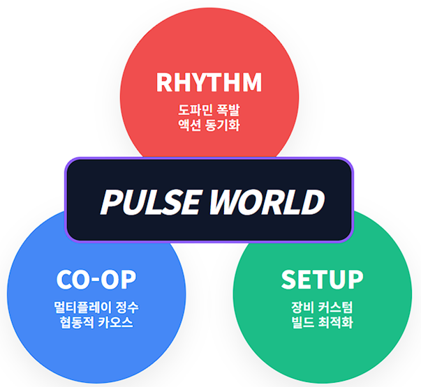
  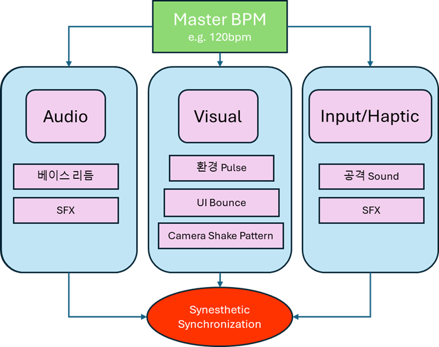

 

---

# 2. 📖 세계관 및 내러티브 기조: 기세 세계의 진실

Pulse World의 모든 시스템(BPM, 판정, 자원)은 무작위적 설계가 아닌, 뚜렷한 **다크 판타지적 개연성**을 가집니다.

### 🌐 1. 대지의 심장 (The Great Heart)과 흐름 (The Flow)
세계 최심부에 잠들어 있는 거대한 심장이 끊임없이 맥동하며 이 세계의 모든 에너지가 되는 **'맥류(Pulse Flow)'**를 만들어냅니다. 인류는 이 고밀도 에너지가 응축된 **'맥석(Pulse Stone)'**을 채굴하여 문명을 발전시켰지만, 무분별한 채굴로 인해 세계 곳곳의 흐름이 뒤틀리며 기이한 생태계가 파편화된 '오염(Pollution)' 구역이 발생했습니다.

### 🤺 2. 유저의 역할: 맥류사 (Pulse Dancer)
일반인은 느끼지 못하는 대지의 진동(BPM)을 태어날 때부터 감지하는 이능력자들입니다. 이들은 맥석이 박힌 무기를 휘두르며 오염의 근원을 처치하고 세계를 정화합니다. 
> 💡 **전투 판정의 개연성:** 전투 행동(마법, 이동)은 에너지를 소모합니다. 대지의 심장이 맥동하는 **'정점(Peak = 정박자)'**에 맞춰 행동해야만 대지에서 퍼지는 맥류 에너지를 100% 흡수하여 파괴적인 위력을 낼 수 있으며, 에너지가 희박해지는 '공허(엇박자)' 구간에서는 스킬이 무효화되거나 빗나가게 됩니다. 

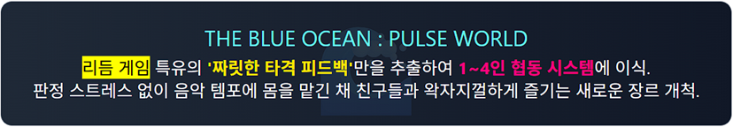

### 👁️‍🗨️ 3. 뒤틀린 생태과 세계의 진실 (The Hidden Truth)
인간에게 치명적인 괴물로 보이는 몬스터(맥류 잔향, 맥류 결정체 등)들은 실상 불안정해진 세계를 복구하기 위해 가이아가 스스로 빚어낸 **'대지의 수호 기제(면역 세포)'**입니다. 플레이어(맥류사)가 이들을 파괴하는 것은 지엽적으로는 인간을 구하는 길이지만, 거시적으로는 세계의 리듬을 더 불안정하게 만드는 모순적 서사 플롯을 바탕으로 이야기가 전개됩니다.

 

---

# 3. ⚔️ 핵심 혁신 (1): 공감각 동기화 리듬 플레이 (Synesthetic Sync)

Pulse World는 BGM과 유저의 조작, 시각적 피드백이 완벽하게 하나의 타임라인에 겹쳐(Snapping) 유저에게 전례 없는 도파민을 제공합니다. 

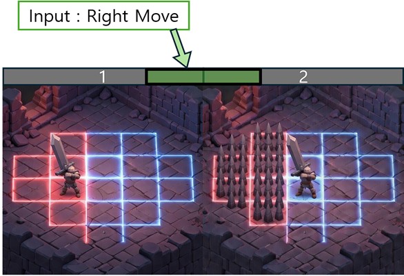

### ⏱️ 3-Tier 판정 및 액션 메커니즘
정교한 동체시력이 아닌, "흐름"을 기반으로 작동하는 전투 시스템입니다. 모든 액션은 `입력(Input)` ➔ `전조(Warning)` ➔ `타격(Damage & Output)`의 일관된 N비트 단위 타임라인을 가집니다.

| 인게임 판정 | 액션 결과 및 이펙트 | 플레이어 체감 피드백 |
|:---:|:---|:---|
| **Perfect (완전 공명)** | **정박(On-Beat)** 타격 성공. 120% 증폭 특화 데미지. | "히트 스탑(0.05초)" + 깊은 베이스 펀치 사운드 + 네온 크리스탈 파편(Shatter) 비산 폭발 |
| **Good (부분 공명)** | 정박에서 미세하게 벗어난 입력. 100% 타격 성공. | 타격 콤보 현상 유지, 무난한 전투 파문 연출. |
| **Miss (공허)** | **엇박(Off-Beat)** 실패. 에너지 불량 트리거로 콤보 단절. | 허공을 가르는 마찰음 + 잿빛 글리치(Glitch) 효과 발생. 패널티 줌. |

### 👁️ "암기력이 필요 없는 눈과 귀의 일체화" (Visual Warning)
과거 시장에 존재했던 시도(예: 크립트 오브 더 네크로댄서)는 훌륭했으나 몬스터의 애니메이션을 외워야 하는 시각적 인지 부하가 존재했습니다. 본 프로젝트는 이를 개량하여, 보스의 **모든 강력한 타격 범위(AOE)를 명확한 '색상 장판'으로 1~2비트 미리 시스템적으로 표기**합니다. 위험 장판의 붉은 점멸 속도와 음악의 비트가 완벽히 동일하기 때문에, 유저는 장판이 '펑!' 터지는 박자에 맞춰 눈과 귀의 본능적 감각만으로 직관적인 대시/회피 스텝을 밟을 수 있습니다.

 

---

# 4. 🎸 핵심 혁신 (2): Weapon Ensemble & 멀티플레이 협동 

Pulse World에서는 클래스(직업)의 굴레가 없습니다. **유저가 손에 쥔 '무기'가 자신의 악기이자 클래스 역할**이 되며, 1~4명의 파티 전투는 소음이 아닌 **"정교하게 편곡된 교향곡"**으로 화음이 믹싱됩니다.

### 🎧 무기군 기반 전투 주파수(주 역할) 분배
| 클래스 성향 (무기군) | 리듬적 역할 (Beat) | 오디오 출력 주파수 (Sound System) |
|:---|:---|:---|
| **탱커 (초중량 대검 등)** | **메인 비트 (Downbeat)** | **저음역대 (20~80Hz) 킥 드럼/파워 톰톰:** 묵직한 "쿵쾅-" 소리로 파티 뼈대를 세우고 몬스터 홀딩. |
| **암살자 (단검/쌍검)** | **오프 비트 (Syncopation)** | **고음역대 (4k~10kHz) 하이햇/스네어:** "챙-챙" 날카롭고 숨 막히는 16비트 연쇄 공격 극딜. |
| **원거리 (장궁/마법)** | **아르페지오 (Arpeggio)** | **중고음역 플럭 신스/기타:** "통통통" 멜로디의 화성적인 변주를 이끄는 조미료 역할 공격. |
| **마법 (지팡이/오브)** | **코드 패드 (Synth Pad)** | **공간 채움 (500~2kHz) 관악/콰이어:** "우우웅~" 광역 서포팅, 버프 결합을 통한 파티 안정감 부여. |

  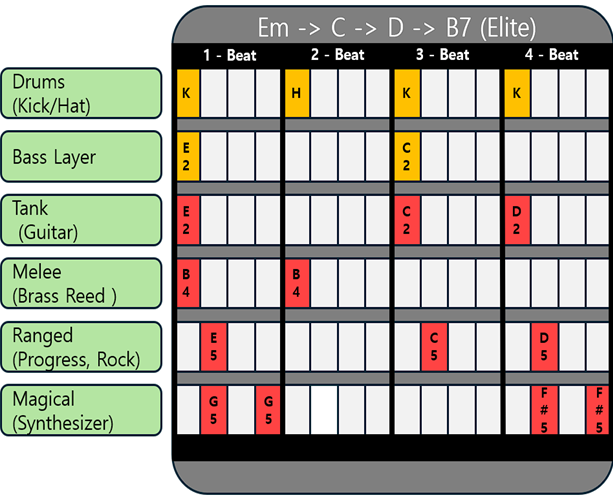
  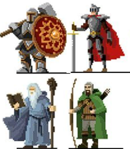

*무기별 오디오 타격이 하모니를 이뤄내는 시각/청각 연출의 일체화 개념*

### 🔥 공명 (Resonance) QTE 시스템 - 유대감의 하이라이트
단지 같은 맵에 서 있는 것을 넘어 진정한 협동을 유도하기 위해 파티 **'공명' 기믹**이 존재합니다. 
장신구의 시너지 게이지가 찼을 때 파티원 1명이 공명 스킬 발동을 트리거하면, **파티원 4명의 화면 전체에 코옵 QTE(순차적 커맨드 타이밍) UI가 전개됩니다.**
- 리더(시전자)가 제시한 템포의 악보에 맞춰, 남은 3명이 모두 버튼 입력을 퍼펙트로 받아내면 파티 전원이 일시 무적에 돌입하거나 보스의 실드를 박살 내는 카타르시스가 터져 나옵니다. 
- 단 한 명이라도 엇박을 내어 불협화음이 나면, 팀 전체가 아주 짧게 기절(Stun)하는 등 **협동의 당위성(High-Risk High-Return)**을 매력적으로 끌어냈습니다.

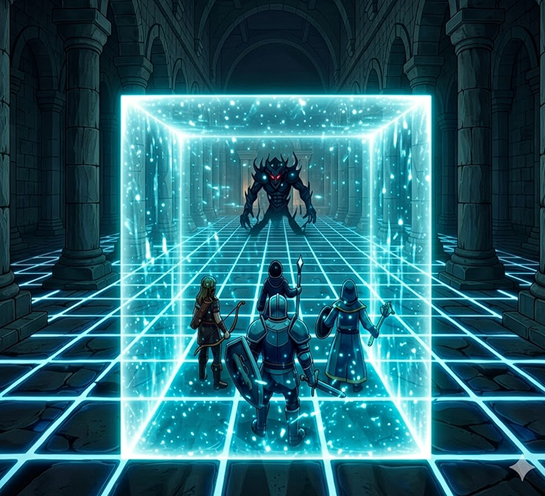

 

---

# 5. 👾 박자와의 사투 - 레벨 디자인 및 보스 기믹 방벽

스테이지는 지루한 파밍의 나열이 되지 않도록 3 Section 분할의 점진적 진행 텐션을 설계하였습니다 (Town 1-1 Forest의 경우, [Section 1 예열 ➔ Section 2 텐션 상승 ➔ Section 3 보스 결전]). 특히 코어 레이드(Raid)에서 플레이어는 흔한 장판 피하기를 넘어 **리듬 그 자체를 극복**해야 합니다.

| **Section 1 (탐색/예열)** | **Section 2 (위기/텐션 상승)** | **Section 3 (클라이맥스/보스 레이드)** |
|:---:|:---:|:---:|
| 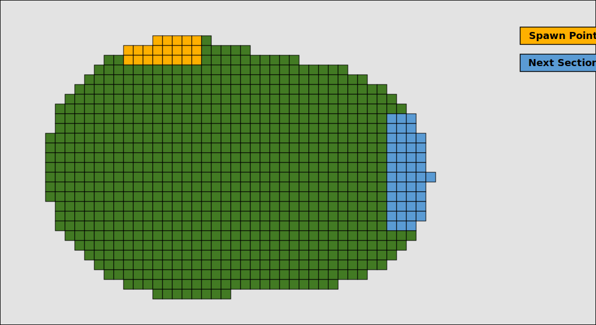 | 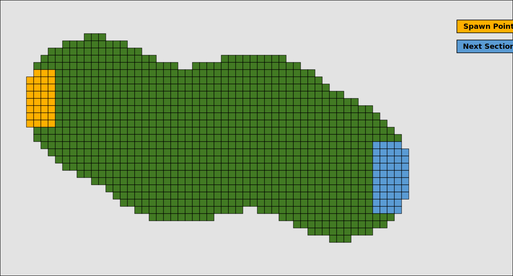 | 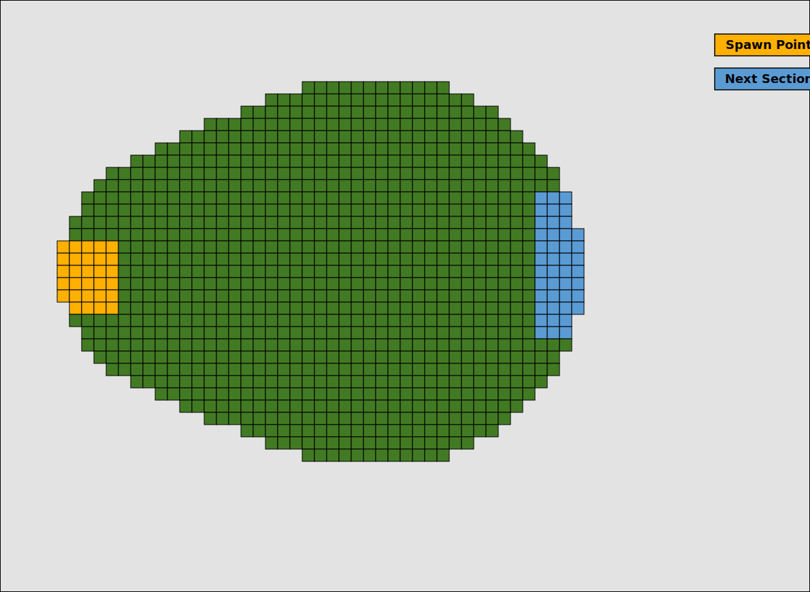 |
| 단순한 정박 위주 일반몹 섬멸 | 엘리트 난입과 엇박자 전조 등장 | 보스전 및 막대한 보상 도면 획득 |

### 🎼 레이드 보스(맥류 심핵)의 3단계 리듬 파괴 기믹 

* **Phase 1 (정상 궤도 - Awakening):** 
  배경음악이 안정적인 4/4박의 `Em - C - D - Em` 코드 전개로 흐릅니다. 보스의 거친 타격 전조가 화면 전체에 규칙적인 메트로놈처럼 박힙니다.
* **Phase 2 (과부하와 변조 - Distortion):** 
  보스 체력이 50% 아래로 떨어지면 대지의 리듬이 발작하기 시작합니다. **화면 전체에 색수차(Chromatic Aberration) 글리치가 발생하며 BGM 코드 진행이 `Em - Bb` 라는 악독한 증4도(Tritone) 불협화음**으로 비틀립니다. 이성적인 4/4박 타임라인은 강제로 3/4박, 5/4박자로 찌그러지며, 플레이어가 예측하던 콤보와 회피 템포가 대거 엇갈리는 **'기괴한 폭력(오작동)'을 극복하는 퍼즐**이 시작됩니다.
* **Phase 3 (결의와 카타르시스 - Epic Resolution):** 
  엇박 공격을 견뎌내면, BGM은 가장 웅장한 전개(해결)로 폭발합니다. 모든 무기의 쿨타임이 가속되며 4명의 플레이어가 일제히 궁극기를 쏟아붓는 장렬한 오케스트라 레이어의 진수를 맛봅니다.

  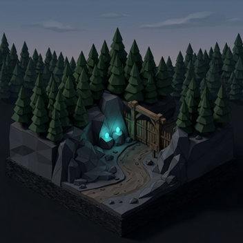
  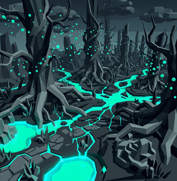
  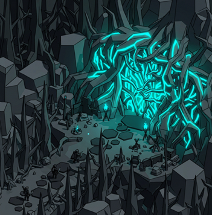

 

---

# 6. 💎 무한 시너지 빌드와 성장 생태계 (Economy System)

RPG 게임의 장기 리텐션을 유지할 **'코어 루프'**와 인앱(P2W)결제가 배제된 **계정 귀속 파밍 시스템**을 자랑합니다.

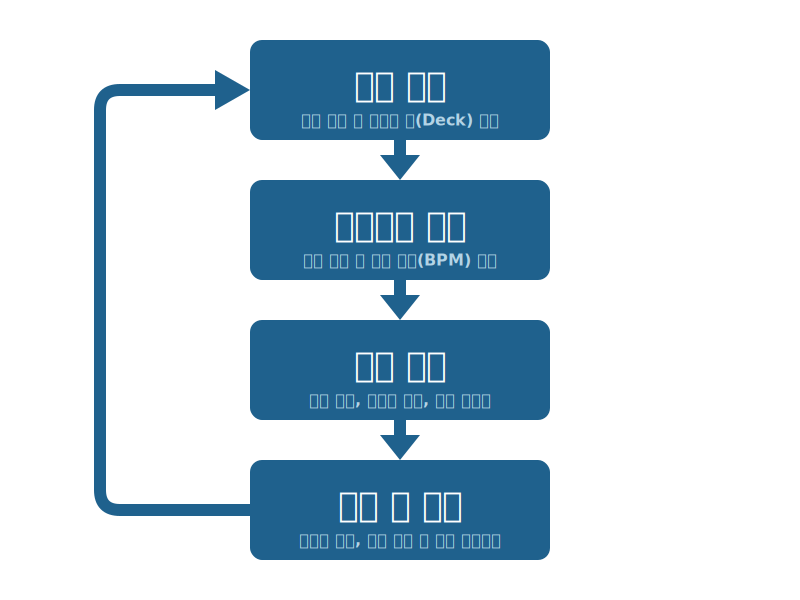

### 🧱 1. "맥석 (Pulse Crystal)" 과 크래프팅 생태계
유저는 몬스터를 통해 장비 완제품이 아닌 **'도면(Blueprint)'**과 **'강화 재료(Pulse Dust)'**를 습득하여 마을의 공방에서 제작(Crafting)으로 장비를 올리는 정석적 파밍의 성취를 얻습니다. 특히, 슬롯에 끼우는 소켓형 룬인 '맥석'은 무기의 물리적 기능에 논리적 트리거(Effect) 결합해 무한한 시너지를 만듭니다.

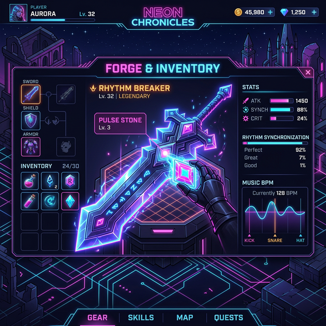

| 핵심 맥석 명칭 | 로직 (공통 메타) | 결합 시너지 응용 (예시) |
|:---|:---|:---|
| 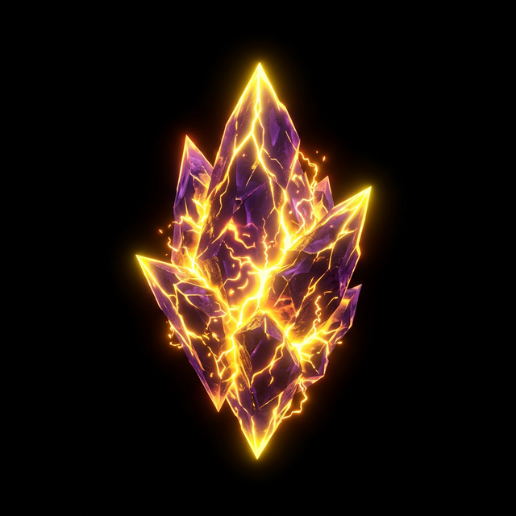 **과충전 (Overcharge)** | 정박 공격 3회 타격 성공 시 에너지를 응집, 4타째 적중 시 주변에 **강력한 뇌전(낙뢰 충격파)과 함께 스턴 유발**. | **+ 대검 장착 시:** 넓은 전방 전체에 적을 쓸어버리는 "뇌전의 등대" 탱커. |
| 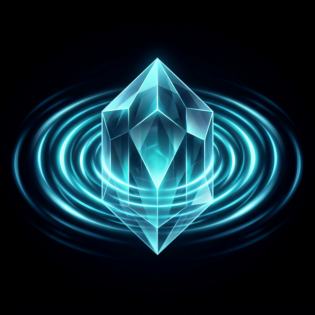 **유리 메아리 (Glass Echo)** | 기본 공격에 잔향(메모리) 스택 축적. 이후 액티브 스킬 사용 시, **밀린 잔상 공격이 적의 엇박자 타이밍을 뚫고 동시에 폭격됨.** | **+ 쌍검 장착 시:** 짧고 미친 타수가 엇박자에 중첩되어 단일 개체를 찢는 "유리 파편 무희" 모드. |

### 👟 2. 신발(Footwear)로 결정되는 "이동 리듬"
공격만 달라지는 것이 아닙니다. 신발 장비 파트를 무엇을 끼느냐에 따라 플레이어의 공간 이동법이 분기됩니다.
- **묵직한 군화:** 정박에 1칸씩 안정적으로 전진하며 단단한 보호 제공.
- **섀도우 부츠:** 정박 입력 시 대지가 미끄러지며(Slide) 부드럽게 2칸을 횡단, 몬스터의 장판 속에서 줄넘기를 하듯 생존에 특화.
- **페도라 스텝:** 공중에 점프하여 이동 중 함정 노드들을 무시(Skip)하는 유틸리티 기능.

 

---

# 7. 💻 기술적 도전의 극한: Illusion Engineering

> "4인 코옵 리듬 액션? PING(네트워크 딜레이) 때문에 불협화음 나서 절대 불가능한 장르 아닌가요?"

저희는 이 거대한 장벽을 포기가 아닌 **최적화된 오디오/서버 아키텍처(MSA) 엔지니어링**으로 극복합니다. 파티원의 행동이 100ms 지연되어 클라이언트에 도착하면 사운드가 "떡지고 엇박"이 나는 것을 '환상(Illusion) 기만 기법'으로 세련되게 막았습니다.

### 🛡️ 1차 보정: Magnet Quantize (오디오 중심 자석 양자화)
상대방 타격 패킷이 늦게 도착해도 억지로 재생하지 않습니다. 플레이어 클라이언트의 BGM 타임라인 상 가장 가까운 **미래의 정박자(16분음표 마디 등) 지류에 자석처럼 스냅(Snapping)시켜 딱 떨어지는 타이밍에만 사운드를 터뜨려 방출(PlayScheduled)**합니다.

### 🛡️ 2차 보정: Dynamic Smearing & Ducking (음향 공간 왜곡)
그래도 늦은 오차 감각을 없애기 위해, 도착 지연율이 높은(Ping이 매우 나쁜) 동료의 스킬 소리는 Low-pass 필터로 어택음을 뭉개고 공간계 이펙트(Reverb) 비중을 대폭 높입니다. 물리적 오차가 마치 **"웅장하고 부드럽게 배경음악을 덮어주는 공간 패드(Pad) 신시사이저 화음"**인 것처럼 유저의 귀를 기만하여 브금 레이어에 스며들게 만듭니다. 동시에 내 무기 타격음을 출력할 땐 중역대 BGM 볼륨을 0.05초간 눌러내는 **Audio Ducking**을 구현하여 내가 치는 사운드만 언제나 또렷하게 들립니다.

  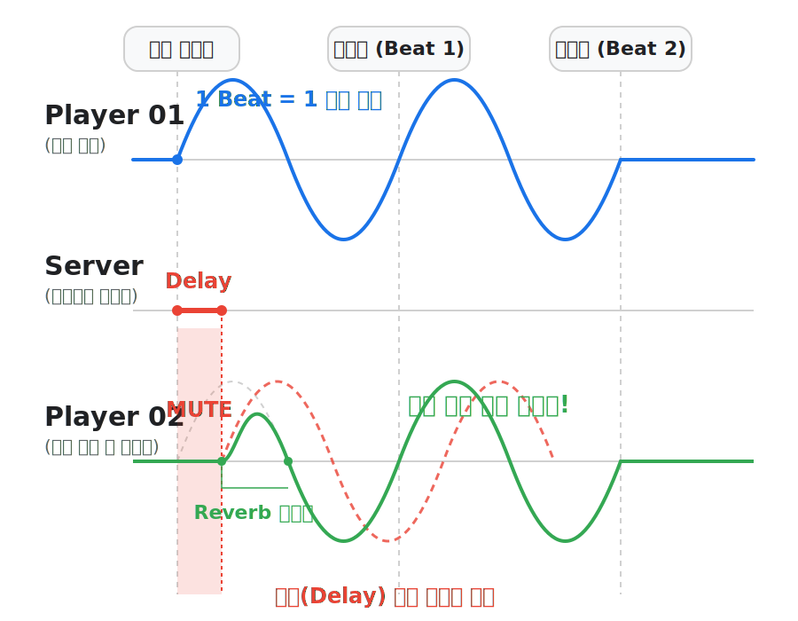
  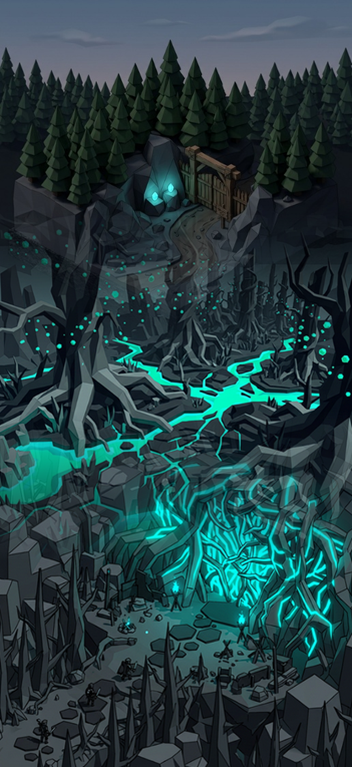

### 🛡️ 3차 보정: 클라이언트 자체 예측 시스템 (Predictive 0ms Sync)
상대방이 고속 8연참 스킬을 시동하면, 서버는 1번째 시작 타격 정보만 전달(`Hit 1`)합니다. 이후의 나머지 잔타격 `Hit 2~8`에 대한 패킷이 100ms 지연되건 말건 **수신자 클라이언트는 첫 1타를 기점으로 타임라인 기반의 악보(Skill Timeline)를 0ms 지연의 로컬 타이밍으로 완벽하게 스스로 연주(사운드 출력) 시작**하여 앙상블이 찢어지는 것을 물리적으로 원천 차단했습니다.

### 🖥️ 4. 서버 아키텍처 (Hybrid MSA & DB)
TCP 기반의 자체 서버 엔진(Game Server)들을 활용과, 매치메이킹 오케스트레이션을 관리하는 Control Plane 구조로 설계되었습니다.
- **DB:** 무결성이 생명인 유저의 Inventory, 획득한 도면/맥석 정보는 **PostgreSQL (Entity Framework Core)** 기반으로 영구히 적재됩니다.
- **Cache:** 실시간 대기열(Waiting Room), 클러스터 룸 로컬리티, 헬스 체크는 극강의 IOPS를 자랑하는 인메모리 스토어 **Redis**로 중앙 공유되어, 로딩화면을 단축하고 멈춤 없는 접속 및 룸 매칭 레이턴시를 구현합니다.

 

---

# 8. 🎯 타겟 시장 분석과 레퍼런스 확장 전략

Pulse World는 글로벌 게임 시장에서 이미 수차례 상업적 성공을 증명한 "장르 융합"의 공식을 진일보시킵니다.

#### [ 시각적/청각적 리듬 쾌감 극대화 벤치마킹 ]
| 벤치마크 게임 | Metal: Hellsinger (2022.09) | Hi-Fi RUSH (2023.01) |
|:---|:---:|:---:|
| **스팀 평가** | 95.9% (압도적 긍정적) | 97.1% (압도적 긍정적) |
| **성공 요인** | 메탈 비트 정박 타격 시 최대 쾌감/DPS 도출 | 환경 애니메이션과 콤보의 배경음 완전 록인 |
| **이미지** | 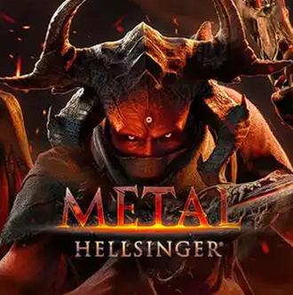 | 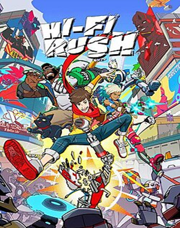 |

#### [ 상호의존적 협동과 빌드 최적화 벤치마킹 ]
| 벤치마크 게임 | Helldivers 2 (2024.02) | Path of Exile (2024.12) | Crypt of the NecroDancer |
|:---|:---:|:---:|:---:|
| **장르 특징** | 코옵(Co-Op) 특화 | 깊이 있는 스킬 젬 파밍 | 무빙/전투를 비트에 통제 |
| **성공 요인** | 철저하게 분배된 개인 소임의 당위성 | 소켓 시스템을 통한 플레이 스타일 구조 | 복잡한 액션의 진입 장벽 완화 |
| **이미지** | 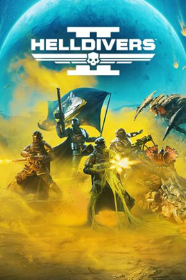 | 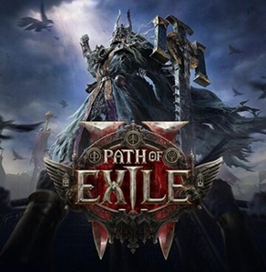 | 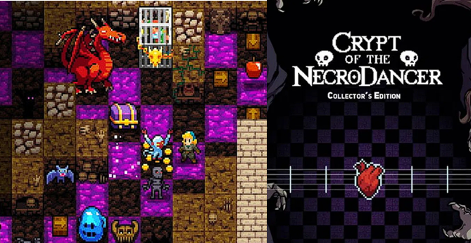 |

 

---

# 9. 🏆 마일스톤 및 사업화 비전 (Roadmap)

과거 수많은 인디게임의 한계였던 '재미있는 프로토타입만 존재하고 콘텐츠 순환이 멈추는' 현상을 피하고자, 개발 1개월 차부터 서버 인프라/데이터 파이프라인(CSV -> Json 매핑 자동화)을 구축했습니다.

| **개발 시기** | **핵심 산출물 및 개발 단계** |
|:---:|:---|
| **2026년 4월 ~ 5월** | **[코어 및 서버 인프라 구축]**   • API / Control Plane / Game 서버 통합 연결 (Redis, gRPC 기반)   • `Magnet Quantize`를 적용한 BPM 베이스 클라이언트 펀치 메커니즘 엔진 동기화 (Input ➔ Warning ➔ Damage)   • 메인 아트 (Dark&Neon) 방향 확정 및 외주 (배경 타일, 보스) 리소스 발주 |
| **2026년 6월 ~ 7월** | **[앙상블 시스템 · 프로토타입]**   • 무기군별 주파수 스메어링(대검-킥드럼, 쌍검-하이햇 분배) 알고리즘 멀티플레이 테스트   • 스킬 덱 조립 가능한 소켓/인벤토리 기반 UI 구축 완료 |
| **2026년 8월 ~ 9월** | **[보스 레이드 및 파밍 기믹 완성]**   • 심핵 보스의 3 Phase (글리치, 엇박 변조 불협화음) 변칙 시스템 트리거 구현   • 4인 코옵 `Resonance QTE` 공명 발동 시스템 처리 완비   • Town 공방 크래프팅 생태계 로직 연동 |
| **2026년 10월 ~ 11월** | **[FGT 폴리싱 및 버티컬 슬라이스 파이널 제출]**   • Forest 지역 (1~5 스테이지) 전 구간 레벨 배치 및 폴리싱 완료   • 외부 유저 FGT 기반 딜 밸런스, 엇박자 불쾌감 패치 (비트 판정 Tolerance 보정 등)   • 버닝비버 및 BIC 출품용 피칭 자료 및 트레일러 영상 제작 마무리 |

### 🚀 총평 (Summary)
**Pulse World**는 그간의 국내 인디씬에서 시도하지 못했던 **정교한 네트워크 오디오 동기화(Engineering)** 기술력과 글로벌 캐시카우 시장인 **핵앤슬래시 코옵 RPG(Loot & Shoot)**를 극강의 비주얼로 합쳐낸 차세대 하이브리드 작품입니다. 압도적 타격감의 도파민은 물론이고, 수명이 매우 긴 '파밍과 세팅 설계'라는 매력적인 구조를 통해 독보적인 글로벌 Steam 게임으로 안착할 잠재력을 품고 있습니다. 읽어주셔서 대단히 감사합니다.
