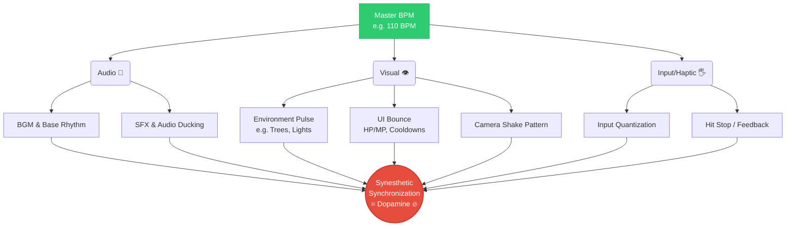
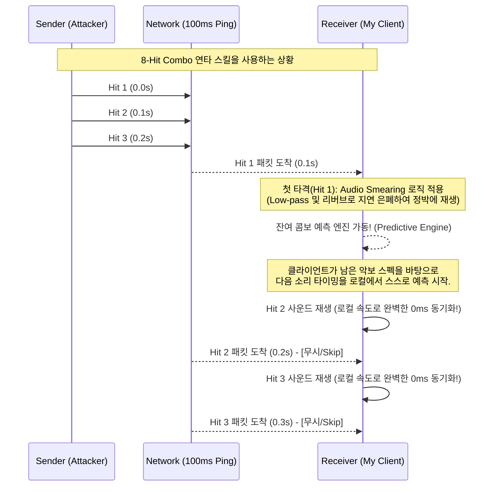
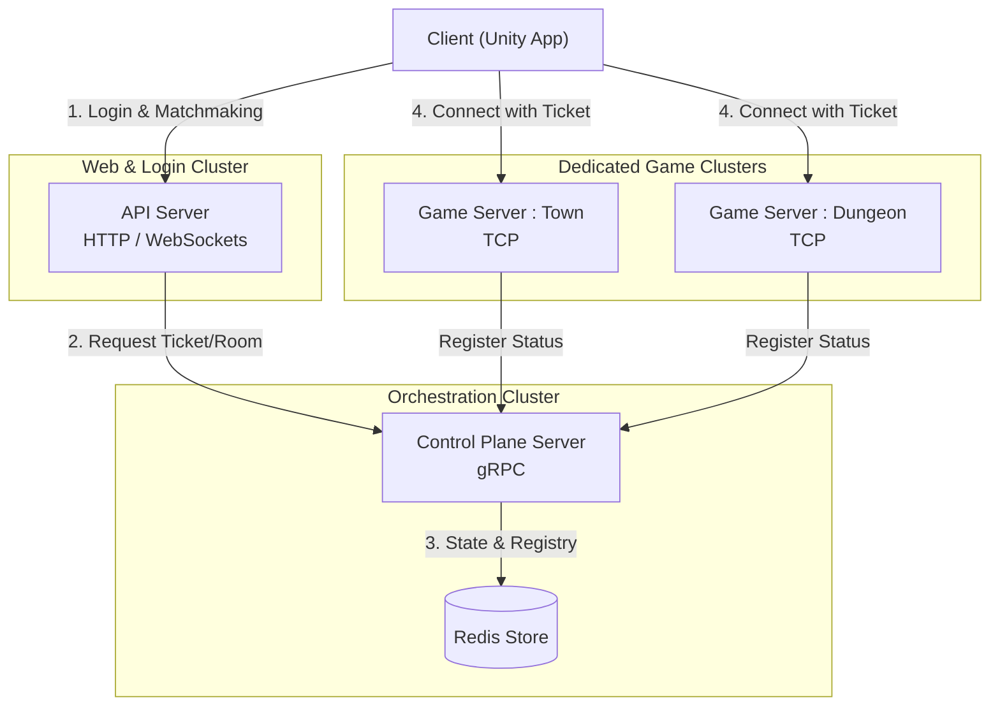
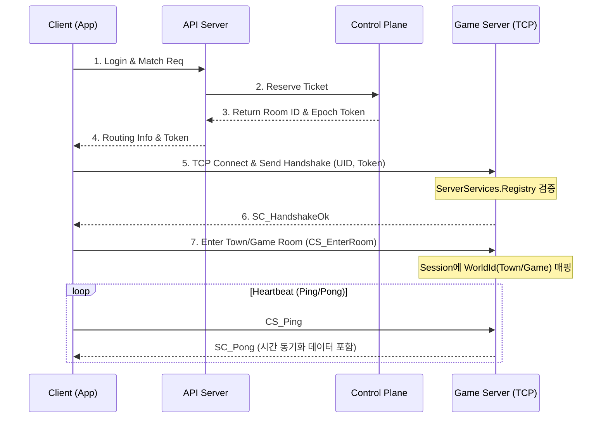
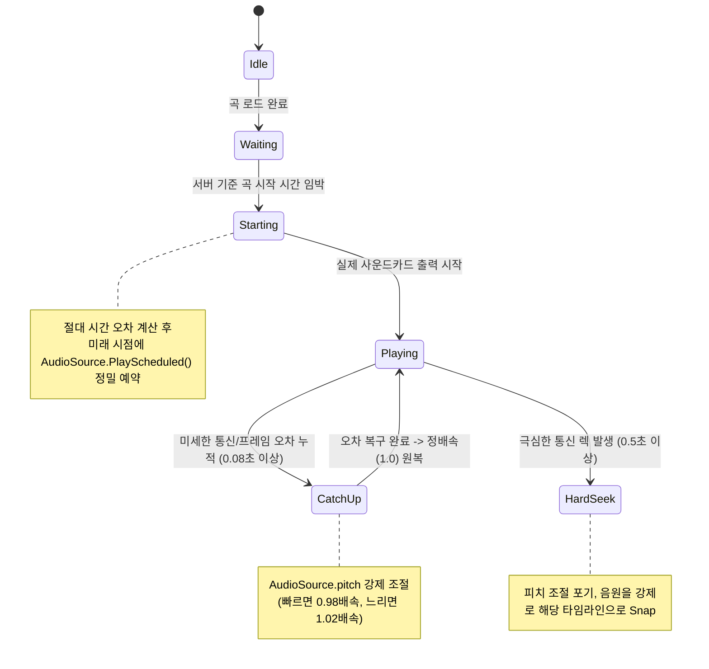
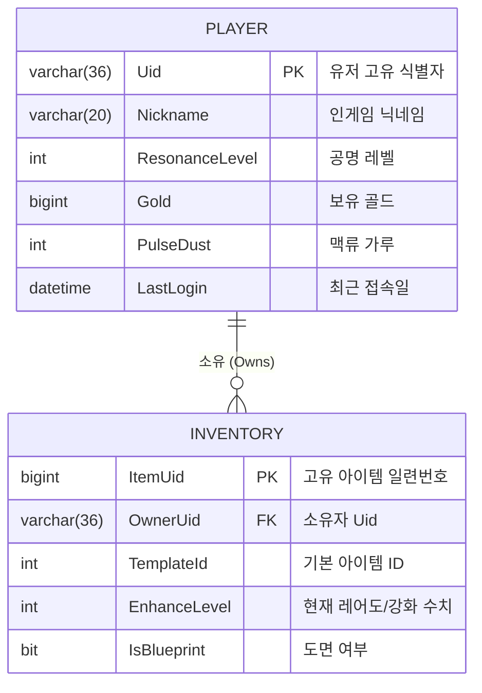

# 기세 세계 (Pulse World) - 2026 데브캠프 기획안 초안

---

## 1. 프로젝트 개요
* **게임명:** Pulse World (기세 세계 - 가제)
* **장르:** 쿼터뷰(Isometric) 멀티플레이 리듬 액션 RPG
* **플랫폼:** PC (Steam)
* **타겟 유저층:**
  * 정교한 박자 판정의 압박 없이, 음악의 흐름(Flow)에 몸을 맡기며 타격감과 액션을 즐기고 싶은 20~30대 캐주얼/액션 게이머 (Easy to learn)
  * 과도한 피지컬 제어나 피로도 없이 협동 전투의 카타르시스와 장비 세팅(파밍)의 재미를 선호하는 RPG 유저
* **핵심 컨셉:** 
  리듬이 단순 배경음악을 넘어 세계의 '물리법칙'으로 작동하는 코어 파밍 RPG. 음악의 템포(BPM)에 맞춰 전투하고, 무기와 '맥석(Crystal)'의 무한 시너지를 통해 나만의 장비 덱(Skill Deck)을 완성하는 게임입니다.

---

## 2. 기획 의도 및 목적
* **시장의 문제점 및 해결 방안:** 
  기존의 정통 리듬 게임은 고도의 반사신경, 극악의 난이도 및 암기 의존으로 인해 신규 유저에게 진입 장벽이 매우 높습니다. 하지만 대부분의 대중은 "음악에 맞춰 몸을 흔드는(Groove)" 원초적 쾌감 자체는 긍정적으로 여깁니다. 본작은 넉넉한 타이밍 판정(약간의 엇박자 허용)과 직관적인 박자 유도를 제공하여 **피지컬 압박은 대폭 낮추고(Easy), 타격 쾌감은 높이는** '리듬감 있는 액션'을 지향합니다.
* **목표(협동 플레이의 카타르시스):** 
  RPG 본연의 '파밍' 재미를 살리는 한편, 1~4인의 파티원이 각자 악기(무기류)의 세션이 되어 기괴한 박자 변조 패턴의 보스와 연대하여 맞서 싸우는 **긍정적 협동 플레이 구조(People)**를 구축하는 것이 핵심 목적입니다.

---

## 3. 핵심 게임 시스템 (Core Mechanism)
* **게임 흐름 (파밍 루프):**
  1. 던전 진입(조율) 및 일반/엘리트 몬스터 사냥.
  2. 전리품으로 '골드'와 '맥류 가루', '장비 도면' 획득.
  3. 무기와 상위 '맥석(Pulse Crystal)' 크래프팅(제작/제련) 진행.
  4. 나만의 차별화된 **Skill Deck(시너지 트리)** 완성.
  5. 더 높은 난이도의 스테이지(심연의 시련) 및 보스 레이드 도전.
* **핵심 전투/조작:** 
  단순한 버튼 난타가 아닌, **마스터 BPM에 스냅핑된 조작**을 기반으로 합니다. 
  `전조(Warning, 시각적 일그러짐) → 타격(Attack/Damage, 강력한 피드백 및 히트스탑) → 경직(InputLock)`의 사이클을 가집니다. 정점(Peak)에 맞춰 행동해야 맥류의 에너지를 폭발시켜 큰 대미지를 내며, 빗나갈 경우 에너지를 잃게 됩니다.
* **성장 요소:** 
  플레이어(맥류사)는 고정된 직업 대신 **무기 × 맥석** 조합에 따라 역할이 변합니다. 
  대검은 메인 비트(탱커/저음), 쌍검은 오프 비트(연속 공격/고음) 등 무기가 곧 악기이자 클래스 역할을 담당하며, 여기에 스킬 시너지를 직관적으로 구성하는 '맥석'을 소켓에 장착시킵니다.

---

## 4. 콘텐츠 및 그래픽 컨셉 (Visual Direction)
* **스토리/세계관:** 
  세계의 최심부에서 잠든 채, 모든 생명 에너지인 '맥류(Pulse Flow)'를 펌프질하는 '대지의 심장(The Great Heart)'. 이 맥류가 과포화되어 왜곡된 변이체들이 세상을 오염시키자, 대지의 진동(BPM)과 공명할 수 있는 이능력자 '맥류사(플레이어)'들이 정화에 나서는 다크 판타지 서사입니다.
* **그래픽 스타일:** 
  > **"빛과 움직임이 자연스럽게 세계의 템포를 알려준다."**
  어둡고 묵직한 분위기의 다크/어반(Dark/Urban) 판타지 위에 눈부신 네온 펄스(Cyan, Gold 등 고대비 Emission)가 극적으로 대비되는 아트워크입니다. 잔인한 묘사 없이 피격 시 맥석(빛의 기하학적 폴리곤)이 경쾌하게 비산되는 파편 연출을 다룹니다. 또한 UI부터 필드의 대지 구조물까지 마스터 BGM 템포에 맞춰 가볍게 바운스하며 생동감을 전달합니다.
* **캐릭터 및 몬스터:** 
  몬스터는 맵 깊이에 따라 패턴과 자아가 진화합니다. 
  일반 몬스터(맥류 잔향)는 단순한 정박자 공격을 반복하나, 엘리트(맥류 결정체)는 엇박자로 유저의 허를 찌릅니다. 그리고 **레이드 보스(맥류 심핵)**는 아군 파티의 4/4박자 리듬 자체를 일그러뜨려(3/4, 5/4박자로 변조) 광역 공격을 가하는 등 시스템의 룰을 깨는 최강의 '변조자' 기믹을 가집니다.

---

## 5. 게임 생태계 및 비즈니스 모델(BM)
* **게임 내 경제 (순환 구조):** 
  가챠나 P2W(Pay to Win)의 획득 방식이 아닌 **온전한 인게임 재화 성장**에 집중합니다.
  * **골드:** 상점 이용, 탐색, 기본적인 장비와 맥석 수수료 결제 (몬스터 사냥을 통해 기초 파밍 단계 지원)
  * **맥류 가루(Pulse Dust):** 맥석 추출, 특정 옵션 상위 맥석 확정(크래프팅), 소켓 개방용 희귀 재료 (코어 유저의 최종 엔드파밍 요소)
  * 파티 간 아이템 경쟁이나 분쟁 요소를 없애기 위해 '개별 드롭 시스템(Instanced Loot)' 및 '완전 계정 귀속' 정책을 채택, 순수 협동의 의미를 고취시킵니다.
* **비즈니스 모델(BM) (확장 중심형):** 
  * **기본 패키지:** Buy-To-Play 방식으로 스팀 등에 합리적인 가격의 베이스 타이틀을 발매합니다.
  * **확장팩/DLC:** 대규모 지역, 신규 무기 클래스 및 보스가 추가되는 메이저급 스토리/레이드 확장팩을 연 단위 단위로 판매.
  * **치장성 아이템:** 밸런스에 영향을 미치지 않는 캐릭터 외형/스킨, 개인 공간(마이룸) 꾸미기 요소 등 꾸준한 부가 수익 창출원을 둡니다.

---

### [참고: 성공적인 기획안을 위한 시각화 팁 (제출 시 첨부 요소)]
* *구체성(시각화):* 제출하는 본문 곳곳에 UI를 목업한 `weapon_socket_inventory_ui.png` 나 시너지 구성 `glass_echo_pulse_stone.png` 등을 함께 배치하여 이해도를 높일 것을 권장합니다.
* *재미 요소 강조 포인트:* 
  기획서 맨 앞단이나 마무리 즈음에 "이 게임은 **도전(Hard)**하는 보스 레이드의 스릴과, 넉넉한 판정으로 초심자도 쉽게 리듬을 탈 수 있는 **흥미성(Easy)**, 유저가 연주 밴드의 일원이 되어 협력하는 **사회적 쾌감(People)**을 모두 담아냅니다." 라는 문구를 삽입하는 것도 매우 효과적입니다.

<br>

---

# 📜 상세 기획 문서 목차 (Table of Contents)

> 본 섹션은 기획 초안을 뒷받침하는 구체적이고 상세한 시스템 및 기획 내용입니다. 궁금한 사항이나 깊이 있는 시스템 구조를 확인하실 수 있습니다.

* [1. 게임 컨셉 (Game Concept)](#1)
* [2. 세계관 및 스토리 기획 (Lore & Story)](#2)
* [3. 시스템 설계 (System Design)](#3)
* [4. 캐릭터 및 몬스터 설계 (Character & Monster)](#4)
* [5. 스킬 및 파동 시스템 설계 (Skill & Pulse System)](#5)
* [6. 장비 시스템 및 덱 세팅 설계 (Equipment & Deck)](#6)
* [7. 성장 및 크래프팅 시스템 설계 (Growth & Crafting)](#7)
* [8. 경제 시스템 설계 (Economy)](#8)
* [9. 오디오 및 리듬 설계 (Audio & Rhythm)](#9)
* [10. 레벨 및 패턴 기획 (Level & Pattern)](#10)
* [11. 아트 및 시각 연출 방향성 (Art & VFX)](#11)
* [12. UI/UX 및 화면 흐름 설계 (UI/UX)](#12)
* [13. 네트워크 및 서버 아키텍처 설계 (Network & Server)](#13)
* [14. 데이터베이스 설계 (Database)](#14)
* [15. 코딩 컨벤션 및 데이터 규약 (Convention & Protocols)](#15)

<div style='page-break-after: always;'></div>

--- 
<a id='1'></a>

# 01. 게임 컨셉 (Game Concept)

## 1. 개요 (Overview)
- **게임명:** Pulse World (가제)
- **장르:** 리듬 액션 RPG, 협동 (캐주얼 조작 지향)
- **플랫폼:** PC (Steam)
- **타겟 유저층:** 
  - 정교한 박자 판정의 압박보다는, 음악의 흐름에 맞춰 캐릭터를 조작하며 타격감을 즐기고 싶은 대중적인 액션 유저
  - 파밍과 장비 세팅의 재미를 선호하되, 과도한 피크 로컬 컨트롤이나 피로도 없이 협동 쾌감을 원하는 RPG 유저

## 2. 로그라인 (Logline)
**"흐름(Flow)을 잃어가는 세계에서 오염을 정화하며, 음악의 템포에 몸을 맡긴 채 다양한 무기를 휘두르는 리듬 액션 RPG"**

## 3. 핵심 특징 (Key Features)

### 3-1. 음악의 템포에 올라타는 전투 (Rhythm Driven Combat)
- **자연스러운 리듬 유도:** 적의 움직임과 맵의 주요 환경들이 BGM의 템포(BPM)와 조화를 이루어, 플레이어가 음악의 흐름 속에서 자연스럽게 리듬을 탈 수 있도록 돕습니다.
- **여유로운 판정 시스템:** 높은 정확도와 암기를 요구하는 정통 리듬 게임의 룰을 벗어났습니다. 약간의 엇박자도 콤보로 이어지며, 정박(Perfect)은 강제 조건이 아닌 더 큰 쾌감을 위한 일종의 '보너스 트리거'로 작동합니다.

### 3-2. "무기 × 맥석" 의 시너지 빌딩
- **무구의 장점:** 특정 직업이나 클래스의 굴레 없이, 맥류사(플레이어)가 손에 쥔 무기에 따라 다채로운 플레이 스킬을 체험하게 됩니다.
- **접근성 높은 파밍과 성장:** 오염을 정화하여 얻는 세계의 응축된 에너지원, '맥석(Pulse Crystal)'을 장비에 결합해 복잡한 트리 구성 없이 직관적인 스킬 시너지를 발견하고 파밍의 보람을 극대화합니다.

### 3-3. 긍정적인 파티 협동 플레이
- 혼자만의 페이스로 충분히 즐길 수 있도록 디자인되었으며, 필요나 기호에 따라 지인들과 부담 없이 더욱 즐거운 경험을 레이드에서 얻을 수 있습니다. ( 시즌 콘텐츠? 등 협력 멀티플레이 지원)
- 보스 전 또한 불쾌한 천장의 설정으로 의미없는 Loop성장을 지양하며, 다 함께 하나의 커다란 리듬에 맞춰 공격을 퍼붓는 연대감 형성에 초점을 맞춥니다.

## 4. 시각적 방향성 (Visual Direction)
> **"빛과 움직임이 자연스럽게 세계의 템포를 알려준다."**

- **그래픽 스타일:** 어둡고 묵직한 다크/어반 판타지 톤에 네온 빛(Cyan, Gold 등)이 강렬하게 어우러지는 아트 스타일을 채택. 
- **환경의 생동감(Micro-bounce):** 유저 인터페이스(UI)뿐만 아니라 대지의 주요 구조물들이 음악 템포에 맞춰 부드럽게 진동하여 플레이를 보조합니다.
- **피드백 이펙트:** 리듬에 맞춰 공격 시 몬스터가 빛의 결정 메쉬 단위로 부서지며, 가볍고 경쾌한 펄스 링 파동으로 누구나 쉽게 타격의 쾌감을 느낄 수 있습니다.

<br>

--- 
<a id='2'></a>

# 15. 세계관 및 스토리 기획 (Lore & Story Design)
# 마다마다다
## 1. 개요 (Overview)
본 문서는 Pulse World의 무대가 되는 가상의 세계와, "왜 플레이어가 리듬(음악)에 맞춰 전투를 벌여야 하는가?"에 대한 당위성을 부여하는 서사적 기반을 정의합니다. 게임의 모든 시스템(BPM, 판정, 스킬, 자원)은 맹목적인 기계적 설정이 아니라 세계관의 논리와 완벽하게 맞물립니다.

> **"이 세계의 모든 물질과 에너지는 대지의 맥동(Pulse)에 의해 작동한다."**

---

## 2. 핵심 세계관 (Core Lore)

### 2-1. 태초의 흐름과 맥석 (The Flow & Pulse Stone)
*   세계는 태초부터 일정한 **'흐름(Flow)'**을 가지고 태어났으며, 이 흐름이 곧 세계를 유지하는 거대한 생명 에너지입니다.
*   이 흐름 에너지를 물리적인 형태로 온전히 머금고 있는 광물이 바로 **'맥석(Pulse Stone)'**입니다. 
*   인류는 맥석을 채굴하고 그 안의 에너지를 동력원으로 삼아 폭발적인 문명 발전을 이루었습니다.
*   맥석이 뿜어내는 에너지는 일정한 파동(BPM)을 가지며, 에너지가 최대로 응축되는 **'정점(Peak)'**과 극도로 희박해지는 **'공허(Dead Interval)'** 상태를 반복합니다.

### 2-2. 오염과 맥류사 (Pollution & Pulse Mage)
*   어느 시기를 기점으로 인류가 맥석을 무분별하게 채굴, 채취하던 지역(Town)들을 중심으로 기이한 **'오염(Pollution)'** 현상이 발생하기 시작했습니다.
*   주변 생태계가 흉폭하게 변이하고 지역 전체의 에너지 흐름이 뒤틀려, 더 이상 맥석을 안전하게 채취할 수 없게 되었습니다.
*   이에 대응하여 오염의 근원을 정화하고 해당 지역을 안정화시키는 자들이 등장했는데, 이들이 바로 플레이어인 **'맥류사(Pulse Mage / Pulse Dancer)'**입니다.
*   맥류사의 주요 임무는 지역(Town)을 돌며 오염을 정화하여 다시 맥석을 채취할 수 있도록 돕는 것이며, 이것이 스테이지를 클리어하는 일차적인 목적입니다.

### 2-3. 리듬 전투의 당위성
*   비정상적으로 뒤틀린 오염된 개체들과 전투를 벌이고 정화 스킬을 사용하기 위해서는 거대한 흐름 에너지를 통제해야 합니다.
*   이 에너지는 심장이 박동하듯 **에너지가 가장 응축되는 찰나(흐름의 정점 = On-Beat 정박)**에만 증폭시킬 수 있습니다.
*   따라서 무술의 초식이나 주문의 영창은 이 세계의 박자(BPM)와 완벽히 동기화되어야 비로소 형태를 갖추고 강력한 위력을 발휘합니다.

| 인게임 판정 | 세계관적 해석 (Lore Meaning) | 전투 결과 |
| :--- | :--- | :--- |
| **Perfect** | **완전 공명:** 맥동의 정점에서 대지의 에너지를 100% 흡수. | 최대 파괴력 돌출, 무기 각성. |
| **Good** | **부분 공명:** 에너지가 흩어지기 직전/직후에 불완전하게 흡수. | 위력 감쇠, 일반적인 타격. |
| **Miss** | **공허:** 에너지가 없는 타이밍에 힘을 끌어내려다 흐름이 끊김. | 행동 실패(에너지 불발), 반동 발생. |

### 2-4. 세계의 진실 : 자정 작용 (The Hidden Truth)
*   인간의 관점에서 오염은 타락이자 재앙이지만, 세계(가이아)의 관점에서는 전혀 다른 의미를 가집니다.
*   인류가 흐름 에너지를 품은 맥석을 무분별하게 파헤치자 세계의 흐름이 불안정해졌고, 이 불안정한 흐름을 복구하고 무질서를 억제하기 위해 세계가 일으킨 **'거대한 자정 작용(방어 기제)'**이 바로 인간들이 눈에 보이는 오염이었습니다.
*   결국 맥류사들이 오염의 근원(보스)을 제거하는 행위는 지엽적으로는 해당 지역(Town)이 멀쩡해지는 것처럼 보이지만, 거시적으로는 세계의 흐름을 더욱 불안정하게 만드는 모순적인 행위입니다.
*   이 서사는 향후 시즌을 거듭하며 인류가 이 진실을 깨닫게 되고, 단순한 채굴을 위한 정화가 아닌 '진정한 의미의 흐름 회복'을 향해 나아가는 거대한 반전의 씨앗이 됩니다.

---

## 3. 캐릭터 및 생태계 (Characters & Ecosystem)

### 3-1. 플레이어: 맥류사 (Pulse Dancer)
*   **맥동감(Pulse Sense):** 일반인은 느끼지 못하는 대지의 진동(BPM)을 태어날 때부터 예민하게 느끼고 리듬에 몸을 맡길 수 있는 각성자들입니다.
*   클래스(직업)의 구분은 고정되어 있지 않으며, **'어떤 맥석(Pulse Crystal)이 박힌 무기에 공명하는가'**에 따라 전투 스타일(탱커의 묵직한 1비트 연성, 암살자의 16비트 연쇄 공명 등)이 완전히 달라집니다.

### 3-2. 적 오브젝트: 오염된 변이체 (Polluted Mutants)
인간의 눈에는 흉폭하게 변이된 괴물로 보이지만, 실상은 불안정해진 흐름을 복구하고 침입자를 배제하기 위해 세계가 빚어낸 **'대지의 수호 기제(단죄자)'**에 가깝습니다. 이들은 잃어버린 흐름에 집착하듯 본능적으로 맥동에 동기화되어 **항상 비트에 맞춰서만 행동**합니다. 이들을 처치하면 체내에 응축되었던 희귀한 광물인 **'맥석(Crystal)'**을 일부 회수할 수 있습니다.

| 생태계 등급 | 세계관 명칭 | 설정 및 게임플레이 특징 |
| :--- | :--- | :--- |
| **일반 (Normal)** | **맥류 잔향 (Pulse Echo)** | 국지적인 오염 파동이 단단한 물질에 깃든 약한 변이체. 자아가 희미하며 본능적인 정벌 패턴만 구사 (일반 던전 잡몹). |
| **정예 (Elite)** | **맥류 결정체 (Pulse Crystalline)** | 고밀도 오염 에너지가 뭉쳐 뚜렷한 형태를 갖춘 개체. 복합적인 맥동 패턴과 엇박자 전개를 시작 (파티 사냥 권장). |
| **보스 (Raid)** | **맥류 심핵 (Pulse Core)** | 오염의 근원이자, 사실상 그 지역의 흐름을 강제로 복원하려는 거대한 '수호 복합체'. 자체적으로 그 지역의 **흐름(BPM) 주파수를 왜곡(조작)**할 수 있어 지형 붕괴와 변박자(엇박) 패턴을 강제함 (엔드 콘텐츠). |

---

## 4. 인게임 시스템 ↔ 세계관 용어 매핑 (Term Mapping)

개발 과정의 시스템 코드(로직)는 다음과 같이 세계관 용어로 자연스럽게 번역됩니다.

### 4-1. 전투 상태 및 무기 매핑
*   **Warning (전조):** 무기의 맥석이 허공의 맥류 에너지를 강하게 빨아들이며 대기가 응축되는 현상. (몬스터의 타격 장판 생성)
*   **Damage (발산):** 무기가 증폭시킨 맥류를 적에게 폭발적으로 쏘아내는 순간.
*   **Move (순보):** 에너지가 터지는 파동(반동)에 올라타 순식간에 물리적 거리를 이동하는 기술.
*   **InputLock (후딜레이/경직):** 강한 에너지를 발산한 후, 무기와 사용자의 신체에 잔열(과부하)이 남아 식을 때까지 일시적으로 공명(행동)이 불가능한 상태.
*   **WarningColorStep:** 무기나 보스의 맥석에 에너지가 충전되는 임계점 강도 (노랑 ➔ 적색).

### 4-2. 레벨 장치 및 모드 매핑
*   **BPM (박자):** 현재 지역의 지하 깊이에 따라 결정되는 대지의 고유 '맥동 주파수'.
*   **BaseBeatDivision:** 가장 강력한 에너지가 흐르는 구역일수록 리듬이 촘촘하게 쪼개짐 (16비트/32비트 패턴 지대).
*   **StartDelayMs (게임 진입 전 대기):** **'조율(Calibration/Tuning)'**. 현지 던전의 맥동 주파수에 파티원들의 심박수와 감각을 강제로 동기화시키는 영점 조준 의식.
*   **Infinite Mode (무한의 탑):** **'심연의 시련 (Abyss Trial)'**. 심장에 한없이 가까이 내려가는 수직 동굴. 내려갈수록 맥동(BPM)이 영원히 가속되며 과부하가 걸리는 생존 한계 구역.


<br>

--- 
<a id='3'></a>

# 02. 시스템 설계 (System Design)

## 1. 핵심 루프 (Core Loop)
게임의 기본적인 흐름은 **[준비 및 조율] ➔ [전투 및 리듬 액션] ➔ [도면(Blueprint) 획득 및 Craft 제작] ➔ [성장]** 의 순환 구조를 가집니다. 플레이어가 부담 없이 반복하여 즐길 수 있는 직관적인 사이클을 지향합니다.

### 1-1. 핵심 성장 사이클 (Progression Cycle)
1. **로비 세팅:** 획득한 무기와 맥석(Pulse Crystal)을 조합하여 나만의 스킬 시너지 덱 세팅.
2. **스테이지 진입 (조율):** 파티원과 합류하거나 싱글 플레이로 진입 시 잠시 대기하며 해당 지역의 BPM(고동 주파수)에 감각을 맞춤.
3. **전투 (인게임):** 쏟아지는 몬스터들을 상대로 리듬에 맞춰 가볍게 액션을 전개하며 돌파.
4. **결산 및 제작 (Craft):** 스테이지 완료 후 획득한 도면(Blueprint)과 재료를 마을 공방에서 제작(Craft)하여 새로운 장비를 얻음.

---

## 2. 전투 시스템 (Combat System)
리듬감을 기반으로 하되 누구나 어렵지 않게 타격의 쾌감을 느낄 수 있는 전투 설계입니다. 

### 2-1. 3단 리듬 판정 생태계 (3-Tier Rhythm Check)
> 💡 *정교한 암기력과 칼트래킹이 아닌, 음악의 '흐름'을 타는 것에 의의를 둡니다.*

*   **Perfect (완전 공명):** 정박(On-Beat)에 100% 맞춰 입력. 데미지 120% 증폭 특화 처리 및 시각적/청각적 이펙트(히트 스탑 0.05초 등)가 눈에 띄게 차별화되며, 콤보 2배 누적.
*   **Good (부분 공명):** 정박에서 미세하게 벗어난 입력. 콤보가 유지되며 기본 데미지 100% 적중. 일반적인 둔탁한 타격감이 적용됨.
*   **Miss (공허):** 박자를 완전히 놓친 엇박 입력. 콤보가 초기화되고 데미지가 무효화되거나 딜 패널티 존재하나, 캐릭터 모션 자체의 후딜레이 패널티는 최소화하여 액션 템포를 이어감.

### 2-2. 액션 사이클 (Action Window)
캐릭터의 행동은 리듬(비트) 단위로 소모되며 직관적인 템포를 가집니다.
*   **전조 (Warning):** 적의 공격이나 강력한 스킬 발동 1~2비트 전, 시각적 왜곡이나 차징 이펙트가 선행되어 플레이어가 타이밍을 대비할 수 있도록 유도.
*   **타격 (Damage):** 정박 도달 시 펑 터지는 강력한 파동 발산.
*   **입력 잠금 (InputLock):** 스킬 등 행동 시 해당 액션에 할당된 N비트(Beat) 동안 다른 입력이 불가하게 묶이는 상태. 이를 통해 자연스럽게 액션의 템포와 마디를 형성유도합니다.
*   **쿨타임 (Cooldown):** 특정 스킬 사용 후, 해당 스킬을 다시 사용하기 위해 채워야 하는 N비트(Beat) 단위의 대기 시간. (쿨타임 중에도 InputLock 상태가 아니라면 다른 행동은 가능)

---

## 3. 시너지 및 상호작용 (Synergy & Interaction)
강압적인 파티 플레이의 역할(탱/딜/힐) 구분을 없애고 자율적인 조합을 강조합니다.

### 3-1. 무기 교체 = 클래스 변환
플레이어의 직업은 정해져 있지 않습니다. 가벼운 쌍검을 들면 빠른 비트의 속결 딜러가 되고, 대검을 들면 무거운 비트의 광역 딜러, 지팡이를 들면 파티를 돕는 서포터로 즉각 전환됩니다.

### 3-2. 파티 연대감 (Co-Op Vibe)
보스 전 또한 불쾌한 천장의 설정으로 의미없는 Loop성장을 지양하며, 
대신, 보스의 약점이 노출되는 특정 템포 구간에서 1~4인의 파티가 일제히 화력을 쏟아붓는 방식의 '합주(Ensemble)'와 같은 연대감을 주는 기믹 위주로 구성됩니다.

<br>

--- 
<a id='4'></a>

# 03. 캐릭터 및 몬스터 설계 (Character & Monster Design)

## 1. 개요 (Overview)
본 문서는 플레이어블 캐릭터와 적으로 등장하는 몬스터의 시스템적 데이터 속성과 생태계 등급 체계를 정의합니다.
해당 데이터 구조는 EntityDataManager를 통해 로드되며 클라이언트와 서버 양측에서 동일한 스펙(EntityId)으로 참조됩니다.

---

## 2. 플레이어 캐릭터 (Player Character)
플레이어는 특정 직업(Class)에 귀속되지 않는 **맥류사(Pulse Dancer)**입니다. 
리듬에 맞춰 공명하며 능력을 끌어내는 특징을 갖기 때문에, 스펙은 착용하는 무기(Weapon)와 보유한 맥석(Pulse Crystal)에 크게 의존합니다.

### 2-1. 캐릭터 모델 및 스펙 정의 (ID: 10 ~ 999)
남/여 성별에 따라 완전히 구별되는 개별 Entity ID를 부여하여 오디오, 애니메이션 리소스를 명확히 분리합니다.

| EntityID | Name | Gender | Type | Base HP | Base Speed | Description |
|---|---|---|---|---|---|---|
| 10 | 기본 캐릭터 (남) | Male | Player | 100 | 1.0 (BPM 배율) | 초기 지급 남성 캐릭터 |
| 11 | 기본 캐릭터 (여) | Female | Player | 100 | 1.0 (BPM 배율) | 초기 지급 여성 캐릭터 |
| 12 | 전용 스킨 (?) | ? | Player | 100 | 1.0 |  스킨 |

### 2-2. 주요 스탯 체계
*   **Base HP:** 기본 체력. 미스(Miss) 시 페널티 견딤 및 몬스터 공격 허용량.
*   **공명률 (Resonance Rate):** 맥석이 뿜어내는 에너지를 온전히 받아들이는 계수. (후반부 성장 스탯)

---

## 3. 몬스터 — 오염된 변이체 (Polluted Mutants)
> 💡 **상세 기획 분리 안내:**
> 몬스터의 세부 데이터(스탯, 패턴, 드롭 테이블 등)는 본 문서에서 전부 다루지 않으며, **마을(Town) 및 지역 테마별로 완전히 분리하여 개별 문서**로 설계합니다.
> 각 지역 문서 내에서 다시 **[일반 / 엘리트 / 레이드 보스]** 로 페이지를 나누어 기획의 디테일을 높일 예정입니다.

### 3-1. 생태계 등급 체계 (ID: 1,000 ~ 99,999)

#### 🟢 1단계: 맥류 잔향 (Pulse Echo) -> **일반 몬스터 (Normal)**
- **특징:** 국지적인 오염 파동이 물이나 돌 같은 질량에 깃든 약한 변이체.
- **전투 패턴:** 1~2가지의 단순한 PatternSet에 의존함.

#### 🟡 2단계: 맥류 결정체 (Pulse Crystalline) -> **엘리트 (Elite)**
- **특징:** 고밀도 오염 에너지가 결정화된 뚜렷한 변이체. 크리스탈 파츠를 장착.
- **전투 패턴:** 돌진, 광역 장판 섞어 쓰기 등 복합 패턴과 기믹을 보임.

#### 🔴 3단계: 맥류 심핵 (Pulse Core) -> **레이드 보스 (Raid Boss)**
- **특징:** 오염의 근원이자, 사실상 그 지역의 흐름을 강제로 복원하려는 거대한 '수호 복합체'.
- **협동 기믹:** 파티원과의 협력이나 일제히 화력을 집중해야 하는 대형 연출 기믹 포함. (세부 레이드 전용 페이지에서 상세 기술)

### 3-2. 몬스터(Entity) 데이터 파라미터 구조
추후 제작될 각 Town별 몬스터 기획서에서 EntityData.json과 매핑될 기본 스키마입니다.

| 파라미터명 (Property) | 데이터 타입 | 예시 값 | 시스템적 기능 및 설명 |
|---|---|---|---|
| EntityId | int | 1001 | 로드 될 모델 프리팹 및 데이터 식별자 매핑 |
| Name | string | "수정 슬라임" | 인게임 및 UI 노출명 |
| EntityType | enum(int) | 2 (Monster) | 시스템 식별 유형 (1: Player, 2: Monster 등) |
| MaxHp | int | 5000 | 몬스터의 전체 체력 |
| BaseDamage | int | 50 | 몬스터의 타격 데미지 |
| BeatPatternId | int | 5012 | 이 몬스터가 사용할 공격 패턴/비트 시퀀스 ID (테이블 참조 분리) |
| Rank | enum | Normal | 몬스터 등급 연동 (일반/엘리트/보스 필터링) |

<br>

--- 
<a id='5'></a>

# 04. 스킬 및 파동 시스템 설계 (Skill & Pulse System Design)

## 1. 개요 (Overview)
본 문서는 플레이어의 전투 액션뿐만 아니라 몬스터가 구사하는 모든 공격 패턴까지 포함하는 포괄적인 스킬(Skill) 구조를 정의합니다.
현재 프로젝트의 리소스 구조(NewSkillDto.cs, NewSkillSO.cs)에 맞추어, **타임라인(Timeline) 기반의 트랙(Track)과 이벤트(Event)** 로 작동하는 시스템을 기술합니다.

### 1-1. 스킬(Skill)과 패턴(Pattern)의 명확한 분리
*   **스킬 (Skill):** 단일 타격의 '실행 결과물'입니다. (예: 전방 3x3 범위에 100의 데미지를 주고 이펙트를 띄운다)
*   **패턴 (Pattern):** 여러 스킬을 특정 시간 단위(비트)로 나열한 **악보(Timeline)**입니다. 보스의 패턴은 직접 데미지를 정의하지 않고, "1비트에 70001번 스킬 호출, 3비트에 70002번 스킬 호출" 형식으로 스킬 ID를 참조하여 연속성을 부여합니다.

---

## 2. 스킬 지향점 및 덱 시스템 (Skill Deck)

### 2-1. 플레이어 장비 연동 덱
플레이어 본체 클래스는 고정 스킬이 없으며, 장비 소켓에 바인딩된 스킬로 덱을 구성합니다.
*   **Skill 1 (Q / 무기):** 주력 기본 공격 및 콤보 시작 (빠른 찌르기, 넓은 베기 등)
*   **Skill 2 (W / 신발):** 이동, 회피, 포지셔닝 (대시, 도약 등)
*   **Skill 3 (E / 장신구 1):** 보조 공격 및 디버프 (지속 데미지 장판 등)
*   **Skill 4 (R / 장신구 2):** 메인 유틸리티 및 궁극기 (광역 폭발, 적 끌어당기기 등)

### 2-2. 범용 식별 규약 (Entity ID)
스킬 데이터 관리를 위해 소유자별로 식별을 분리합니다. (0_Convention_Protocols.md 참조)
*   600,000 ~ 699,999 : Player Skill (유저 스킬)
*   700,000 ~ 799,999 : Monster Skill (몹 전용 스킬)
*   800,000 ~ 849,999 : System/Trap (맵 기믹, 낙뢰 등)

---

## 3. 타임라인 기반 스킬 구조 (Skill Architecture)

현재 클라이언트/서버에서 공통으로 참조하는 스킬은 NewSkillDef 구조체를 기반으로 **트랙(Track)** 과 **이벤트 액션(Event Action)** 별로 작동합니다. 하나의 스킬 안에 여러 동작(예: 전조 후 타격)을 비트 단위로 배치할 수 있습니다.

### 3-1. 스킬 최상위 명세 (NewSkillDef)
*   SkillId: 고유 식별자 (600001 등)
*   TotalDurationBeats: 스킬의 전체 길이(비트 수). 애니메이션 길이나 기본 Input Lock 타임의 기준선 역할.
*   Tracks: 다수의 SkillTrack을 보유하여, 이펙트와 데미지를 병렬로 처리 가능.

### 3-2. 스킬 트랙과 이벤트 (SkillTrack & SkillEvent)
하나의 트랙(Track) 내에는 특정 비트(Beat)에 발동하는 이벤트(Event)들이 리스트업 됩니다.
*   TriggerBeat: 동작이 발동하는 시작 비트 타임 (0부터 시작).
*   DurationBeats: 동작의 지속 시간 (예: 장판이 3비트간 유지).
*   Action: 실제 작동하는 기능 컴포넌트 (BaseAction 다형성).

---

## 4. 스킬 모듈 액션 타입 (Skill Action Types)

이벤트에 부착할 수 있는 BaseAction의 종류와 데이터 속성입니다. 이들을 조합하여 무한한 스킬 패턴을 스크립트 없이 Json/SO 데이터만으로 창출합니다.

| Action Type | 세부 파라미터 및 설명 | 활용 예시 |
|---|---|---|
| **1. Warning (전조)** | Shape(Rect/Diamond/Custom), ColorSteps(빨강/노랑 등 시간별 색상 헥스 적용) | 보스가 2비트 뒤에 내리칠 장판의 범위를 미리 붉게 표시. |
| **2. Damage (타격)** | Shape(판정 범위), Amount(피해량), HitPlayers/Monsters(피아식별), RecalculateTargets(실시간 트래킹 여부) | 전조 액션 다음 비트에 배치하여 실제 데미지를 입히는 폭파 로직. |
| **3. Move (이동)** | MoveType(Dash/Walk/Blink), Distance, DirectionX/Y | 회피 스킬 구르기, 혹은 몹의 돌진 공격 로직. |
| **4. InputLock** | (전역 조작 잠금) - 상태이상 | 스킬 시전 중 혹은 피격 시 강제로 다음 조작을 N비트동안 잠그는 역할. |
| **5. Wait** | (타임 오프셋 대기) | 특정 구간 동안 트랙을 쉬게 함. |

### 4-1. 모양 판정 (Shape Definitions)
모든 전조(Warning)와 타격(Damage)은 아래의 다형성 Shape를 매핑하여 범위를 결정합니다.
*   RectShape: 폭(Width)과 길이(Height), 시전자 방향성 회전 유무(RotateWithSource).
*   DiamondShape: 다이아몬드형 광역 범위 적용 (반경 Radius).
*   CustomCellsShape: GridPoint (X, Y) 픽셀/타일 좌표를 하나하나 지정하는 커스텀 형태.

---

## 5. (추후 과제) 시너지 및 맥석 결합 시스템
현재 타임라인 스킬 시스템 위에, 플레이어가 장비에 '맥석'을 부착할 시 NewSkillDef 내부의 속성(예: 이벤트의 DurationBeats 감소, Damage 액션의 Amount 배수 증가, 이펙트 추가 장판 트리거)이 동적으로 덮어씌워지거나 오버라이드 되도록 설계할 예정입니다.

<br>

--- 
<a id='6'></a>

# 05. 장비 시스템 및 덱 세팅 설계 (Equipment & Deck Design)

## 1. 개요 (Overview)
본 게임에서 장비는 단순한 스탯 상승의 수단을 넘어, **캐릭터의 직업(클래스)과 전투 액션을 결정짓는 가장 핵심적인 시스템**입니다. 
플레이어는 6개의 장비 슬롯을 조합하여 자신만의 전투 스타일(스킬 덱)을 구축하게 됩니다.

---

## 2. 6블록 장비 슬롯 구조 (6-Slot System)

캐릭터는 총 6부분의 장비를 착용할 수 있으며, 각 부위는 고유한 역할과 '스킬 바인딩' 여부를 가집니다.

### 2-1. 액티브 스킬 바인딩 부위 (Active Skill Slots)
4개의 부위는 착용 즉시 퀵슬롯(Q, W, E, R 등)에 액티브 스킬을 제공합니다.
1. **무기 (Weapon):** 주력기/평타
   - 전투의 기본 템포와 사거리를 결정합니다. (예: 빠른 템포의 쌍검, 묵직하고 넓은 대검)
2. **신발 (Shoes):** 이동기/생존기
   - 박자에 맞춘 회피, 도약, 돌진 등 포지셔닝 스킬을 제공합니다.
3. **장신구 1 (Accessory 1):** 보조/유틸리티
   - 전방 방어막 생성, 도트 데미지 장판 등 전투를 보조합니다.
4. **장신구 2 (Accessory 2):** 특수 기믹 및 궁극기 (Beat Guide & QTE Event)
   - 캐릭터 주위를 둥글게 공전(Orbit)하며 현재 스테이지의 BPM과 맥동을 시각적으로 보여주는 **'비트 가이드(Beat Indicator)'** 역할을 기본적으로 수행합니다.
   - 스킬 발동 시 컷씬 연출과 함께 사용자가 선입력을 성공하면 **파티원 전원에게 '순차적 커맨드 입력(QTE)'을 강제**합니다. 파티 전원의 입력이 완벽히 성공해야만 전황을 뒤잡을 수 있는 강력한 시너지 효과(예: 파티 전체 일시 무적, 폭발적인 광역 딜 등)를 냅니다.

### 2-2. 패시브 및 스탯 특화 부위 (Passive Slots)
나머지 2개의 부위는 직접적인 액션을 주지 않지만, 스탯 뻥튀기나 조건부 패시브로 덱의 뼈대를 뒷받침합니다.
5. **머리 (Head):** 조건부 트리거 패시브
   - "Perfect 판정 3회 연속 성공 시 다음 스킬 데미지 증가" 같은 리듬 관련 패시브.
6. **갑옷/상하의 (Armor):** 생존 스탯 및 오라
   - 체력(MaxHp), 방어력 등 기본 생존력을 높이고 파티원에게 수동적인 오라 효과 제공.

---

## 3. 맥석 (Pulse Crystal) 룬 시스템

장비만으로도 스킬의 형태가 정해지지만, 각 장비에 뚫려 있는  **소켓(Socket)**에 **맥석(Pulse Crystal)**을 장착하여 스킬의 잠재력을 무궁무진하게 변형(Synergy)할 수 있습니다.

### 3-1. 맥석의 확장성 (Extensibility)
*   **스킬 형태 변형:** 투사체 개수 증가?, 데미지 속성 변경, 폭발 범위(Shape) 확장.
*   **리듬/쿨타임 조작:** 스킬의 타격 틱(HitCount) 증가, 쿨타임(CooldownBeats) 감소.
*   **파티 시너지:** 타격 시 파티원 회복, 보스 어그로 획득 등.

### 3-2. 무한 시너지 빌드 예시 (Build Crafting)
*   **"광역 디버프 폭발 빌드"**: [적 방어력 감소 장판 장신구] + [다단 히트 쌍검 무기] + [맥석: 타격 횟수 비례 추가 데미지]
*   **결과:** 장신구로 넓은 범위에 방어력 감소 지대를 깐 뒤, 쌍검의 빠른 템포와 타격 횟수 증가 맥석으로 순식간에 누적 데미지를 폭발시키는 콤보 완성.

---

## 4. 밸런스 및 리스크 검증 (Risk & Solutions)

자유도가 높은 장비 종속형 덱 시스템은 '오버파워(OP)' 덱의 고착화라는 리스크를 동반합니다. 이를 방지하기 위한 안전장치입니다.

### 4-1. 밸런스 통제 장치
1. **입력 잠금 (Input Lock) 페널티:** 강력한 무기+맥석 조합일수록, 시전 후 다른 행동을 할 수 없는 '잔열(InputLockBeats)'이 길게 발생하여 리스크를 높입니다.
2. **에너지(코스트) 상한선:** 장비 부위마다 장착할 수 있는 맥석의 최대 수용량(Cost Limit)을 두어, 무한정 좋은 맥석만 도배하는 것을 방지합니다.
3. **상성 및 기믹 타파 권장:** 레이드 보스(맥류 심핵)마다 특정 무기군(예: 타격계)이나 특정 유틸기(예: 무적 회피기)가 반강제되도록 디자인하여, 다양한 덱 스위칭을 유도합니다.

---

## 5. 장비 데이터 구조 (Data Spec Guideline)

2_Equipments.csv 및 EntityIdDefine.cs 규약에 맞춘 베이스 디자인 데이터입니다.

| Category | ID Range | Resource Path | 주요 데이터 파라미터 |
|---|---|---|---|
| **Weapon** | `100,000` ~ `199,999` | `Prefabs/Equipment/Weapon` | `BaseDamage`, `BoundSkillId` |
| **Head** | `200,000` ~ `229,999` | `Prefabs/Equipment/Armor` | `BaseHp`, `PassiveSkillId` |
| **Armor (Top/Bottom)** | `230,000` ~ `239,999` | `Prefabs/Equipment/Armor` | `BaseHp`, `BaseDef`, `PassiveSkillId` |
| **Shoes (Boots)** | `240,000` ~ `249,999` | `Prefabs/Equipment/Shoes` | `BaseSpeed`, `BoundSkillId` |
| **Accessory**| `300,000` ~ `399,999` | `Prefabs/Equipment/Accessory`| `ElementStat`, `BoundSkillId` |

*※ BoundSkillId 필드에는 04_Skill_Design.md에서 정의한 60만 번대 유저 스킬 ID가 할당되어 장착 시 호출됩니다.*


<br>

--- 
<a id='7'></a>

# 07. 성장 및 크래프팅 시스템 설계 (Growth & Crafting System)

## 1. 개요 (Overview)
본 게임에서 캐릭터 본체의 레벨업(레벨 스케일링) 비중은 상대적으로 낮으며, 성장의 성취감은 철저히 **장비 제작(Crafting)과 맥석(Pulse Crystal) 제련**에 집중되어 있습니다. 플레이어는 몬스터를 사냥해 모은 전리품을 통해 스스로 강력한 무기를 '주조'하고 스킬의 한계를 돌파합니다.

---

## 2. 캐릭터 본원 성장 (Base Progression)

### 2-1. 공명 레벨 (Resonance Level)
*   **특징:** 계정 혹은 캐릭터의 전체적인 진행도를 나타내는 지표.
*   **효과:** 레벨 디자인 상의 기본적인 체력(Base HP)과 소폭의 기본 데미지만 상승합니다. (전투력에 미치는 영향은 10~20% 내외)
*   **목적:** 유저가 "게임 체이지를 클리어하며 경험치가 쌓이고 있다"는 기본적인 RPG의 체감을 주기 위한 보조 스탯입니다.

---

## 3. 핵심 콘텐츠: 장비 크래프팅 (Equipment Crafting)
완제품 장비가 필드에서 뚝 떨어지는 구조가 아닌, **도면(Blueprint)과 재료를 모아 유저가 직접 장비를 완성하는 '공방 시스템'**이 파밍의 메인 콘텐츠입니다.

### 3-1. 도면(Blueprint) 시스템
장비를 제작하기 위한 첫 번째 제약/해금 장치입니다.
*   **획득처:** 보스 최초 클리어, 특정 테마 던전 히든 룸 발견, 마을 평판 달성 등.
*   **특징:** 도면을 한 번 등록하면, 해당 장비를 언제든 마을 공방에서 제작할 수 있는 권리가 영구 해제됩니다.

### 3-2. 제작 시스템의 재미 요소 (Crafting Mechanics)
장비 제작은 단순히 버튼 한 번을 누르는 행위를 넘어, 반복 파밍에 목표 의식을 부여합니다.
*   **크래프팅(제작) 상호작용 (TBD):** 공방에서 장비를 만들어내는 *진행 과정 자체*를 소소한 미니 콘텐츠나 재미 요소(예: 리듬 타이밍 맞추기 등)로 뺄 예정입니다. (현재 세부 기획 확정 전, 추후 보강)
*   **부품 파밍:** 특정 보스의 '심핵(Core)', 기믹을 파훼해야만 얻을 수 있는 '온전한 수정' 등 의미 있는 재료 수집의 재미를 제공합니다.
*   **대성공/변이 (Great Success/Mutation):** 같은 도면으로 장비를 만들더라도, 제작 시 무작위 확률로 '대성공' 판정이 뜨면 장비의 Base 스탯이 한계치를 돌파하거나, 뚫려있는 빈 맥석 소켓(Socket)의 개수가 1칸 더 늘어나는 등 파밍의 고점(End-Game Goal)을 자극합니다.

---

## 4. 장비 및 스킬(맥석) 강화 (Enhancement)

제작된 장비와 장착된 맥석의 위력을 상위 단계로 끌어올리는 구조입니다. 

### 4-1. 맥석 강화 시스템 (Pulse Crystal Reforging)
맥석은 플레이어의 액티브 스킬 그 자체이므로, 이를 육성하는 것이 덱(Deck) 전투력 상승의 주요 수단입니다.
*   **맥류 가루(Pulse Dust):** 사냥을 통해 흔하게 얻는 기본 '강화 재료' 자원입니다.
*   **맥석(Pulse Crystal):** 장비 소켓에 박아넣는 '스킬 코어' 개체 자체입니다.
*   **제련 (Tier Up):** 하급 맥석 N개 + 맥류 가루(Pulse Dust)를 소모하여, 맥석의 티어를 올려 고정 수치(예: 쿨타임 감소)를 강화합니다.
*   **속성 부여:** 거대한 보스 전리품을 촉매제로 사용하여, 기존 맥석에 [화염 도트 피해 추가] 같은 부가적인 유틸 속성을 인챈트할 수 있습니다.

### 4-2. 장비 레어도 승급 (Equipment Rarity Upgrade)
장비 자체의 강화는 의미 없는 +레벨(MaxLv) 상승을 무한대로 반복하는 방식이 아닙니다. **동질의 장비를 상위 레어도(Rarity)로 진화시키는 '근본적인 성장'**을 따릅니다.
*   **승급 (Tier/Rarity Upgrade):** 동일한 설계도(Blueprint)로 만든 동일 장비를 2개 이상 모아 하나로 압축제련하면, 장비의 총 레어도(예: Magic ➔ Rare ➔ Epic)가 한 단계 상승합니다.
*   **효과:** 레어도가 오를 때마다 Base 스탯이 대폭 오르거나 소켓이 추가 개방되어 새로운 맥석을 낄 수 있게 됩니다.
---

## 5. 경제 및 성장 루프 (The Growth Loop) 요약
1.  **경험:** 보스에게 패배하거나 아슬아슬하게 승리.
2.  **도면 확보:** 승리/탐색 보상으로 상위 무기/유틸기의 도면(Blueprint) 획득.
3.  **조달:** 도면에 명시된 몬스터 부위 파괴/특정 던전 파밍을 통해 재료 수집.
4.  **제작:** 마을(Town) 공방에서 장비를 제작하여 새로운 덱(스킬) 해금.
5.  **제련:** 장비의 소켓에 맥석을 장착하고 강화하여 시너지 폭발 (➔ 1번으로 돌아가 상위 보스 도전).


<br>

--- 
<a id='8'></a>

# 06. 경제 시스템 설계 (Economy System)

## 1. 개요 (Overview)
본 문서는 게임 내 재화의 획득, 소비, 순환 구조를 정의합니다.
Pulse World는 **패키지 판매(Buy-to-Play) 및 확장팩 DLC 중심의 비즈니스 모델**을 지향하므로, 인앱 결제(가챠, P2W) 요소가 배제된 철저히 **순수 인게임 플레이 보상 기반의 경제 구조**를 가집니다.

게임의 경제는 유저가 던전을 돌고, 재화를 모아 '장비 파밍'과 '맥석(Pulse Crystal) 세팅'을 완성해 나가는 코어 루프를 완벽하게 보조하는 데 목적이 있습니다.

---
## 2. 기본 재화 명세 (Currencies)

모든 재화는 오직 플레이(전투, 퀘스트, 분해 등)를 통해서만 획득할 수 있습니다.

### 2-1. 골드 (Gold)
*   **성격:** 게임 내 가장 기본적인 범용 통화.
*   **획득처:** 
    *   스테이지 클리어 보상 (난이도/BPM에 비례하여 증가)
    *   몬스터 사냥 시 드롭
    *   사용하지 않는 하급 장비 및 잉여 맥석 판매
*   **소비처:** 
    *   NPC 상점 (회복 포션, 기본 강화 재료 구매)
    *   장비 강화 및 맥석 제련(크래프팅) 수수료
    *   특수 숨겨진 스테이지(비밀 차원 등) 입장 시 탐색 비용

### 2-2. 맥류 가루 (Pulse Dust)
*   **성격:** 성장의 핵심이 되는 마일리지 및 크래프팅 전용 특수 재화.
*   **획득처:** 
    *   엘리트 등급 이상 몬스터 및 레이드 보스 처치
    *   획득한 **맥석(Pulse Crystal)**을 분해할 때 추출
*   **소비처:** 
    *   무작위 획득이 아닌, 유저가 원하는 특정 옵션의 '상위 맥석'을 **확정 제작(Crafting)**할 때 소모
    *   장비의 막힌 소켓(Socket)을 개방할 때 사용

---

## 3. 핵심 아이템 파밍 구조 (Item Farming Loop)

무과금/코어 유저 불문하고 게임의 엔드 스펙은 철저히 '인게임 파밍과 노력'을 통해 이뤄지도록 설계합니다.

### 3-1. 장비 (Equipment) 크래프팅 생태계
*   **완제품 드롭 지양:** 스테이지 클리어 시 장비 완제품이 직접 떨어지는 확률적 파밍을 지양합니다.
*   **도면(Blueprint) 획득:** 보스 처치, 퀘스트, 비밀 구역 탐사 등을 통해 특정 장비의 **'제작 도면'**을 획득하는 것이 1차 목표입니다.
*   **크래프팅(Crafting)의 재미:** 도면을 얻었다면, 해당 장비를 완성하기 위해 필요한 테마별 희귀 재료(보스 심핵, 특수 광석 등)를 모으는 과정 자체가 파밍의 재미가 됩니다. 제작 시 대성공(Great Success) 수치에 따라 무작위 추가 스탯이 붙는 등 **제작 콘텐츠 자체가 독립적인 플레이 동기**를 제공합니다.

### 3-2. 맥석 (Pulse Crystal) 순환
*   장비보다 훨씬 빈번하게 드롭되며, 무한 시너지 빌드(덱 세팅)의 핵심 부품입니다.
*   **제련(Reforging):** 하급 맥석 N개와 골드를 소비하여 같은 등급의 다른 맥석으로 재설정(Reroll)하거나, 상위 등급으로 업그레이드할 수 있습니다. (추가 과금 요소 일절 없음)
*   **맞춤 제작(Craft):** 앞서 언급한 '맥류 가루(Pulse Dust)'를 듬뿍 소모하여, 현재 빌드에 필수적인 특정 맥석(예: 타격 수 만렙 맥석)을 원포인트로 제작합니다.

---

## 4. 거래 (Trading) 및 계정 귀속

### 4-1. 완전 계정 귀속 (Account Bound)
*   **1:1 거래 및 경매장 미지원:** 협동 플레이인 경우 장비를 거래하여 스펙을 올리는 방식 보다 같이 필요한 재료를 모으는 행동을 도움으로서 플레이의 재미를 높이도록 의도. **모든 아이템과 재화는 계정에 귀속**됩니다.

### 4-2. 파티 플레이 아이템 분배
*   **개별 드롭 시스템 (Instanced Loot):** 파티 레이드 시 드롭되는 모든 아이템과 골드는 플레이어 각자의 화면에만 보이며 개별적으로 습득합니다. 
*   이를 통해 파티원 간의 아이템 입찰 경쟁이나 분쟁을 없애고, 긍정적이고 스트레스 없는 협동 파밍의 재미만 남깁니다.


<br>

--- 
<a id='9'></a>

# 12. 오디오 및 리듬 설계 (Audio & Rhythm Design)

## Pulse World: 극대화된 리듬감(Groove)을 게임플레이로 승화시키는 디자인 방법론

본 문서는 단순히 "BGM 틀어놓고 버튼을 누르는 리듬게임"이 아닌, MMORPG 환경인 **Pulse World**에서 **플레이어가 어떻게 압도적인 리듬감(Groove)과 소속감을 느끼게 할 것인가**에 대한 핵심 게임 디자인, 시스템 공학, 그리고 세부 SFX 연출 방법론을 총망라합니다.

---

## 1. 완벽한 '리듬감(Groove)'의 체감 (공감각적 동기화)

음악과 게임이 융합된 장르에서 몰입감(Flow)을 느끼기 위해서는 청각, 시각, 촉각이 단 하나의 축(Master BPM)에 맞아떨어져야 합니다.



### 1-1. 시각적 동기화 (Visual Sync)
**귀를 막아도 눈으로 박자를 읽을 수 있어야 합니다.**
* **환경 시스템 (월드의 심장박동):** 나무의 흔들림, 광원의 깜빡임 등이 서버의 마스터 BPM에 맞춰 맥동(Pulse)합니다.
* **UI/UX 미세 바운스:** 스킬 아이콘 쿨다운, HP바 팝핑 폰트 등이 음악적 그리드(Grid)에 스냅핑되어 진동합니다.
* **카메라 제어:** 타격 카메라 진동 주파수를 BGM의 킥(Kick) 드럼 리듬과 동일하게 맞춥니다.

### 1-2. 청각적 쾌감 (Audio Layering & Psychoacoustics)
* **주파수 마스킹 방지 (Audio Ducking):** 여러 타격음이 겹칠 때 BGM이 떡지지 않도록, 타격 순간 주변 배경음의 특정 주파수(중역대)를 0.05초간 눌러주어 플레이어 액션만 명료하게 귀에 꽂히게 만듭니다.
* **어택(Attack) 극대화:** 타격음의 도입부(10ms 이내)를 극도로 날카롭게 만들고 잔향을 BPM 템포와 일치시킵니다.

### 1-3. 입력 보정 (Input Tolerance Mechanism)
* **해결책 (Input Quantization):** 유저가 정박에서 0.1초 늦게/빠르게 쳐도, 실제 타격 이펙트/효과음 시간은 **가장 가까운 완벽한 정박자(Grid Line)로 당기거나 미룹니다.** 뇌가 '리듬을 타고 있다'고 완벽하게 착각하게 만듭니다.

---

## 2. 다이내믹 리듬 연출과 스케일 (Contextual Scaling)

분위기와 전투 페이즈에 맞춰 화성학적, 리듬적 밀도를 다르게 배분합니다.

| 페이즈 (Phase) | 분위기 (Atmosphere) | 리듬 밀도 (Density) | 화성 (Harmony/Chord) | BGM / 연출 특징 |
| --- | --- | --- | --- | --- |
| **마을 (Town)** | 휴식, 예열, 소통 | 낮음 (Sparse) | Em-C-G-D (안정적) | Lo-Fi, Chill-out, 자연스러운 맥동 |
| **일반 필드 (Stage)** | 경쾌한 탐험, 짧은 전투 | 중간 (Call & Response) | 유동적 (다이나믹 변경) | 전투 개시 시 악기 레이어 실시간 추가 |
| **레이드 Ph1 (Awakening)** | 절망감, 압박감 | 매우 낮음 | 드론 사운드 / E Root | 공포 게임 같은 정적, 무거운 베이스 |
| **레이드 Ph2 (Clash)** | 극도의 혼란, 위기 | 높음 (Swing, 불규칙) | Tritone (증4도 불협화음) | 엇박 난무, 콤보 방해, 기괴한 텐션 |
| **레이드 Ph3 (Epic)** | 카타르시스, 클라이맥스 | 최고조 (Polyrhythm) | 웅장한 해결 (Resolution) | 4인의 무기 속도가 맞물리는 폴리리듬 |

### 2-1. 상세 화성학 전개 시나리오 예시

| 상황 / 시나리오 | 목표 감정선 | 적용되는 코드 진행 예시 (키: Em 기준) | 화성학적 특징 및 유저 체감 |
| --- | --- | --- | --- |
| **마을 (일반)** | 평화, 안정 | `Em(I) ➔ C(VI) ➔ G(III) ➔ D(VII)` | 대중음악/팝에서 주로 쓰이는 무난한 "4코드 신드롬". 심박수 안정화. |
| **마을 (황혼/밤)**| 서정적 애수 | `Cmaj7 ➔ Bm7 ➔ Am7 ➔ Gmaj7` | 메이저 세븐스의 부드럽고 재지(Jazzy)한 느낌. 텐션을 제거함. |
| **일반 필드 조우**| 모험, 전진 | `Em(I) ➔ C(VI) ➔ D(VII) ➔ Em(I)` | 마지막에 으뜸화음(Em)으로 돌아와 안도감을 주며 짧은 전투에 적합. |
| **정예몹 난입** | 위기감 | `Em(I) ➔ C(VI) ➔ D(VII) ➔ B7(도미넌트)` | 마지막에 세컨더리 도미넌트(B7, D#음 포함)를 써 극도의 긴장성 유발. |
| **보스전 Ph1** | 공포, 무력감| `E Pedal Point (E음 베이스 지속)` | 화성이 진행되지 않고 베이스가 하나의 음으로 짓눌러 미지의 공포를 자아냄. |
| **보스전 Ph2** | 파괴적 혼란| `Em ➔ Bb (트라이톤 이동)` | 화성학적으로 가장 악독한 증4도(Tritone) 이동. 예측 빗나감 유도. |
| **보스전 Ph3** | 카타르시스 | `Em ➔ C ➔ Am ➔ B7` | 위기가 최고조(B7)에 달한 뒤, 다시 새로운 루프로 강렬하게 폭발하는 루프. |

---

## 3. 무기별 주파수 분배와 리듬 앙상블 (Rhythm & Melody Roles)

### A. 리듬/타악기 계열 (Percussion & Beat)
| 무기군 (예시) | 리듬적 역할 | 오디오 출력 (Sound Output) | 주파수/음향 역할 |
| --- | --- | --- | --- |
| **초중량 (대검/탱커)** | **메인 비트 (Downbeat)** | **[EDM 킥 드럼 / 파워 톰톰]** 우웅-쾅! | 저음역대(20~80Hz) 펀치감 확보. BGM 베이스 제어. |
| **경량 근접 (쌍검/암살)** | **오프 비트 (Syncopation)**| **[하이햇 / 셰이커 / 전자 스네어]** 채챙-챙! | 고음역대(4k~10kHz) 타격감. 베이스를 뚫고 나오는 속도감. |

### B. 멜로디/화성 계열 (Melody & Harmony)
| 무기군 (예시) | 리듬적 역할 | 오디오 출력 (Sound Output) | 주파수/음향 역할 |
| --- | --- | --- | --- |
| **원거리 (활/머스킷)** | **아르페지오 / 오스티나토** | **[플럭 신스 / 어쿠스틱 기타]** 통통 튐. | 중고음역대. 현재 마스터 진행에 맞춰 피치(Pitch) 기변 발사. |
| **서포팅 마법 (힐러)** | **코드 패드 (Sustain/Pad)** | **[풍성한 신스 패드 / 콰이어]** 우우웅~ | 중역대(500~2kHz). 파티에 거대 공간감과 안정감 부여. |
| **파괴 마법 (궁극기)** | **브라스(Brass) 리드 멜로디** | **[디스토션 기타 / 호른 블로우]** 빰-!! | 하이라이트 구간 BGM을 뚫고 나오는 독주 악기 역할. |

### 3-1. 보스전 리듬 앙상블 타임라인 스케치 (Ensemble Timeline)

```mermaid
gantt
    title Boss Ph3 Epic Resolution (4 Bars) / 4인 파티 밴드 앙상블
    dateFormat  x
    axisFormat  %S.%L초

    section [BGM 마스터 코드]
    Em (1마디) : done, 0, 2000
    C (2마디) : done, 2000, 4000
    Am (3마디) : done, 4000, 6000
    B7 (위기고조) : done, 6000, 8000

    section [탱커] 대검 (Kick)
    내려찍기 (정박)       : active, 0, 200
    내려찍기 (정박)       : active, 1000, 1200
    대지 강타 (강한정박)   : active, 2000, 2200
    내려찍기 (정박)       : active, 4000, 4200
    방패 올려치기         : active, 6000, 6200

    section [암살] 쌍검 (Hi-Hat)
    16비트 난도질 (오프비트): 200, 1800
    16비트 난도질 (오프비트): 2200, 3800
    콤보 휴식             : 4000, 4800
    백스탭 (스네어 포인트) : 5000, 5200
    마무리 일격 (강타)     : 6800, 7500

    section [원거리] 활 (Pluck)
    3연사 (아르페지오 E-B) : 0, 400
    3연사 (아르페지오 C-G) : 2000, 2400
    3연사 (아르페지오 A-E) : 4000, 4400
    차징 샷 대기           : 6000, 7500

    section [법사] 마법 (Synth/Brass)
    장판 힐 (Pad 지속음)     : 0, 2000
    버프 (Pad 지속음)        : 2000, 4000
    파괴 마법 캐스팅         : 4000, 6000
    메테오 (Brass 리드!!)    : active, 7000, 8000
```



> **[시각 자료 해석]**
> 1. 대검(탱커)은 항상 마디의 첫 박자(0s, 2s, 4s)를 강하게 찍어 뼈대를 만듭니다.
> 2. 쌍검(암살)은 빈 공간이나 엇박자에 얇게 스킬을 구겨 넣어 하이햇 역할을 합니다.
> 3. 활(원거리)은 코드가 변하는 0s, 2s, 4s에 통통 튀는 음으로 화성적 리듬을 장식합니다.
> 4. 마법(법사)은 공간을 채우다가, 가장 긴장감이 높은 B7 코드(6s~8s)의 마지막 7초 구간에 궁극기(메테오)를 터뜨려 멜로디의 카타르시스를 폭발시킵니다.

### 3-2. 무기별 점유 비트(N-Beat Window)와 콤비네이션 설계 원칙

입력 판정은 오직 '시작 비트(Input Beat)'에서만 일어납니다. 하지만 타격이 확정된 이후 그 스킬이 점유하는 **N비트 구간 안에서는 시각적/청각적 연출의 완벽한 자유도**가 보장됩니다.

1. **무기별 고유 Sound Pattern 배정:** 쌍검(단검) 스킬이 4비트를 점유한다면, 유저가 누르는 순간 시스템은 4비트 구간을 예약하고, 미리 짜여진 16비트 단위의 타격 악보(오디오)를 자동 재생합니다.
2. **동기화된 그리드 버퍼 (Grid Buffer):** 모든 유저의 입력 시작점은 가장 가까운 음악적 그리드(16분 음표)에 스냅(Snap)되어 불협화음을 방지합니다.

---

## 4. 인게임 세부 SFX (효과음) 구현 스펙 기준

### 4-1. 플레이어 타격 판정 (Hit Feedback)
| 판정 | 사운드 특징 (SFX 특성) | 플레이어 지각/피드백 감각 |
| --- | --- | --- |
| **Perfect (공명)** | 무기 본연 타격음 + **강한 베이스 펀치 & 맑은 크리스탈 공명음**. 소리의 여운이 굵게 남음. | 시각적인 "히트 스탑(0.05초)" 및 줌 펀치 효과와 결합되어 압도적 쾌감 전달. |
| **Good (부분)** | 일반적인 둔탁한 타격음 위주. 크리스탈 공명 사운드는 약함. | 무난한 기본 액션 느낌. |
| **Miss (공허)** | 허공을 가르는 바람 수리(Whoosh) 및 잿빛 피드백 마찰음. 엇박의 불편함 제공. | 콤보가 단절되는 심리적 낭패감. |

### 4-2. 무기 및 시스템 SFX 연출
* **무기 장착:** 무기를 쥘 때 맥석(Crystal)에 에너지가 충전되는 은은한 스웰링(Swelling) 사운드.
* **Warning (전조):** 공격 직전 맥류를 응집하는 고주파 차지(Charge) 음.
* **InputLock (경직):** 스킬 발산 후 잔열이 식어가는 스파크 지직거림.

### 4-3. 몬스터 / 레이드 보스 SFX
* **일반 몬스터 타격:** 살점 유혈 표현을 배제하고 묵직한 **맥석 섀터(Crystal Shatter, 유리 깨지는 소리)** 위주의 건조한 사운드 사용.
* **보스 페이즈 전환 (과부하):** 강력한 **글리치(Glitch), 디스토션, 드론 베이스(Drone Bass)** 등 듣는 이에게 무겁고 기괴한 에너지 노이즈 집중.

---

## 5. 지연 속 앙상블을 유지하는 네트워크 환상 제어 (Illusion Engineering)

100ms 가량의 네트워크 지연 환경 속에서 파티 앙상블 리듬이 무너지는 것을 방지하는 클라이언트 기만(Illusion) 시스템입니다.

### 문제 1: 남의 타격음이 100ms 지연되어 들려 리듬이 무너짐
* **해결책 (Quantize & Smearing):**
  1. **자석 스냅핑:** 지연된 패킷을 즉시 재생하지 않고, 미래의 1/16박자 라인까지 잠시 묵혔다가 완벽한 정박에 터뜨림.
  2. **오디오 뭉개기:** 내 타격은 날카로운 어택으로, 타인의 지연 타격은 Low-Pass 필터와 Reverb(잔향)를 길게 주어 "웅장한 신스 패드 화음"처럼 배경에 스며들도록 은폐.

### 문제 2: 난도질 등 연타 스킬 지연 발생 시 소음화
* **해결책 (Predictive 0ms Simulation):** 
타 유저가 8연속 타격기를 쓰면, 내 클라이언트는 첫 1타만 지연 패킷(Smearing)으로 수신하고, 2타부터는 내 클라이언트 기준 **로컬 0ms 칼박으로 스스로 예측/자동 재생**합니다.



### 문제 3: 화성의 지연 불협화음
* **해결책 (Receiver-Centric Harmony / 수신자 중심 화성):**
상대가 A코드를 칠 때 출발한 스킬 효과음(예: 활의 아르페지오 신스음)이라도, 내 클라이언트에 도착할 때 이미 BGM이 B코드 타임라인으로 넘어간 상태라면, 강제로 원본 사운드의 피치를 꺾어 **로컬 배경 음악 B코드로 조율(Auto-Tune)**하여 재생합니다. 삑사리를 원천 차단합니다.

---

## 6. 결론적 논리 (Selling Point)

Pulse World의 리듬 시스템은 유저가 "얼마나 칼박으로 키보드를 누르는지" 시험하는 하드코어가 아닙니다.
**핵심 설계 철학은 '시스템이 알아서 완벽에 가깝게 포장해 주는 관대한 엔터테인먼트'입니다.**

이를 통해 플레이어는 "내가, 그리고 우리 파티가 마치 완벽한 교향곡을 연주하며 보스를 박살 냈다"고 뇌가 착각하게 되며, 기존의 액션 RPG에서는 절대 느낄 수 없는 압도적인 중독성과 카타르시스를 경험하게 됩니다.


<br>

--- 
<a id='10'></a>

# 13. 레벨 및 패턴 기획 (Level & Pattern Design)

## 1. 개요 (Overview)
본 문서는 Pulse World의 던전(Level) 환경 구성과 몬스터/보스가 구사하는 **"리듬 기반 전투 패턴(Beat Gimmicks)"**의 설계 방향을 정의합니다.
리듬 액션 RPG에서 레벨 디자인은 단순한 공간의 나열이 아니라, **'배경 음악(BGM)의 구조(Verse, Chorus)에 맞춘 텐션 조절'**이 핵심입니다.

---

## 2. 스테이지 레벨링 스펙트럼 (Level Progression)

Pulse World의 스테이지는 음악의 템포와 전투의 호흡에 따라 크게 두 가지로 분류됩니다.

### 2-1. 일반 던전 (Wave-based Stage)
파밍과 성장을 위한 기본 스테이지로, 잡몹을 몰아잡는(Hack & Slash) 쾌감에 집중합니다.
*   **음악 연동:** 주로 BPM 100~120 수준의 경쾌하고 대중적인 음악이 사용됩니다.
*   **웨이브 (Wave) 진행:** 넓은 원형 방이나 긴 복도를 지나며, 곡의 진행(도입부 ➔ 절정부)에 따라 몬스터 웨이브가 스폰됩니다.
*   **환경 펄스 (Environmental Pulse):** 코러스(하이라이트) 구간에 진입하면 맵의 네온 구조물이나 바닥의 맥석(Crystal) 오브젝트들이 비트에 맞춰 더 강하게 진동(Micro-bounce)하며 시각적 텐션을 극대화합니다.
*   **패턴 특징:** 타격 판정을 넓혀 다수의 적을 '정박'에 때리는 콤보 액션 위주.

### 2-2. 보스 레이드 (Boss Encounter)
성장의 결과를 확인하고 협동의 재미를 극대화하는 엔드 콘텐츠입니다.
*   **음악 연동:** BPM 변화가 있거나 강렬한 드럼 베이스가 특징인 에픽 브금(Epic BGM)이 깔립니다.
*   **페이즈 맵 (Phased Arena):** 보스의 체력(페이즈) 변경이나 곡의 변주에 따라 맵의 지형지물이 무너지거나, 빛의 색상이 변하는 등 공간 자체가 패턴에 관여합니다.

---

## 3. 핵심 리듬 기믹 및 보스 패턴 (Rhythm Patterns)

Pulse World에서는 전통적인 리듬 게임의 떨어지는 노트 대신, **보스의 공격 전조(Telegraphs)** 자체가 리듬 노트 역할을 합니다.

### 3-1. 방어/회피 패턴 (Defensive Beat)
몬스터의 공격을 피하는 행위가 음악의 정박과 맞아떨어지도록 설계합니다.

| 패턴 분류 | 시각적 전조 (Telegraph) | 유저 대응 (Gimmick) |
| :--- | :--- | :--- |
| **비트 장판 (Beat Area)** | 붉은 영역 안으로 네온 링(Ring)이 4박자에 걸쳐 좁혀져 옴. | 링이 완벽히 겹치는 마지막 정박에 `[Space(구르기/대시)]`를 누르면 "Perfect Evasion" 판정 획득. |
| **연속 펄스 웨이브 (Pulse Wave)** | 보스를 중심으로 파동이 파문처럼 N회 퍼져나감. | 줄넘기를 하듯 파동이 발밑에 닿는 비트에 맞춰 점프 하거나 회피. |
| **저격 타겟팅 (Beat Lock-on)** | 특정 유저 머리 위에 조준선이 깜빡이며 (예: 삡-삡-삡-쾅!) 소리를 냄. | '쾅!' 하는 엇박 타임에 정확히 방어 스킬(가드) 전개. |

### 3-2. 공격/파훼 패턴 (Offensive Beat)
단순한 딜찍누(DPS 기반 클리어)가 아닌, 리듬을 맞췄을 때 보스의 실드를 깨거나 큰 데미지를 주는 기믹입니다.

| 패턴 분류 | 시각적 전조 (Telegraph) | 유저 대응 (Gimmick) |
| :--- | :--- | :--- |
| **브레이크 콤보 (Break Combo)** | 보스가 기를 모으며, 머리 위에 특정 타수(예: 8 Hit) 게이지 발생. | 파티원들이 구역에 들어가 BGM의 8비트에 맞춰 "동시에 정박 타격"을 성공시켜야 보스 기절(Stun/Break) 유발. |
| **오브젝트 활성화 (Sync Nodes)** | 필드 4곳에 맥석 튜닝 노드가 생성됨. | 파티원 4명이 각 노드에 서서 돌아가는 비트에 맞춰 상호작용 키를 누르면, 보스에게 강력한 레이저 반격 발사. |
| **리듬 카운터 (Rhythm Parry)** | 보스의 특정 모션 부근에서 하얀색 번쩍임 지속. | 해당 모션 직후 떨어지는 강건타 비트에 맞춰 공격 스킬 적중 시 보스 딜레이 발생 (카운터 어택). |

---

## 4. 레벨 기획 시 주의사항 (Level Design Rules)

1.  **가독성 최우선:** 다크 판타지 배경 위에서 보스의 타격 장판(네온 마젠타/레드)이 100% 명확히 구분되어야 합니다. 과도한 배경 디테일 지양.
2.  **노이즈 캔슬링(Noise Canceling):** 여러 플레이어의 스킬 이펙트가 겹쳐 보스의 패턴 전조(Telegraph)를 가리면 안 됩니다. 보스의 패턴 레이어를 최상단(Z-order)으로 렌더링.
3.  **엇박자의 패널티화 지양:** 난이도를 높이기 위한 변태적인 엇박 공격은 플레이어에게 불쾌감을 줍니다. 예외 상황(하드모드 전용 패턴 등)을 제외하면 공격 기준은 철저히 4/4박 정박과 8비트를 기반으로 쪼갭니다.


<br>

--- 
<a id='11'></a>

# 14. 아트 및 시각 연출 방향성 (Art & VFX Design)

## 1. 개요 (Overview)
본 문서는 Pulse World의 기조인 **"빛과 움직임이 곧 세계의 심장 박동이다"**를 시각적으로 구현하기 위한 UI, 이펙트(VFX), 그리고 환경 셰이더(Shader) 연출 방향성을 정의합니다. 모든 시각적 피드백은 음악의 마스터 BPM과 철저히 연동되어 공감각적 쾌감을 전달해야 합니다.

---

## 2. UI 및 비트 인디케이터 (Beat Indicator)

플레이어가 언제 액션을 입력해야 하는지, 리듬을 시각적으로 읽게 해주는 핵심 UI입니다.

### 2-1. 메인 맥동계 (Heartbeat UI)
*   **위치:** 화면 하단 중앙(Screen Space) 또는 캐릭터 발밑(World Space) 배치.
*   **형태 및 애니메이션:**
    *   **수축 링 (Shrinking Ring):** 비트(정박)가 다가올수록 바깥쪽 원이 안쪽 판정선으로 수축합니다. 속도감을 위해 옅은 잔상(Trail)을 남깁니다.
    *   **펄스 라인 (Pulse Line):** ECG(심전도) 파형처럼 좌우에서 중앙으로 선이 이동합니다.
    *   **정박 (On-Beat) 팝핑:** 판정선에 닿는 순간 중앙 UI가 빛나며 `Bloom Intensity`가 1.2배로 0.05초간 반짝입니다.
*   **시인성:** 몬스터의 바닥 장판을 가리지 않도록 기본 투명도를 40~50% 유지합니다. 색상은 맥석 에너지인 청록색(Cyan) 또는 황금색.

---

## 3. 전투 판정 및 이펙트 (Combat VFX)

플레이어의 액션 정확도(Perfect/Good/Miss)와 타격감을 시각적으로 극대화합니다. 생물학적 유혈 표현은 완전히 배제하고, 순수한 **빛과 에너지의 파편화**에 집중합니다.

### 3-1. 판정별 타격 이펙트 (Hit Feedback)

| 판정 | 판정 텍스트 (Hit Text) | 이펙트 연출 (VFX) | 후처리 효과 (Post-Processing) |
| :--- | :--- | :--- | :--- |
| **Perfect** | "PERFECT!" 강한 팝업 + 후광 | 타격점 중심 **펄스 링(파동) + 3D 메쉬 맥석 파편(Crystal Shards)** 전방위 흩뿌림 | **히트 스탑(0.05초)** + 줌 펀치(Camera Zoom) + 프레임 플래시 |
| **Good** | 단순 크기 팝업 + 페이드아웃 | 무기의 궤적(Trail)과 기본 스파크 위주 | 약한 타격감(약진) 카메라 셰이크 |
| **Miss** | 찌그러지거나 회색빛 부서짐 텍스트 | 탁한 잿빛 연기 + 글리치(Glitch) 효과 발생 | 극히 짧은 검은색 화면 외곽 비네팅(Vignette) 패널티 |

### 3-2. 무기 액션 사이클 VFX
*   **Warning (전조):** 공격 1~2비트 전, 타격점으로 주변 먼지가 빨려드는 공간 굴절(Refraction) 셰이더 적용.
*   **Attack (파동):** 원반형 왜곡 파티클(Shockwave)이 날카롭게 팽창하며 대지 타격.
*   **InputLock (경직):** 무기에 남은 에너지가 식어가는 형태의 지직거리는 스파크나 잔열 연기 적용.

---

## 4. 환경 및 몬스터 렌더링 (Environment & Enemy Visuals)

### 4-1. 대지의 맥동 (Environmental Pulse)
카메라가 UI를 보지 않아도 세계 전체가 박자를 치고 있음을 보여주어야 합니다.
*   **환경 발광 (Emission):** 맵상의 거대 맥석이나 문양의 `Emission` 수치가 마스터 BPM에 맞춘 `Mathf.Sin` 애니메이션 커브를 따라 밝아집니다.
*   **파티클 바운스:** 공중에 뜬 먼지와 앰비언트 빛 입자가 정박마다 Y축 방사형으로 미세하게 튕겨 오릅니다 (Velocity Boost).
*   **월드 약진:** 바닥 텍스처 자체가 킥 드럼 타이밍에 맞춰 파동(Ripple)을 한 번씩 뿜어 생동감을 전파합니다.

### 4-2. 몬스터 및 레이드 보스
*   **일반 몬스터 사멸:** 시체가 남지 않고 에너지 덩어리가 빛가루로 산화하며 수축하는 미니 펄스 웨이브를 뿜습니다. 남은 에너지는 플레이어에게 흡수되는 록온 궤적을 그립니다.
*   **레이드 보스 (과부하 연출):** 보스의 등장이나 치명적 패턴 전조 시 색상을 반전시키는 크로마틱 어버레이션(Chromatic Aberration)과 글리치를 대폭 활용합니다.
*   **장판 텔레그래핑 (AOE Warning):** 붉은색, 보라색의 형광 영역이 BGM 비트(정박)에 완벽히 동기화되어 강하게 점멸합니다.

---

## 5. 포스트 프로세싱 및 접근성 (Post-Processing & Accessibility)

전체 화풍은 **어둡고 무거운 톤(Dark Urban Fantasy) 속에 튀어나오는 치명적인 형광빛(Neon Pulse)의 고대비(High Contrast)**를 추구합니다.

### 5-1. 렌더링 톤매핑 및 치명적 위기
*   **ACES 톤매핑 & 플레어:** 깊이 있는 다크 판타지 색감을 확보하고 강력한 스킬이 터질 때 시네마틱 아나모픽 플레어(Anamorphic Flare)를 할당합니다.
*   **Low Health (치망적 위기 상태):** HP가 낮아지면 화면 외곽의 붉은 비네팅이 단순 깜빡이는 것이 아니라 **주인공의 빠른 심박수(BPM) 비트**에 맞춰 맥동합니다.

### 5-2. 피사계 심도 (Depth of Field) & 셰이더 조작
*   **단순 전투:** 가시성을 위해 DoF를 최소화하고 선명하게 유지.
*   **박자 변조 (오작동 기믹):** 보스가 엇박이나 리듬 파괴 패턴을 사용할 때 화면 가장자리에 극단적인 색수차(RGB 분리) 셰이더를 덧입혀 맹렬한 불안정감을 줍니다.

### 5-3. 시각적 접근성 (Accessibility)
*   **색약 지원:** 위험 장판을 빨간색에만 의존하지 않고 명확한 텍스처 기하학 도형 패턴으로 구별할 수 있게 설계합니다.
*   **오버드로우 (Overdraw) 방지:** 파워풀한 이펙트가 겹쳐 눈이 아프거나 GPU가 병목을 일으키지 않도록 알파 블렌딩 오클루전 처리를 최적화하고 투명도 제어 슬라이더를 유저에게 제공합니다.


<br>

--- 
<a id='12'></a>

# 10. UI/UX 및 화면 흐름 설계 (UI/UX & Screen Flow Design)

## 1. 개요 (Overview)
본 문서는 Pulse World의 **전체 화면 전환 흐름(Screen Flow)**과 마우스 및 눈의 피로도를 최소화하는 **최적의 UI 배치(Screen Layout)**를 텍스트 표기 형태로 직관적으로 정리합니다.
모든 UI는 16:9 와이드 모니터(PC/Steam) 환경에서 액션에 집중할 수 있는 깔끔한 '사용성(Usability)'을 최우선으로 배치됩니다.

---

## 2. 전체 화면 전환 흐름 (Screen Flow)
화면의 뎁스(Depth)를 엄격히 분리하여, 전투 중에 불필요한 인벤토리를 열거나 마을에서 전투 UI가 떠 있는 상황을 방지합니다.

1.  **로그인 씬 (Login):** 아이디/비밀번호 입력 및 게임 접속
2.  **대기실 (Home):** 내 캐릭터와 장비를 세팅하는 독립된 개인 룸
3.  **마을 필드 (Town):** 다른 유저와 만나 파티를 짜고 NPC와 교류하는 멀티플레이 구역
4.  **전투 (In-Game):** 파티원과 함께 보스 레이드를 수행하는 던전 세션
5.  **보상 화면 (Result):** 클리어 랭크 확인 및 도면, 재료 전리품 언박싱 팝업
6.  **귀환:** (선택에 따라) Home 또는 Town으로 복귀

---

## 3. 화면별 구체적 UI 배치 및 사용성 가이드

보기 불편한 복잡한 다이어그램 대신, 화면의 방위(상/하/좌/우/중앙)를 기준으로 어떤 UI가 어디에, 왜 배치되는지 텍스트로 명확히 나눕니다.

### 3-1. Home (장비 세팅 및 출격 대기실)
*   **사용성 목표:** 화면의 왼쪽은 '선택', 오른쪽은 '확인', 하단은 '행동'으로 마우스 동선을 일원화합니다.

| 화면 위치 | 배치될 UI 요소 | 기능 및 UX 의도 |
| :--- | :--- | :--- |
| **중앙 (Center)** | **내 캐릭터 (3D 모델링)** | 장착한 장비의 외형이 실시간 반영되는 뷰어. |
| **좌측 중앙 (Left)** | **장비 6슬롯 메뉴**<br/>(머리/상하의/무기/신발/장신구1/장신구2) | 위에서 아래로 직관적으로 나열. 클릭 시 해당 파츠의 보유 리스트 필터링 팝업 전개. |
| **우측 중앙 (Right)** | **장비 상세 정보 및 맥석 소켓**<br/>(또는 소모품 탭) | 좌측에서 선택한 아이템의 스탯이나 장착된 맥석 정보를 즉시 확인. |
| **우측 하단 끝 (Bottom-Right)** | **[던전 출격 (MAP)]** 버튼<br/>**[마을 (Town) 입장]** 버튼 | 세팅을 마치고 본 게임으로 진입하는 가장 크고 중요한 버튼을 마우스가 이동하기 쉬운 우측 끝에 고정. |

### 3-2. Town (다중 접속 마을 필드)
*   **사용성 목표:** 타 유저 및 필드의 시야를 넓게 확보하기 위해 모든 UI를 모니터 테두리 구석으로 완전히 밀착시킵니다.

| 화면 위치 | 배치될 UI 요소 | 기능 및 UX 의도 |
| :--- | :--- | :--- |
| **좌측 상단 (Top-Left)** | **플레이어 프로필 및 파티 정보** | 내 레벨, HP/MP 상태 및 현재 속한 파티 멤버 프레임 표시. |
| **우측 상단 (Top-Right)** | **미니맵 및 채널, 옵션 버튼** | 전체 지역 축소맵과 채널 변경 버튼, ESC 메뉴 접근 아이콘. |
| **좌측 하단 (Bottom-Left)** | **채팅 로그 (Chat)** | 길드/파티/일반 소통을 위한 반투명 창 (비활성 시 투명도 증가). |
| **우측 하단 (Bottom-Right)** | **가방/인벤토리 및 시스템 메뉴** | [I]를 눌러 가방을 여는 시스템 토글 버튼 및 핑(Ping) 휠 등의 퀵메뉴 배치. |
| **중앙 (Center / Field)** | **NPC 상호작용 및 파티 모집판 (Floating)** | 캐릭터가 공방 NPC나 마을 내 **특정 구역(파티 게시판, 만남의 광장 등) 주변에 접근하면** 화면에 `[F] 파티 찾기` 등의 알림창이 대문짝만하게 홀로그램처럼 떠오름. <br/> **(파티 모집 UI는 화면상 상시 고정 버튼이 아니며, 해당 구역에서 상호작용 키 입력 시 전체 화면 팝업으로 크게 열림)** |

### 3-3. In-Game (던전 및 보스 전투 HUD)
*   **사용성 목표:** 눈싸움 피로도를 줄입니다. 보스(상단)를 바라보다 시선이 미끄러지는 '하단 일자 라인'에 내 스킬 정보를 압축해서 모아둡니다.

| 화면 위치 | 배치될 UI 요소 | 기능 및 UX 의도 |
| :--- | :--- | :--- |
| **최상단 중앙 (Top-Center)** | **보스 HP 바 & 브레이크 게이지**<br/>(상태이상 디버프 아이콘 포함) | 화면 중 가장 크고 눈에 띄게 배치. 딜이 박히는 쾌감을 화면 최상단 전체에 시각화. |
| **중앙 (Center - World)** | **보스 패턴 텔레그래핑 (장판)**<br/>**리듬/판정 이펙트** (Perfect, Good) | 타격음과 함께 화면 한가운데에 리듬 판정 텍스트가 팝업되어, 콤보 텐션을 유도. |
| **최하단 중앙 (Bottom-Center)** | **내 체력(HP) / 마나(MP) 바**<br/>**스킬 쿨타임 4슬롯 (Q, W, E, R)** | 핵심. 보스를 보다가 눈만 살짝 아래로 내리면 스킬 쿨타임이 확인되어야 함. *음악의 비트(1/4박)에 맞춰 이 스킬 슬롯 테두리가 팽창/수축하는 시각 펄스 기능 포함.* |
| **좌측 중앙 (Left)** | **파티원 상태 (HP 바)** | 시선을 한쪽으로 치웠으며, 파티원의 생사 여부만 빠르게 확인 가능하도록 축소 배치. |

### 3-4. 크래프팅 및 보상, 대화 등 기타 UI (Sub-Systems)

*   **대화 및 퀘스트 수주 (Dialog UI):**
    *   `[하단 중앙]` 넓고 가로로 긴 반투명 **텍스트 박스** (대사 출력).
    *   `[텍스트 박스 근처 좌측]` 화자(NPC)의 스탠딩 일러스트.
    *   `[텍스트 박스 근처 우측]` 퀘스트 요약 텍스트와 함께 `[수락]`, `[거절]` 버튼을 마우스 바로 옆에 세로로 배치.
*   **전리품 획득 보상 팝업 (Reward UI):**
    *   `[화면 정중앙]` 던전 종료 직후 화면 배경이 흑백(Dim) 처리되고, 중앙에 랭크(S, A) 연출과 함께 드롭된 **도면(Blueprint)**과 재료 조각들이 박스로 나타나는 팝업.
*   **크래프팅 미니게임 (Crafting UI):**
    *   `[화면 정중앙 침범]` 도면 선택 후 제작에 들어가면 별도 오버레이 전환. 풀 스크린 중앙에 게이지 바 혹은 타이밍 링이 나타나는 상호작용성 UI 표시 (기획 구체화 후 세부 레이아웃 확정).


<br>

--- 
<a id='13'></a>

# 08. 네트워크 및 서버 아키텍처 설계 (Network & Server Architecture)

## 1. 개요 (Overview)
본 문서는 Pulse World의 전체 백엔드, 서버 구조와 클라이언트의 접속 흐름, 그리고 핵심 게임플레이를 관통하는 **실시간 멀티플레이 리듬 동기화(Time Sync)**를 정의합니다.
안정적인 매치메이킹과 분산 처리를 위해 MSA(Microservices Architecture) 형태의 다중 서버 구조를 채택하고 있습니다.

---

## 2. 전체 서버 아키텍처 (Backend Architecture)

Pulse World의 서버는 크게 3가지 독립적인 서버 군과 Redis 저장소로 구성됩니다.

### 2-1. 서버 컴포넌트 역할
1.  **API Server (HTTP/REST & WebSocket):**
    *   **역할:** 유저 인증, 로비 UI 정보 제공, 상점 및 웹 기반 요청 처리.
    *   **특징:** 대기방(Waiting Room) 시스템을 위해 WebSockets(`/hub/room`)을 운용하며, 게임 진입을 위한 티켓(Ticket) 발급을 담당합니다.
2.  **Control Plane Server (gRPC):**
    *   **역할:** 서버 클러스터의 두뇌 역할(Orchestrator). 
    *   **특징:** 각 GameServer(Town, InGame)의 헬스체크 및 상태를 리스트업(Registry)하고, 유저의 매치메이킹 할당(Allocation) 및 로컬리티(어느 룸에 접속 중인지)를 추적(Presence)합니다. Redis와 직접 통신합니다.
3.  **Game Server (TCP - Custom ServerCore):**
    *   **역할:** 마을(Town)이나 주요 경쟁 콘텐츠 안에서 캐릭터의 이동, 스킬 판정, 몬스터 AI가 동작하는 실시간 데디케이티드 서버(Dedicated Server)입니다.
    *   **특징:** 가장 빠르고 상태를 보존(Stateful)해야 하는 네트워크 연결을 담당합니다.

> 🔮 **미래 확장 계획 (Hybrid Server Architecture):**
> 향후 하이브리드 서버 구조로 개편될 예정입니다.
> *   **일반 PVE 던전:** 서버 유지비 절감과 쾌적한 로컬 판정을 위해 **STUN/TURN 서버**를 응용한 P2P(Peer-to-Peer) 호스트 릴레이 방식으로 통신을 오프로드(Offload)하는 구조로 변경될 수 있습니다.
> *   **기록 경쟁 및 PVP (무한의 탑, 레이드 등):** 보안과 공정성이 필수적인 콘텐츠는 현재 설계된 **강력한 Server-Authoritative(서버 권한 검증)** 구조를 그대로 유지합니다.

### 2-2. 아키텍처 토폴로지 다이어그램


---

## 3. 서버-클라이언트 세션 핸드셰이크 흐름

API 서버를 통해 진입 티켓(Token, Epoch)을 발급받은 클라이언트는 게임 서버(Game Server)에 TCP로 연결하여 `ClientSession`을 생성합니다.

### 3-1. 세션 연결 생명주기


---

## 4. 리듬 액션 핵: 분산 시간 동기화 (TimeSync)

매치메이킹 후 인게임에 진입하면, "모든 파티원의 BGM 재생 시점이 완벽히 동일해야 한다"는 명제를 풀기 위해 서버의 절대 시간(`ServerNowMs`)을 클라이언트가 추적(`TimeSync.cs`)합니다.

### 4-1. TimeSync 추적 알고리즘
클라이언트는 Heartbeat(Ping/Pong) 패킷을 통해 RTT 레이턴시를 구하고, 로컬 시간과 서버 시간 사이의 오프셋(`OffsetMs`)을 도출합니다.
*   **Warmup (초기 스냅):** 처음 8회의 핑은 오차를 무시하고 즉시 서버 시간에 강제 스냅(Snap)하여 대략적인 영점을 맞춥니다.
*   **스무딩 (Smoothing) 및 클램핑:** 패킷 지터(Jitter)로 인해 시간이 요동치는 것을 막기 위해 최대 200ms 이상의 튐을 방지(`MaxJumpMs=200`)하고, 최근 오프셋을 부드럽게 보간(`Lerp(0.2f)`)합니다.

---
## 5. 오디오 정밀 동기화 (BgmSyncPlayer)

네트워크 시간을 맞추는 것을 넘어, Unity AudioSource 장치의 하드웨어 아날로그 출력 딜레이를 극복하는 모듈입니다.

### 5-1. 오디오 재생 상태도 (`BgmSyncPlayer.cs`)


---

## 6. 인게임 리듬 판정 아키텍처 (Gameplay Sync)

오디오가 서버 시간에 완벽하게 맞춰졌다면, 전투 판정은 서버 권위(Server Authoritative) 형태로 안전하게 동작합니다.

1.  **클라이언트 액션 발동:** 클라이언트는 오프셋 보정이 끝난 자신의 '로컬 비트 시간'을 패킷에 담아 스킬 사용 발송. (`CS_SkillCast { LocalCastBeat = 12.5 }`)
2.  **서버 판정 (Validating):** 데디케이티드 서버(Game Server)의 해당 Room은 수신된 타임스탬프가 현재 서버 비트와 비교하여 허용 오차 윈도우(Perfect, Good 등) 이내인지 검증.
3.  **결과 브로드캐스트:** 통과된 판정만 적용되어 파티원 전체에게 데미지 및 이펙트 신호를 동기화(`SC_SkillCastResult`).


<br>

--- 
<a id='14'></a>

# 09. 데이터베이스 설계 (Database Design)

## 1. 개요 (Overview)
본 문서는 Pulse World 서버가 유저의 정보와 게임 상태를 영속적으로 보존하고, 실시간 매치메이킹 및 세션 상태를 빠르게 읽고 쓰기 위한 데이터베이스 아키텍처를 정의합니다.
성능과 데이터 무결성을 모두 확보하기 위해 **RDBMS(PostgreSQL)**와 **In-Memory NoSQL(Redis)**을 혼합한 하이브리드 데이터베이스 구조를 사용합니다.

---

## 2. 데이터베이스 아키텍처 (DB Architecture)

현재 구축된 소스 구조(ApiDbContext.cs, RedisStore.cs)를 바탕으로 한 데이터 저장소 분리 정책입니다.

### 2-1. RDBMS (EF Core 기반)
*   **용도:** 절대 유실되어서는 안 되는 '영구적인(Persistent)' 유저 데이터 보관.
*   **주요 저장 데이터 (Master Data):**
    *   **계정 정보 (Account):** UID, 접속 암호화 토큰, 닉네임, 재화(골드, 맥류 가루).
    *   **인벤토리 (Inventory):** 보유 중인 장비(2_Equipments.csv 매핑 데이터), 소유한 맥석(Pulse Crystal) 정보.
    *   **성장 정보 (Progression):** 공명 레벨, 도면(Blueprint) 해금 여부, 스테이지 클리어 기록.
*   **특징:** API Server에서 Entity Framework Core(ApiDbContext)를 통해 관리되며, 트랜잭션(Transaction) 무결성을 최우선으로 합니다.

### 2-2. Redis (In-Memory NoSQL)
*   **용도:** 극도로 빠른 읽기/쓰기가 필요한 '휘발성(Ephemeral)' 데이터 및 서버 간 상태 공유.
*   **주요 저장 데이터 (Session & State):**
    *   **서버 레지스트리 (Registry):** 현재 떠 있는 Game Server들의 헬스체크 및 여유 CPU 상태.
    *   **유저 프레즌스 (Presence):** 특정 유저(UID)가 현재 어느 서버, 어느 방(Room)에 접속해 있는지에 대한 로컬리티 맵.
    *   **매치메이킹 대기열 (Waiting Room):** 파티를 구하는 유저들의 큐 테이블.
*   **특징:** Control Plane Server와 API Server가 공통으로 접근하여 분산 환경에서의 '단일 진실 공급원(SSOT)' 역할을 수행합니다.

---

## 3. 핵심 스키마 설계 (Entity Schema)

EF Core 기반 PostgreSQL에 들어갈 대표적인 플레이어 데이터 구조입니다. 주요 엔티티(Entity) 간의 관계를 시각적으로 파악하기 위한 다이어그램을 제공합니다.



### 3-1. 유저 베이스 (PlayerEntity)
| 필드 (Column) | 타입 (Type) | 설명 (Description) |
|---|---|---|
| Uid (PK) | varchar(36) | 유저 고유 식별자 (GUID) |
| Nickname | varchar(20) | 인게임 닉네임 |
| ResonanceLevel | int | 타 RPG의 베이스 레벨에 해당하는 공명 레벨 |
| Gold | bigint | 보유 골드 (재화) |
| PulseDust | int | 맥류 가루 (재화) |
| LastLogin | datetime | 마지막 접속 시간 |

### 3-2. 장비 및 아이템 (InventoryEntity)
| 필드 (Column) | 타입 (Type) | 설명 (Description) |
|---|---|---|
| ItemUid (PK) | bigint | DB 발급 고유 아이템 일련번호 |
| OwnerUid (FK) | varchar(36) | 소유자 Uid |
| TemplateId | int | 2_Equipments.csv의 기준 ID (예: 100001) |
| EnhanceLevel | int | 장비 강화 수치 |
| IsBlueprint | bit(bool) | 해당 아이템이 완제품인지, 제작용 도면인지 구분 |

---

## 4. 데이터 플로우 및 캐싱 전략 (Data Flow & Caching)

실시간 데디케이티드 서버(Game Server) 특성상 RDBMS 부하를 줄이기 위한 캐싱(Caching) 전략입니다.

1.  **로그인 로드 (Login Load):** API Server 세션 연결 시 RDBMS에서 유저 정보를 끌어와 JWT와 함께 임시 메모리로 올립니다.
2.  **게임 룸 진입 (Enter Room):** Game Server(TCP)에 접속할 때, RDBMS를 직접 찌르지 않고 API 서버나 Redis에서 넘겨준 유저 스냅샷(캐시 데이터)을 기반으로 메모리 객체(Player)를 생성합니다.
3.  **인게임 저장 (Periodic Save):** 게임 플레이 도중 획득하는 재화나 장비는 메모리상에서만 증감시키고, 보스 클리어 직후 또는 플레이어가 마을(Town)을 떠날 때 비동기로 RDBMS에 한 번에 덤프(Bulk Update)합니다.

---

## 5. 향후 확장성 및 구조 개편 파이프라인 (Future Scalability)

게임 컴플렉시티 증가 및 운영 확장에 대비한 데이터베이스 장기 플랜입니다.

1.  **PVP 및 무한의 탑 리더보드 (Ranking DB):**
    *   향후 랭킹 시스템이 도입될 경우, RDBMS의 잦은 정렬 연산을 피하기 위해 **Redis의 Sorted Set (ZADD, ZRANGE)** 자료구조를 활용하여 실시간 전 서버 통합 랭킹보드를 구현합니다.
2.  **NoSQL 다큐먼트 저장소 도입 (Logging & Analytics):**
    *   유저의 모든 '맥석 교체 이력', '스킬 사용 빈도', '보스 사망 위치' 등 빅데이터 로그는 정형화된 RDBMS 대신 **MongoDB나 Elasticsearch** 같은 로그 수집용 NoSQL에 적재하여, 기획 및 밸런싱 분석 자료로 활용할 계획입니다.
3.  **데이터 샤딩 (Sharding):**
    *   유저 풀이 수백만 단위로 커질 경우, 지역적(아시아/북미) 분리가 아닌 Uid 해시값 기준으로 RDBMS 테이블을 쪼개는 수평적 샤딩을 분산 서버 아키텍처에 맞게 적용합니다.


<br>

--- 
<a id='15'></a>

# 00. 코딩 컨벤션 및 데이터 규약 (Coding Convention & Data Protocols)

> [!IMPORTANT]
> 본 문서는 **RhythmRPG** 프로젝트의 서버-클라이언트-기획 간 데이터 정합성을 유지하기 위한 **최상위 규약 문서**입니다.
> 새로운 오브젝트, 아이템, 몬스터 등을 기획 및 추가할 때 반드시 본 문서의 ID 규칙과 경로 스펙을 준수해야 합니다.

---

## 1. Entity 정의 및 스키마 (Entity Definitions)

**Entity**는 우리 프로젝트에서 고유 식별자(ID)를 가지며 게임 내 기능적, 시각적 실체를 갖는 모든 객체를 의미합니다.

### 1.1 서버-클라이언트 Entity 구조
현재 프로젝트는 **Single Source of Truth**를 지향하며, Entity ID 하나로 클라이언트 리소스와 서버의 데이터 테이블이 1:1 매칭됩니다.

*   **클라이언트 (Unity):** `EntityDefinitionSO` (ScriptableObject) 형태로 비주얼 데이터(Prefab, Animator)와 함께 관리됨. 
    `EntityIdDefine.cs`에서 정수형 ID 기반으로 로직 분기.
*   **서버 (C# Server):** `EntityDataManager.cs`를 통해 JSON 파일(`EntityData.json`)로부터 스펙(MaxHp, EntityType 등)을 로드하여 검증.

> [!TIP]
> **데이터 동기화:** 기획의 최상단 원본은 `Design/DataTables/` 내의 `.csv` 명세들이며, 이것이 곧 서버의 JSON과 클라이언트의 SO(ScriptableObject)로 매핑되어 사용됩니다.

---

## 2. 데이터 식별 규약 (Data ID Rules)

기존 알파벳 접두어(C001, M001 등) 방식에서 **정수형(Integer) ID 체계**로 마이그레이션된 현재의 스펙입니다.
클라이언트 코드의 `EntityIdDefine.cs` 클래스에 명시된 규칙과 정확히 일치하며 하드코딩된 대역폭을 따릅니다.

| Category (분류) | ID Range (시작) | ID Range (끝) | 클라이언트 분류 함수 | 비고 (Description) |
| :--- | :--- | :--- | :--- | :--- |
| **System/Reserved** | `0` | `9` | - | 시스템 예약 및 테스트용 더미 객체 |
| **Player (플레이어)** | `10` | `999` | `IsPlayer(id)` | 플레이어 캐릭터 모델 및 스킨 |
| **Monster (몬스터)** | `1,000` | `99,999` | `IsMonster(id)` | 일반 몬스터, 엘리트, 보스 |
| **Weapon (무기)** | `100,000` | `199,999` | `IsWeapon(id)` | 무기 아이템 및 무기 모델 (Active Skill Bind) |
| **Armor (머리)** | `200,000` | `209,999` | `IsHead(id)` | 투구, 모자 등 |
| **Armor (상하의)** | `210,000` | `229,999` | `IsBody(id)`, `IsPants(id)`| 갑옷 및 하의 장비 |
| **Armor (장갑/신발)**| `230,000` | `249,999` | `IsGloves(id)`, `IsShoes(id)`| 장갑 및 신발류 장비 |
| **Accessory (장신구)**| `300,000` | `399,999` | `IsAccessory(id)` | 반지, 목걸이 등 (250,000~299,999는 기타 Armor 여유분) |
| **Consumable (소비)**| `400,000` | `499,999` | `IsConsumable(id)` | 포션, 버프 주문서 등 소비성 아이템 |
| **Material/Etc (재료)**| `500,000` | `599,999` | `IsMaterial(id)` | 강화 재료, 퀘스트 아이템 및 기타 화폐 류 |
| **Player Skill (유저 스킬)**| `600,000` | `699,999` | `IsPlayerSkill(id)` | 무기/장신구 바인딩용 액티브 및 패시브 스킬 정의 |
| **Monster Skill (몹 스킬)**| `700,000` | `799,999` | `IsMonsterSkill(id)` | 몬스터 패턴 내장 스킬 (장판, 돌진, 타격 등 범용 엔티티) |
| **System/Trap (함정)**| `800,000` | `849,999` | `IsTrapSkill(id)` | 맵 낙뢰, 환경 데미지 장판 등 시스템 스킬 |

> [!WARNING]
> 표에 기재되지 않은 대역폭(예: 850,000 이상)은 현재 미할당 구역입니다. 유지보수를 위해 대역폭 확장이 필요할 시 활용합니다.

---

## 3. 리소스 셋팅 및 경로 규약 (Resource Paths)

`EntityID`를 부여받은 기획 데이터가 실제 인게임 리소스로 할당되기까지의 경로(Path) 규칙입니다. 
클라이언트의 팩토리(Factory) 로직은 이 경로를 기반으로 에셋을 로드합니다.

### 3.1 📂 Data Tables & Config (기획 원본)
- **위치:** `Design/DataTables/`
- **구조:** `1_Common_Items.csv`, `2_Equipments.csv`, `3_Drop_Groups.csv` 등 넘버링 및 카테고리화.
- **서버 JSON 적재 경로:** `Server/GameServer/Content/01.Game/Entity/Json/EntityData.json`

### 3.2 📂 Prefabs & Models (클라이언트 리소스)
클라이언트에서 `GetResourceFolderPath(id)`를 호출할 때 반환되는 폴더 기준. Addressables 나 Resources 폴더 내 아래 구조를 따릅니다.
*   `Entities/Player/` - 10 ~ 999 ID 대역의 모델/프리팹
*   `Entities/Monster/` - 1000 ~ 99999 ID 대역
*   `Entities/Weapon/` - 100000 대역
*   `Entities/Armor/` - 200000 대역
*   `Entities/Accessory/` - 300000 대역
*   `Entities/Consumable/` - 400000 대역
*   `Entities/Material/`, `Entities/Etc/` - 나머지 재료 및 아이템

### 3.3 📂 Audio (음원 및 SFX)
> [!NOTE]
> 🎧 **사운드 리소스 관리 프로세스 및 설정 방식은 추후 별도로 상세히 기획하여 추가될 예정입니다.**
> (현재 초기 작업 폴더인 `Design/AudioSamples_V2/` 외 인게임 적용 우선순위, 레이턴시 분류, Wwise/FMOD 연동 여부 등은 다음 단계에서 확립합니다.)

---

## 4. 명명 및 코딩 컨벤션 (Naming Conventions)

팀 내 혼선을 줄이고, 기획/개발 코드 매핑을 쉽게 하기 위한 기재입니다.

*   **클래스 (Class) 및 구조체 (Struct):** `PascalCase` 사용 (예: `PlayerController`, `EntityDataManager`)
*   **변수 (Variable) 및 함수 (Function):** `camelCase` 사용 (예: `calculateDamage()`, `isPlayer`)
*   **상수 (Constant) 및 Enum:** `UPPER_SNAKE_CASE` 사용 (예: `MAX_HP`, `PLAYER_MIN`)
*   **기타 인터페이스:** `I` 접두어 사용 (예: `IEntity`)

### 4.1 주석 및 협업 (Comments & Collaboration)
```csharp
/// <summary>
/// ID를 기반으로 리소스 로드 경로(폴더명)를 반환합니다.
/// 예: 10 -> "Entities/Player"
/// </summary>
public static string GetResourceFolderPath(int id) { ... }
```
- 함수/메소드 위에는 위와 같이 XML 주석 `/// <summary>` 을 달아 역할과 반환값을 기재.
- 미완성 로직이나 기획 데이터 누락분은 `// TODO: (담당자, 날짜) 내용` 형태로 기재하여 트래킹합니다.

<br>


