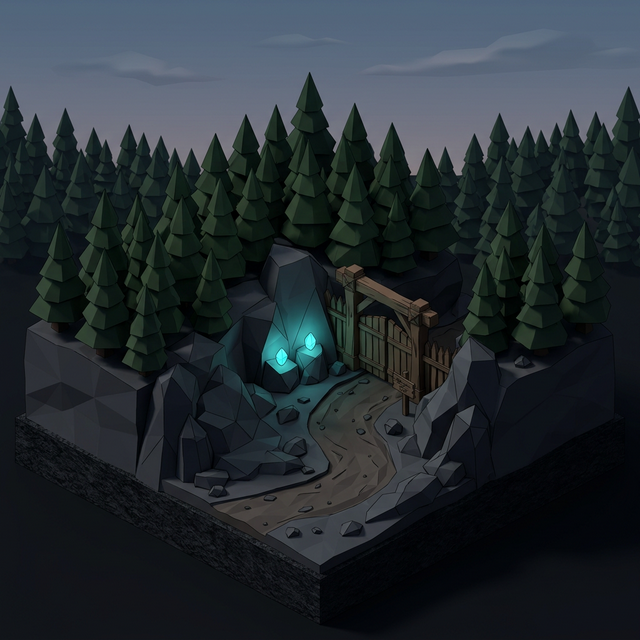
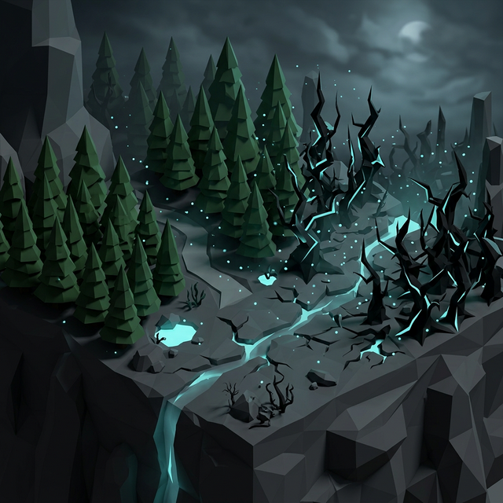
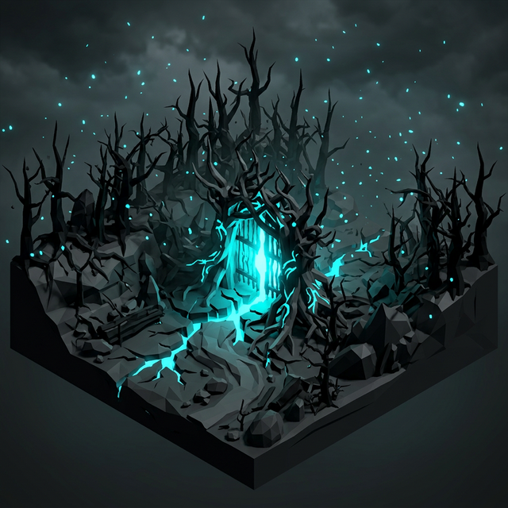

# Town 01_Forest - Stage 1-1 상세 기획 (오염의 초입)

## 1. 개요 (Overview)
- **스테이지명**: 1-1. 숲의 입구 (초입) - 튜토리얼 (Edge of the Forest)
- **컨셉**: 튜토리얼 성향이 강한 스테이지. 숲의 평화로운 초입에서 점차 오염이 시작되고 본격적인 오염된 숲으로 진입하는 과정을 담음.
- **예상 플레이 타임**:
  - **1인 (Solo)**: 10 ~ 12분
  - **2~4인 (Party)**: 5 ~ 8분
- **맵 구조**: 총 3개의 구역(Section)으로 진행되며, 기믹 상호작용(문 열기), 위험 구역(장판) 회피, 그리고 기초적인 전투(몬스터 방어선) 튜토리얼을 제공합니다.

---

## 2. 시각적 범례 (Grid Legend)
*   🟩 : **이동 가능 구역** (일반 타일)
*   ⬛ : **외곽 벽 / 진입 불가 구역** (낭떠러지, 바위산, 진입 불가 나무숲)
*   🟫 : **장애물 / 엄폐물** (돌무더기, 쓰러진 고목)
*   🟦 : **플레이어 위치** (최대 4인)
*   🟥 : **몬스터 스폰 위치**
*   🟨 : **에너지석 (상호작용 장치 / 문 개방용)**
*   🚪 : **관문 (문)**
*   🌲 : **일반 나무 / 숲 경계 요소**
*   🥀 : **오염된 나무 (경고 장판 오염물 투척 위치)**

---

## 3. 스테이지 구성 및 구조 디자인

### [Section 1] 숲의 입구 (아직 오염이 보이지 않는 구역)

*   **분위기**: 오염에 대한 인식을 하기 힘든 환경. 기존 Forest Town을 둘러싸고 있던 돌산과 우거진 숲의 경계 구역.
*   **목표 및 의도**: 사용자에게 상호작용을 가르치기 위함. 숲 초입 입구를 나타내는 문 양옆에 있는 에너지석(2개)과 상호작용하여 문을 열 수 있다는 것을 학습.
*   **진행**: 문을 열고 문 안쪽 지역으로 모든 Player가 들어가면 Section 2로 이동.
*   **맵 크기**: 19 x 15 (돌협곡에서 숲으로 진입하는 유기적인 오솔길)
*   **맵 구조**:
    ```text
    ⬛⬛⬛⬛⬛⬛⬛⬛🚪🚪🚪⬛⬛⬛⬛⬛⬛⬛⬛ (Section 2로 이동)
    ⬛⬛⬛⬛⬛⬛⬛🟩🟩🟩🟩🟩⬛⬛⬛⬛⬛⬛⬛
    ⬛⬛⬛⬛⬛⬛🟩🟩🟩🟩🟩🟩🟩⬛⬛⬛⬛⬛⬛
    ⬛⬛⬛⬛⬛🟩🟩🟨🟩🟩🟩🟨🟩🟩⬛⬛⬛⬛⬛ (양 옆 에너지석)
    ⬛⬛⬛⬛🟩🟩🟩🟩🟩🟩🟩🟩🟩🟩⬛⬛⬛⬛⬛
    ⬛⬛⬛⬛🟩🟩🌲🟩🟩🟩🟩🟩🌲🟩🟩⬛⬛⬛⬛
    ⬛⬛⬛🟩🟩🟩🟩🟩🟩🟩🟩🟩🟩🟩🟩🟩⬛⬛⬛
    ⬛⬛🟩🟩🌲🟩🟩🟩🟩🟩🟩🟩🟩🟩🌲🟩🟩⬛⬛
    ⬛⬛🟩🟩🟩🟩🟩🟩🟩🟩🟩🟩🟩🟩🟩🟩🟩⬛⬛
    ⬛⬛⬛🟩🟩🟩🟩🟩🟩🟩🟩🟩🟩🟩🟩🟩⬛⬛⬛ (돌협곡 사이 우거진 숲 경계)
    ⬛⬛⬛⬛🟩🟩🟩🟩🟩🟩🟩🟩🟩🟩🟩⬛⬛⬛⬛
    ⬛⬛⬛⬛⬛🟩🟩🟩🟩🟩🟩🟩🟩🟩⬛⬛⬛⬛⬛
    ⬛⬛⬛⬛⬛⬛🟩🟩🟦🟦🟦🟩🟩⬛⬛⬛⬛⬛⬛ (Player Start)
    ⬛⬛⬛⬛⬛⬛⬛🟩🟩🟩🟩🟩⬛⬛⬛⬛⬛⬛⬛
    ⬛⬛⬛⬛⬛⬛⬛⬛⬛⬛⬛⬛⬛⬛⬛⬛⬛⬛⬛
    ```

---

### [Section 2] 오염의 시작 (위험/회피 교육)

*   **분위기**: 초반부는 정상적인 숲이지만, 특정 지점부터 나무들의 모양과 분위기가 달라지며 오염 지역으로 변모함.
*   **목표 및 의도**: 사용자에게 Warning(경고 장판) 지역에 대한 인식을 심어주어 위험성과 회피 기동을 교육.
*   **위험 요소 (오염된 나무 - 🥀)**: 오염된 나무 주위로 Random하게 오염물이 가지에서 떨어짐 (1Beat Warning 후 데미지). 꼼수로 넘어갈 수 없게 비어있는 공간이 없도록 맵 전역에 넓게 배치, 단 난이도가 너무 높지 않게 간격을 조절.
*   **맵 크기**: 21 x 18 (넓어졌다가 기괴하게 오염되는 굽이진 형태)
*   **맵 구조**:
    ```text
    ⬛⬛⬛⬛⬛⬛⬛⬛⬛🚪🚪🚪⬛⬛⬛⬛⬛⬛⬛⬛⬛ (Section 3 진입)
    ⬛⬛⬛⬛⬛⬛⬛🟩🟩🟩🟩🟩🟩🟩⬛⬛⬛⬛⬛⬛⬛
    ⬛⬛⬛⬛⬛⬛🟩🟩🟩🥀🟩🥀🟩🟩🟩⬛⬛⬛⬛⬛⬛
    ⬛⬛⬛⬛⬛🟩🟩🟩⬛⬛⬛⬛🟩🟩🟩🟩⬛⬛⬛⬛⬛
    ⬛⬛⬛⬛🟩🟩🟩⬛⬛⬛⬛⬛⬛🟩🟩🟩🟩⬛⬛⬛⬛ (중앙의 거대한 오염된 장애지대)
    ⬛⬛⬛⬛🟩🟩🥀⬛⬛⬛⬛⬛⬛🥀🟩🟩🟩⬛⬛⬛⬛
    ⬛⬛⬛⬛🟩🟩🟩🟩⬛⬛⬛⬛🟩🟩🟩🟩⬛⬛⬛⬛⬛
    ⬛⬛⬛⬛⬛🟩🟩🥀🟩🟩🟩🟩🟩🥀🟩🟩⬛⬛⬛⬛⬛
    ⬛⬛⬛⬛🟩🟩⬛⬛🟩🟩⬛⬛🟩🟩⬛⬛🟩🟩⬛⬛⬛ (지형을 가르는 기괴한 언덕/오염 경계선)
    ⬛⬛⬛🟩🟩🟩🟩🟩🟩🟩🟩🟩🟩🟩🟩🟩🟩🟩⬛⬛⬛
    ⬛⬛🟩🌲🟩🟩🟩🟩🟩🟩🟩🟩🟩🟩🟩🟩🟩🌲🟩⬛⬛
    ⬛🟩🟩🟩🟩🟩🟩🟩🟩🟩🟩🟩🟩🟩🟩🟩🟩🟩🟩🟩⬛ (거대한 돔 형태의 숲 공터)
    ⬛🟩🌲🟩🟩🟩🟩🟩🟩🟩🟩🟩🟩🟩🟩🟩🟩🟩🌲🟩⬛
    ⬛⬛🟩🟩🟩🟩🟩🟩🟩🟩🟩🟩🟩🟩🟩🟩🟩🟩🟩⬛⬛
    ⬛⬛⬛🟩🌲🟩🟩🟩🟩🟩🟩🟩🟩🟩🟩🟩🌲🟩⬛⬛⬛
    ⬛⬛⬛⬛🟩🟩🟩🟩🟩🟩🟩🟩🟩🟩🟩🟩🟩⬛⬛⬛⬛
    ⬛⬛⬛⬛⬛⬛🟩🟦🟦🟦🟦🟩🟩⬛⬛⬛⬛⬛⬛⬛⬛ (Player 시작 지점)
    ⬛⬛⬛⬛⬛⬛⬛⬛🚪🚪🚪⬛⬛⬛⬛⬛⬛⬛⬛⬛ (Section 1에서 진입)
    ```

---

### [Section 3] 오염된 숲 (본격적인 오염 진입장 및 기초 전투)

*   **분위기**: 본격적인 오염된 숲. 사방이 불길한 기운과 몬스터들로 둘러싸여 있음.
*   **목표 및 의도**: 몬스터의 존재를 각인하고 전투를 강제하여 전투 감각(기초 타격/회피)을 배우는 튜토리얼 결전지. 가장 단순하고 약한 몬스터 스폰.
*   **진행 기믹**: 
    1. 2차 문 개방을 위해 Section 1처럼 양 옆의 에너지석(🟨)을 활성화.
    2. 활성화하면 오염된 나뭇가지들이 문을 막아 개방까지 **일정 시간(버티기)**이 소요됨.
    3. 버티는 시간 동안 맵 외곽선(🟥)에서 몬스터들이 지속 스폰하여 중앙으로 몰려옴.
    4. 일정 시간이 지나 문이 열리고 모든 사용자가 넘어오면 스테이지 1-1 클리어.
*   **맵 크기**: 23 x 16 (오염된 나무와 덤불로 둘러싸인 거대한 유기적 터)
*   **맵 구조**:
    ```text
    ⬛⬛⬛⬛⬛⬛⬛⬛⬛⬛🚪🚪🚪⬛⬛⬛⬛⬛⬛⬛⬛⬛⬛ (본격적인 오염 지역 진입 문 / 클리어)
    ⬛⬛⬛⬛⬛⬛⬛⬛🟩🟩🟩🟩🟩🟩🟩⬛⬛⬛⬛⬛⬛⬛⬛
    ⬛⬛⬛⬛⬛⬛⬛🟩🟩🟩🟩🟩🟩🟩🟩🟩⬛⬛⬛⬛⬛⬛⬛
    ⬛⬛⬛⬛⬛⬛🟩🟩🟨🟩🟩🟩🟩🟩🟨🟩🟩⬛⬛⬛⬛⬛⬛ (문 개방 에너지석)
    ⬛⬛⬛⬛⬛🟩🟩🟩🟩🟩🟩🟩🟩🟩🟩🟩🟩🟩⬛⬛⬛⬛⬛
    ⬛⬛⬛⬛🟩🟩🟩🟩🟩🟩🟩🟩🟩🟩🟩🟩🟩🟩🟩⬛⬛⬛⬛
    ⬛⬛⬛🟥🟩🟩🟩🟩🟩🟩🟩🟩🟩🟩🟩🟩🟩🟩🟩🟥⬛⬛⬛
    ⬛⬛🟥🟩🟩🟩🟩🟩🟩🟩🟩🟩🟩🟩🟩🟩🟩🟩🟩🟩🟥⬛⬛ 
    ⬛🟥🟩🟩🟩🟩🟩🟩🟩🟩🟦🟦🟦🟩🟩🟩🟩🟩🟩🟩🟩🟥⬛ (가운데로 진입 후 버티기 전투)
    ⬛⬛🟥🟩🟩🟩🟩🟩🟩🟩🟩🟩🟩🟩🟩🟩🟩🟩🟩🟩🟥⬛⬛
    ⬛⬛⬛🟥🟩🟩🟩🟩🟩🟩🟩🟩🟩🟩🟩🟩🟩🟩🟩🟥⬛⬛⬛ (가장자리 🟥에서 단순한 몬스터들 스폰)
    ⬛⬛⬛⬛🟩🟩🟩🟩🟩🟩🟩🟩🟩🟩🟩🟩🟩🟩🟩⬛⬛⬛⬛
    ⬛⬛⬛⬛⬛🟩🟩🟩🟩🟩🟩🟩🟩🟩🟩🟩🟩🟩⬛⬛⬛⬛⬛
    ⬛⬛⬛⬛⬛⬛🟩🟩🟩🟩🟩🟩🟩🟩🟩🟩🟩⬛⬛⬛⬛⬛⬛
    ⬛⬛⬛⬛⬛⬛⬛⬛🟩🟩🟩🟩🟩🟩🟩⬛⬛⬛⬛⬛⬛⬛⬛
    ⬛⬛⬛⬛⬛⬛⬛⬛⬛⬛🚪🚪🚪⬛⬛⬛⬛⬛⬛⬛⬛⬛⬛ (Section 2에서 진입)
    ```
