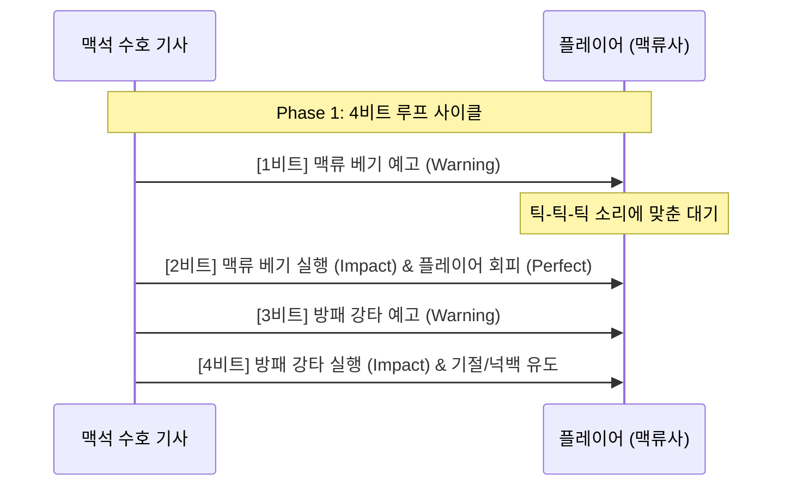

# ⚔️ 엘리트 몬스터 디자인: 맥석 수호 기사 (Crystalline Pulse Knight)

본 문서는 RhythmRPG 프로젝트의 인게임 전시 및 쇼케이스용으로 기획된 엘리트 몬스터 **"맥석 수호 기사 (Crystalline Pulse Knight)"**의 상세 전투 패턴, 시각/청각 연출(FX), 그리고 레벨 밸런싱 공학에 대한 기획서입니다.

---

## 1. 기본 정보 및 컨셉 (Overview & Concept)

```text
오랜 시간 고농도의 오염된 맥류 노출되어 신체가 결정화된 기사.
거대한 대검과 부서진 맥석이 박힌 방패를 들고 있으며, 대지의 박자(BGM)와 공명하며 파괴적인 충격파를 방출합니다.
```

- **이름 (Name):** 맥석 수호 기사 (Crystalline Pulse Knight)
- **에셋 식별자 (Entity ID):** 1021 (BlackKnight 프리팹 사용)
- **등급 (Rank):** 엘리트 (Elite / 맥류 결정체)
- **기본 속성:**
  - **체력 (Max HP):** 250 (쇼케이스에서 플레이어 1~2인이 약 1~2분간 전투를 몰입감 있게 즐길 수 있는 밸런스)
  - **행동 주기:** BGM의 정박 (4/4 박자, 1비트 단위)

---

## 2. 핵심 디자인 철학: 루즈하지도, 불합리하지도 않게 (Fair & Engaging Design)

전투의 몰입감과 공정성을 모두 잡기 위해 다음과 같은 규칙을 설계에 적용합니다.

### 2-1. 불합리함 방지 (No Unfairness)
- **완벽한 선조 (100% Telegraphs):** 플레이어에게 예기치 못한 피격을 입히는 즉시 발동(0ms) 공격을 완전히 배제합니다. 모든 공격 스킬은 최소 1비트(0.43초 / 110 BPM 기준) 이상의 시각적 장판 예고(Warning Line)와 사운드 전조를 제공합니다.
- **클리어 댄스 비트 (Rhythm Dance):** 보스의 공격과 이동이 4박자(1마디) 단위의 일관된 루프 속에서 춤을 추듯 진행됩니다. 플레이어는 몇 번의 조우만으로 보스의 공격 타이밍(엇박이 아닌 정박 위주)을 예측하고 회피(Space)를 준비할 수 있습니다.

### 2-2. 지루함 방지 (No Boredom)
- **페이즈 전환 및 폭주 (Phase 2 Overload):** 체력이 50% 이하로 감소하면 보스가 **"맥석 과부하(Crystal Overload)"** 상태에 돌입하며 외형이 붉게 물들고, 패턴의 템포와 범위가 넓어집니다.
- **적극적인 위치 이동 (Mobility):** 가만히 서서 공격만 받아내는 샌드백이 아닙니다. 매 4박자 루프마다 플레이어에게 돌진하거나 거리를 벌리는 기동형 AI를 수행하여 플레이어가 끊임없이 무빙을 하도록 유도합니다.

---

## 3. 전투 패턴 설계 (Combat Patterns)

보스의 행동은 4박자(1마디)를 주기로 계획됩니다.

### 3-1. Phase 1 (체력 50% 초과): 정밀한 파수꾼
기본적인 공격과 방패 방어를 위주로 플레이어에게 리듬 회피와 딜타임의 영점을 맞추게 합니다.



#### 패턴 A: 맥류 베기 (Pulse Slash)
- **전조 (Warning):** 전방 부채꼴 3칸 영역에 1비트 동안 붉은 예고선이 반짝입니다.
- **실행 (Impact):** 대검을 크게 휘두르며 20의 피해를 입힙니다.
- **그리드 범위:**
  ```text
  ⬜⬜⬜⬜⬜
  ⬜🟥🟥🟥⬜
  ⬜⬜⬛⬜⬜  (⬛: 보스 위치, 🟥: 피격 범위)
  ⬜⬜⬜⬜⬜
  ```

#### 패턴 B: 방패 강타 (Shield Bash)
- **전조 (Warning):** 정면 1칸에 1비트 동안 매우 진한 붉은색 장판이 깔립니다.
- **실행 (Impact):** 방패로 지면을 내리찍어 15의 피해를 입히고, 피격된 플레이어를 **1비트 동안 기절(Input Lock)** 시키며 1칸 밀쳐냅니다(Knockback).
- **그리드 범위:**
  ```text
  ⬜⬜⬜⬜⬜
  ⬜⬜🟥⬜⬜
  ⬜⬜⬛⬜⬜
  ```

---

### 3-2. Phase 2 (체력 50% 이하): 맥류 과부하 (Crystal Overload)
체력이 50% 이하로 떨어지면 기사는 지면을 내리치며 주변에 파동을 방출하고 폭주합니다. 공격력과 스킬 범위가 극대화됩니다.

#### 패턴 C: 결정화 도약 (Crystalline Leap)
- **행동:** 플레이어에게 2칸 돌진한 뒤 곧바로 공중으로 뛰어올라 플레이어 위치를 강타합니다.
- **전조 (Warning):** 도약 착지 지점을 중심으로 십자 형태의 넓은 예고선이 1비트 동안 활성화됩니다.
- **실행 (Impact):** 육중하게 착지하며 주변에 30의 큰 피해를 줍니다.
- **그리드 범위:**
  ```text
  ⬜⬜🟥⬜⬜
  ⬜⬜🟥⬜⬜
  🟥🟥🟥🟥🟥
  ⬜⬜🟥⬜⬜
  ⬜⬜🟥⬜⬜
  ```

#### 패턴 D: 결정 폭풍 (Crystal Storm)
- **전조 (Warning):** 기사를 중심으로 내부 링(3x3)에서 외부 링(5x5)으로 확장되는 빛의 고리가 박자에 맞춰 번쩍입니다.
- **실행 (Impact):** 보스 주변 8칸 전체에 결정 파편 폭풍을 일으켜 35의 피해를 입히고 2칸 멀리 밀쳐냅니다. 플레이어는 외곽 안전지대로 정확히 빠져나가야 합니다.
- **그리드 범위:**
  ```text
  🟥🟥🟥🟥🟥
  🟥⬜⬜⬜🟥
  🟥⬜⬛⬜🟥
  🟥⬜⬜⬜🟥
  🟥🟥🟥🟥🟥
  ```

---

## 4. 시각 및 청각 연출 가이드 (VFX & SFX Direction)

RhythmRPG의 공감각적 몰입감을 극대화하기 위한 보스 전용 연출 세부 사항입니다.

### 4-1. 시각 연출 (VFX)
- **맥동 싱크 Bloom:** 보스의 갑옷 틈새에 박힌 보라색 맥석들이 BGM의 킥(Kick) 박자마다 `Bloom Intensity`가 강하게 반짝입니다.
- **Warning 장판 애니메이션:** 단순히 빨간색으로 채워지는 장판이 아닌, **BGM의 서브 비트(8비트) 템포에 맞춰 외곽 테두리 펄스가 안쪽으로 수축**되는 연출을 적용하여 눈으로 박자를 읽기 쉽게 합니다.
- **결정 비산 이펙트:** 공격 성공 시, 붉은 유혈 이펙트 대신 **청명한 보라색 크리스탈 파편(Crystal Shards)**이 깨져나가며 화면 전체로 흩뿌려집니다.
- **Phase 2 과부하 돌입 연출:** 페이즈 전환 시 화면에 강한 크로마틱 어버레이션(색수차) 글리치가 0.5초간 발생하고, 보스의 맥석 광원이 마젠타 레드(Magenta Red)로 영구히 변환됩니다.

### 4-2. 청각 연출 (SFX)
- **경고음 (Telegraph Sound):** 장판 예고가 진행되는 동안, 박자에 밀착되어 "웅- 웅-" 소리가 커지다가 타격 순간 날카로운 파열음이 재생됩니다.
- **Perfect 피드백:** 플레이어가 정확한 타이밍에 보스의 공격을 회피하거나 카운터 스킬을 맞출 경우, **글라스 스매시(Crystal Break) 느낌의 영롱한 고주파 공명음**을 출력하여 청각적 쾌감을 제공합니다.
- **사운드 더킹 (Audio Ducking):** 보스의 강력한 스킬(결정 폭풍)이 발동되는 타이밍에는 0.1초 동안 BGM의 멜로디 파트 볼륨을 30% 낮추고 베이스와 타격음만을 선명하게 부각시켜 타격감을 살립니다.
