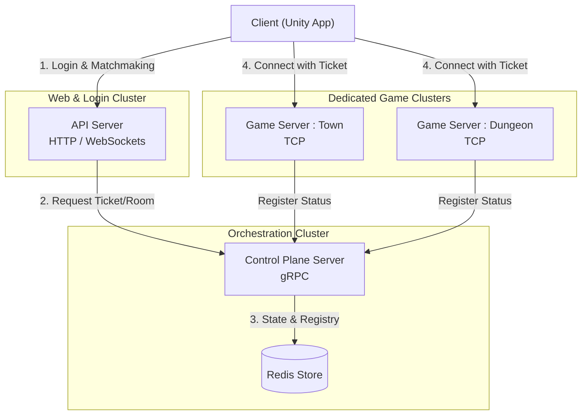
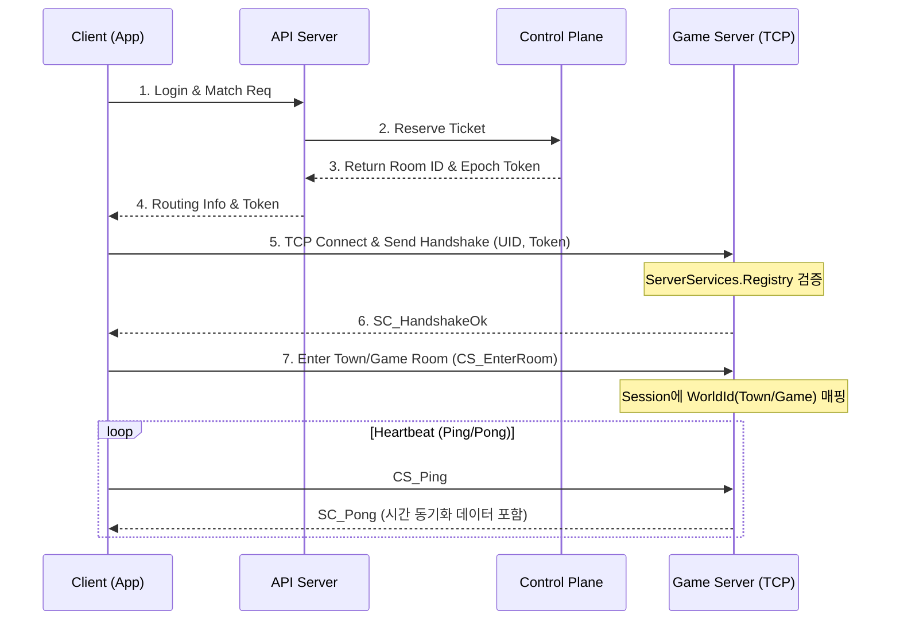
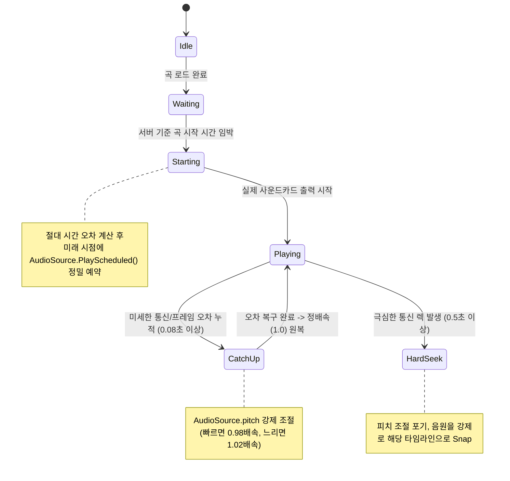

# 08. 네트워크 및 서버 아키텍처 설계 (Network & Server Architecture)

## 1. 개요 (Overview)
본 문서는 Pulse World의 전체 백엔드, 서버 구조와 클라이언트의 접속 흐름, 그리고 핵심 게임플레이를 관통하는 **실시간 멀티플레이 리듬 동기화(Time Sync)**를 정의합니다.
안정적인 매치메이킹과 분산 처리를 위해 MSA(Microservices Architecture) 형태의 다중 서버 구조를 채택하고 있습니다.

---

## 2. 전체 서버 아키텍처 (Backend Architecture)

Pulse World의 서버는 크게 3가지 독립적인 서버 군과 Redis 저장소로 구성됩니다.

### 2-1. 서버 컴포넌트 역할
1.  **API Server (HTTP/REST & WebSocket):**
    *   **역할:** 유저 인증, 로비 UI 정보 제공, 상점 및 웹 기반 요청 처리.
    *   **특징:** 대기방(Waiting Room) 시스템을 위해 WebSockets(`/hub/room`)을 운용하며, 게임 진입을 위한 티켓(Ticket) 발급을 담당합니다.
2.  **Control Plane Server (gRPC):**
    *   **역할:** 서버 클러스터의 두뇌 역할(Orchestrator). 
    *   **특징:** 각 GameServer(Town, InGame)의 헬스체크 및 상태를 리스트업(Registry)하고, 유저의 매치메이킹 할당(Allocation) 및 로컬리티(어느 룸에 접속 중인지)를 추적(Presence)합니다. Redis와 직접 통신합니다.
3.  **Game Server (TCP - Custom ServerCore):**
    *   **역할:** 마을(Town)이나 주요 경쟁 콘텐츠 안에서 캐릭터의 이동, 스킬 판정, 몬스터 AI가 동작하는 실시간 데디케이티드 서버(Dedicated Server)입니다.
    *   **특징:** 가장 빠르고 상태를 보존(Stateful)해야 하는 네트워크 연결을 담당합니다.

> 🔮 **미래 확장 계획 (Hybrid Server Architecture):**
> 향후 하이브리드 서버 구조로 개편될 예정입니다.
> *   **일반 PVE 던전:** 서버 유지비 절감과 쾌적한 로컬 판정을 위해 **STUN/TURN 서버**를 응용한 P2P(Peer-to-Peer) 호스트 릴레이 방식으로 통신을 오프로드(Offload)하는 구조로 변경될 수 있습니다.
> *   **기록 경쟁 및 PVP (무한의 탑, 레이드 등):** 보안과 공정성이 필수적인 콘텐츠는 현재 설계된 **강력한 Server-Authoritative(서버 권한 검증)** 구조를 그대로 유지합니다.

### 2-2. 아키텍처 토폴로지 다이어그램

---

## 3. 서버-클라이언트 세션 핸드셰이크 흐름

API 서버를 통해 진입 티켓(Token, Epoch)을 발급받은 클라이언트는 게임 서버(Game Server)에 TCP로 연결하여 `ClientSession`을 생성합니다.

### 3-1. 세션 연결 생명주기

---

## 4. 리듬 액션 핵: 분산 시간 동기화 (TimeSync)

매치메이킹 후 인게임에 진입하면, "모든 파티원의 BGM 재생 시점이 완벽히 동일해야 한다"는 명제를 풀기 위해 서버의 절대 시간(`ServerNowMs`)을 클라이언트가 추적(`TimeSync.cs`)합니다.

### 4-1. TimeSync 추적 알고리즘
클라이언트는 Heartbeat(Ping/Pong) 패킷을 통해 RTT 레이턴시를 구하고, 로컬 시간과 서버 시간 사이의 오프셋(`OffsetMs`)을 도출합니다.
*   **Warmup (초기 스냅):** 처음 8회의 핑은 오차를 무시하고 즉시 서버 시간에 강제 스냅(Snap)하여 대략적인 영점을 맞춥니다.
*   **스무딩 (Smoothing) 및 클램핑:** 패킷 지터(Jitter)로 인해 시간이 요동치는 것을 막기 위해 최대 200ms 이상의 튐을 방지(`MaxJumpMs=200`)하고, 최근 오프셋을 부드럽게 보간(`Lerp(0.2f)`)합니다.

---
## 5. 오디오 정밀 동기화 (BgmSyncPlayer)

네트워크 시간을 맞추는 것을 넘어, Unity AudioSource 장치의 하드웨어 아날로그 출력 딜레이를 극복하는 모듈입니다.

### 5-1. 오디오 재생 상태도 (`BgmSyncPlayer.cs`)

---

## 6. 인게임 리듬 판정 아키텍처 (Gameplay Sync)

오디오가 서버 시간에 완벽하게 맞춰졌다면, 전투 판정은 서버 권위(Server Authoritative) 형태로 안전하게 동작합니다.

1.  **클라이언트 액션 발동:** 클라이언트는 오프셋 보정이 끝난 자신의 '로컬 비트 시간'을 패킷에 담아 스킬 사용 발송. (`CS_SkillCast { LocalCastBeat = 12.5 }`)
2.  **서버 판정 (Validating):** 데디케이티드 서버(Game Server)의 해당 Room은 수신된 타임스탬프가 현재 서버 비트와 비교하여 허용 오차 윈도우(Perfect, Good 등) 이내인지 검증.
3.  **결과 브로드캐스트:** 통과된 판정만 적용되어 파티원 전체에게 데미지 및 이펙트 신호를 동기화(`SC_SkillCastResult`).
