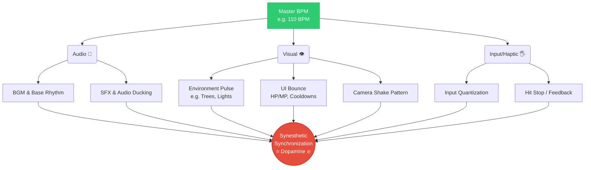
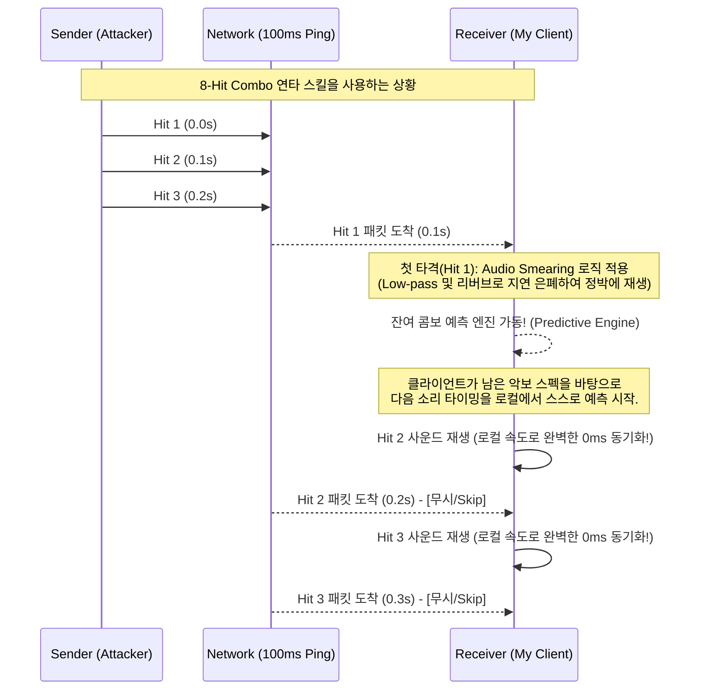

# 12. 오디오 및 리듬 설계 (Audio & Rhythm Design)

## Pulse World: 극대화된 리듬감(Groove)을 게임플레이로 승화시키는 디자인 방법론

본 문서는 단순히 "BGM 틀어놓고 버튼을 누르는 리듬게임"이 아닌, MMORPG 환경인 **Pulse World**에서 **플레이어가 어떻게 압도적인 리듬감(Groove)과 소속감을 느끼게 할 것인가**에 대한 핵심 게임 디자인, 시스템 공학, 그리고 세부 SFX 연출 방법론을 총망라합니다.

---

## 1. 완벽한 '리듬감(Groove)'의 체감 (공감각적 동기화)

음악과 게임이 융합된 장르에서 몰입감(Flow)을 느끼기 위해서는 청각, 시각, 촉각이 단 하나의 축(Master BPM)에 맞아떨어져야 합니다.

### 1-1. 시각적 동기화 (Visual Sync)
**귀를 막아도 눈으로 박자를 읽을 수 있어야 합니다.**
* **환경 시스템 (월드의 심장박동):** 나무의 흔들림, 광원의 깜빡임 등이 서버의 마스터 BPM에 맞춰 맥동(Pulse)합니다.
* **UI/UX 미세 바운스:** 스킬 아이콘 쿨다운, HP바 팝핑 폰트 등이 음악적 그리드(Grid)에 스냅핑되어 진동합니다.
* **카메라 제어:** 타격 카메라 진동 주파수를 BGM의 킥(Kick) 드럼 리듬과 동일하게 맞춥니다.

### 1-2. 청각적 쾌감 (Audio Layering & Psychoacoustics)
* **주파수 마스킹 방지 (Audio Ducking):** 여러 타격음이 겹칠 때 BGM이 떡지지 않도록, 타격 순간 주변 배경음의 특정 주파수(중역대)를 0.05초간 눌러주어 플레이어 액션만 명료하게 귀에 꽂히게 만듭니다.
* **어택(Attack) 극대화:** 타격음의 도입부(10ms 이내)를 극도로 날카롭게 만들고 잔향을 BPM 템포와 일치시킵니다.

### 1-3. 입력 보정 (Input Tolerance Mechanism)
* **해결책 (Input Quantization):** 유저가 정박에서 0.1초 늦게/빠르게 쳐도, 실제 타격 이펙트/효과음 시간은 **가장 가까운 완벽한 정박자(Grid Line)로 당기거나 미룹니다.** 뇌가 '리듬을 타고 있다'고 완벽하게 착각하게 만듭니다.

---

## 2. 다이내믹 리듬 연출과 스케일 (Contextual Scaling)

분위기와 전투 페이즈에 맞춰 화성학적, 리듬적 밀도를 다르게 배분합니다.

| 페이즈 (Phase) | 분위기 (Atmosphere) | 리듬 밀도 (Density) | 화성 (Harmony/Chord) | BGM / 연출 특징 |
| --- | --- | --- | --- | --- |
| **마을 (Town)** | 휴식, 예열, 소통 | 낮음 (Sparse) | Em-C-G-D (안정적) | Lo-Fi, Chill-out, 자연스러운 맥동 |
| **일반 필드 (Stage)** | 경쾌한 탐험, 짧은 전투 | 중간 (Call & Response) | 유동적 (다이나믹 변경) | 전투 개시 시 악기 레이어 실시간 추가 |
| **레이드 Ph1 (Awakening)** | 절망감, 압박감 | 매우 낮음 | 드론 사운드 / E Root | 공포 게임 같은 정적, 무거운 베이스 |
| **레이드 Ph2 (Clash)** | 극도의 혼란, 위기 | 높음 (Swing, 불규칙) | Tritone (증4도 불협화음) | 엇박 난무, 콤보 방해, 기괴한 텐션 |
| **레이드 Ph3 (Epic)** | 카타르시스, 클라이맥스 | 최고조 (Polyrhythm) | 웅장한 해결 (Resolution) | 4인의 무기 속도가 맞물리는 폴리리듬 |

### 2-1. 상세 화성학 전개 시나리오 예시

| 상황 / 시나리오 | 목표 감정선 | 적용되는 코드 진행 예시 (키: Em 기준) | 화성학적 특징 및 유저 체감 |
| --- | --- | --- | --- |
| **마을 (일반)** | 평화, 안정 | `Em(I) ➔ C(VI) ➔ G(III) ➔ D(VII)` | 대중음악/팝에서 주로 쓰이는 무난한 "4코드 신드롬". 심박수 안정화. |
| **마을 (황혼/밤)**| 서정적 애수 | `Cmaj7 ➔ Bm7 ➔ Am7 ➔ Gmaj7` | 메이저 세븐스의 부드럽고 재지(Jazzy)한 느낌. 텐션을 제거함. |
| **일반 필드 조우**| 모험, 전진 | `Em(I) ➔ C(VI) ➔ D(VII) ➔ Em(I)` | 마지막에 으뜸화음(Em)으로 돌아와 안도감을 주며 짧은 전투에 적합. |
| **정예몹 난입** | 위기감 | `Em(I) ➔ C(VI) ➔ D(VII) ➔ B7(도미넌트)` | 마지막에 세컨더리 도미넌트(B7, D#음 포함)를 써 극도의 긴장성 유발. |
| **보스전 Ph1** | 공포, 무력감| `E Pedal Point (E음 베이스 지속)` | 화성이 진행되지 않고 베이스가 하나의 음으로 짓눌러 미지의 공포를 자아냄. |
| **보스전 Ph2** | 파괴적 혼란| `Em ➔ Bb (트라이톤 이동)` | 화성학적으로 가장 악독한 증4도(Tritone) 이동. 예측 빗나감 유도. |
| **보스전 Ph3** | 카타르시스 | `Em ➔ C ➔ Am ➔ B7` | 위기가 최고조(B7)에 달한 뒤, 다시 새로운 루프로 강렬하게 폭발하는 루프. |

---

## 3. 무기별 주파수 분배와 리듬 앙상블 (Rhythm & Melody Roles)

### A. 리듬/타악기 계열 (Percussion & Beat)
| 무기군 (예시) | 리듬적 역할 | 오디오 출력 (Sound Output) | 주파수/음향 역할 |
| --- | --- | --- | --- |
| **초중량 (대검/탱커)** | **메인 비트 (Downbeat)** | **[EDM 킥 드럼 / 파워 톰톰]** 우웅-쾅! | 저음역대(20~80Hz) 펀치감 확보. BGM 베이스 제어. |
| **경량 근접 (쌍검/암살)** | **오프 비트 (Syncopation)**| **[하이햇 / 셰이커 / 전자 스네어]** 채챙-챙! | 고음역대(4k~10kHz) 타격감. 베이스를 뚫고 나오는 속도감. |

### B. 멜로디/화성 계열 (Melody & Harmony)
| 무기군 (예시) | 리듬적 역할 | 오디오 출력 (Sound Output) | 주파수/음향 역할 |
| --- | --- | --- | --- |
| **원거리 (활/머스킷)** | **아르페지오 / 오스티나토** | **[플럭 신스 / 어쿠스틱 기타]** 통통 튐. | 중고음역대. 현재 마스터 진행에 맞춰 피치(Pitch) 기변 발사. |
| **서포팅 마법 (힐러)** | **코드 패드 (Sustain/Pad)** | **[풍성한 신스 패드 / 콰이어]** 우우웅~ | 중역대(500~2kHz). 파티에 거대 공간감과 안정감 부여. |
| **파괴 마법 (궁극기)** | **브라스(Brass) 리드 멜로디** | **[디스토션 기타 / 호른 블로우]** 빰-!! | 하이라이트 구간 BGM을 뚫고 나오는 독주 악기 역할. |

### 3-1. 보스전 리듬 앙상블 타임라인 스케치 (Ensemble Timeline)

```mermaid
gantt
    title Boss Ph3 Epic Resolution (4 Bars) / 4인 파티 밴드 앙상블
    dateFormat  x
    axisFormat  %S.%L초

    section [BGM 마스터 코드]
    Em (1마디) : done, 0, 2000
    C (2마디) : done, 2000, 4000
    Am (3마디) : done, 4000, 6000
    B7 (위기고조) : done, 6000, 8000

    section [탱커] 대검 (Kick)
    내려찍기 (정박)       : active, 0, 200
    내려찍기 (정박)       : active, 1000, 1200
    대지 강타 (강한정박)   : active, 2000, 2200
    내려찍기 (정박)       : active, 4000, 4200
    방패 올려치기         : active, 6000, 6200

    section [암살] 쌍검 (Hi-Hat)
    16비트 난도질 (오프비트): 200, 1800
    16비트 난도질 (오프비트): 2200, 3800
    콤보 휴식             : 4000, 4800
    백스탭 (스네어 포인트) : 5000, 5200
    마무리 일격 (강타)     : 6800, 7500

    section [원거리] 활 (Pluck)
    3연사 (아르페지오 E-B) : 0, 400
    3연사 (아르페지오 C-G) : 2000, 2400
    3연사 (아르페지오 A-E) : 4000, 4400
    차징 샷 대기           : 6000, 7500

    section [법사] 마법 (Synth/Brass)
    장판 힐 (Pad 지속음)     : 0, 2000
    버프 (Pad 지속음)        : 2000, 4000
    파괴 마법 캐스팅         : 4000, 6000
    메테오 (Brass 리드!!)    : active, 7000, 8000
```

> **[시각 자료 해석]**
> 1. 대검(탱커)은 항상 마디의 첫 박자(0s, 2s, 4s)를 강하게 찍어 뼈대를 만듭니다.
> 2. 쌍검(암살)은 빈 공간이나 엇박자에 얇게 스킬을 구겨 넣어 하이햇 역할을 합니다.
> 3. 활(원거리)은 코드가 변하는 0s, 2s, 4s에 통통 튀는 음으로 화성적 리듬을 장식합니다.
> 4. 마법(법사)은 공간을 채우다가, 가장 긴장감이 높은 B7 코드(6s~8s)의 마지막 7초 구간에 궁극기(메테오)를 터뜨려 멜로디의 카타르시스를 폭발시킵니다.

### 3-2. 무기별 점유 비트(N-Beat Window)와 콤비네이션 설계 원칙

입력 판정은 오직 '시작 비트(Input Beat)'에서만 일어납니다. 하지만 타격이 확정된 이후 그 스킬이 점유하는 **N비트 구간 안에서는 시각적/청각적 연출의 완벽한 자유도**가 보장됩니다.

1. **무기별 고유 Sound Pattern 배정:** 쌍검(단검) 스킬이 4비트를 점유한다면, 유저가 누르는 순간 시스템은 4비트 구간을 예약하고, 미리 짜여진 16비트 단위의 타격 악보(오디오)를 자동 재생합니다.
2. **동기화된 그리드 버퍼 (Grid Buffer):** 모든 유저의 입력 시작점은 가장 가까운 음악적 그리드(16분 음표)에 스냅(Snap)되어 불협화음을 방지합니다.

---

## 4. 인게임 세부 SFX (효과음) 구현 스펙 기준

### 4-1. 플레이어 타격 판정 (Hit Feedback)
| 판정 | 사운드 특징 (SFX 특성) | 플레이어 지각/피드백 감각 |
| --- | --- | --- |
| **Perfect (공명)** | 무기 본연 타격음 + **강한 베이스 펀치 & 맑은 크리스탈 공명음**. 소리의 여운이 굵게 남음. | 시각적인 "히트 스탑(0.05초)" 및 줌 펀치 효과와 결합되어 압도적 쾌감 전달. |
| **Good (부분)** | 일반적인 둔탁한 타격음 위주. 크리스탈 공명 사운드는 약함. | 무난한 기본 액션 느낌. |
| **Miss (공허)** | 허공을 가르는 바람 수리(Whoosh) 및 잿빛 피드백 마찰음. 엇박의 불편함 제공. | 콤보가 단절되는 심리적 낭패감. |

### 4-2. 무기 및 시스템 SFX 연출
* **무기 장착:** 무기를 쥘 때 맥석(Crystal)에 에너지가 충전되는 은은한 스웰링(Swelling) 사운드.
* **Warning (전조):** 공격 직전 맥류를 응집하는 고주파 차지(Charge) 음.
* **InputLock (경직):** 스킬 발산 후 잔열이 식어가는 스파크 지직거림.

### 4-3. 몬스터 / 레이드 보스 SFX
* **일반 몬스터 타격:** 살점 유혈 표현을 배제하고 묵직한 **맥석 섀터(Crystal Shatter, 유리 깨지는 소리)** 위주의 건조한 사운드 사용.
* **보스 페이즈 전환 (과부하):** 강력한 **글리치(Glitch), 디스토션, 드론 베이스(Drone Bass)** 등 듣는 이에게 무겁고 기괴한 에너지 노이즈 집중.

---

## 5. 지연 속 앙상블을 유지하는 네트워크 환상 제어 (Illusion Engineering)

100ms 가량의 네트워크 지연 환경 속에서 파티 앙상블 리듬이 무너지는 것을 방지하는 클라이언트 기만(Illusion) 시스템입니다.

### 문제 1: 남의 타격음이 100ms 지연되어 들려 리듬이 무너짐
* **해결책 (Quantize & Smearing):**
  1. **자석 스냅핑:** 지연된 패킷을 즉시 재생하지 않고, 미래의 1/16박자 라인까지 잠시 묵혔다가 완벽한 정박에 터뜨림.
  2. **오디오 뭉개기:** 내 타격은 날카로운 어택으로, 타인의 지연 타격은 Low-Pass 필터와 Reverb(잔향)를 길게 주어 "웅장한 신스 패드 화음"처럼 배경에 스며들도록 은폐.

### 문제 2: 난도질 등 연타 스킬 지연 발생 시 소음화
* **해결책 (Predictive 0ms Simulation):** 
타 유저가 8연속 타격기를 쓰면, 내 클라이언트는 첫 1타만 지연 패킷(Smearing)으로 수신하고, 2타부터는 내 클라이언트 기준 **로컬 0ms 칼박으로 스스로 예측/자동 재생**합니다.

### 문제 3: 화성의 지연 불협화음
* **해결책 (Receiver-Centric Harmony / 수신자 중심 화성):**
상대가 A코드를 칠 때 출발한 스킬 효과음(예: 활의 아르페지오 신스음)이라도, 내 클라이언트에 도착할 때 이미 BGM이 B코드 타임라인으로 넘어간 상태라면, 강제로 원본 사운드의 피치를 꺾어 **로컬 배경 음악 B코드로 조율(Auto-Tune)**하여 재생합니다. 삑사리를 원천 차단합니다.

---

## 6. 결론적 논리 (Selling Point)

Pulse World의 리듬 시스템은 유저가 "얼마나 칼박으로 키보드를 누르는지" 시험하는 하드코어가 아닙니다.
**핵심 설계 철학은 '시스템이 알아서 완벽에 가깝게 포장해 주는 관대한 엔터테인먼트'입니다.**

이를 통해 플레이어는 "내가, 그리고 우리 파티가 마치 완벽한 교향곡을 연주하며 보스를 박살 냈다"고 뇌가 착각하게 되며, 기존의 액션 RPG에서는 절대 느낄 수 없는 압도적인 중독성과 카타르시스를 경험하게 됩니다.
"@ | Out-File -FilePath "$Path\12_Audio_Rhythm_Design.md" -Encoding utf8
