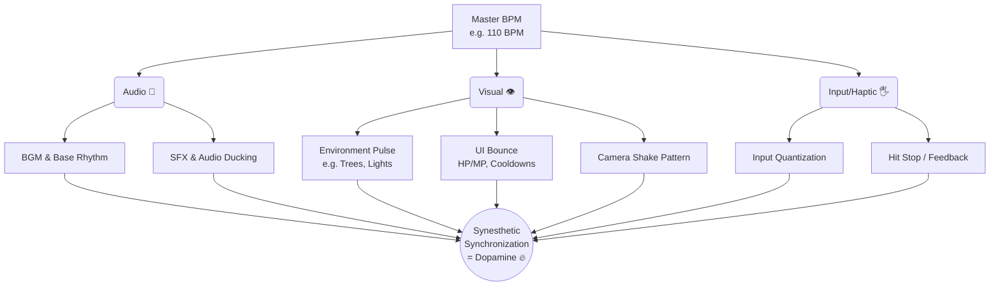

# 🎵 Pulse World — 리듬 방법론 및 오디오(SFX) 통합 기획서

> **핵심 컨셉: "소리가 곧 세계의 심장 박동이다."**
> 본 문서는 "BGM 틀어놓고 버튼을 누르는 리듬게임"이 아닌, MMORPG 환경인 **Pulse World**에서 **플레이어가 어떻게 압도적인 리듬감(Groove)과 소속감을 느끼게 할 것인가**에 대한 핵심 게임 디자인, 네트워크 지연 해결책, 그리고 세부 SFX 스펙을 총망라합니다.

---

# 1. 완벽한 '리듬감(Groove)'의 체감 (공감각적 동기화)

음악과 게임이 융합된 장르에서 몰입감을 느끼기 위해서는 청각, 시각, 촉각이 단 하나의 축(Master BPM)에 맞아떨어져야 합니다.

*   **시각적 동기화:** 귀를 막아도 눈으로 박자를 읽을 수 있도록 환경, UI, 카메라 진동이 마스터 BPM에 스냅핑됩니다.
*   **주파수 마스킹 방지 (Audio Ducking):** 타격음이 BGM이나 서로의 스킬 소리를 덮어 떡지지 않도록, 타격 순간 주변 배경음의 중역대를 0.05초간 눌러줍니다.
*   **입력 양자화 (Input Quantization):** 플레이어가 0.1초 늦게/빠르게 치더라도 실제 타격 이펙트/효과음 시간은 완벽한 정박자로 당겨주어 자신이 '리듬을 타고 있다'고 뇌를 착각하게 만듭니다.

---

# 2. 다이내믹 리듬 연출과 스케일 (Contextual Scaling)

| 페이즈 (Phase) | 분위기 (Atmosphere) | 리듬 밀도 (Density) | 화성 (Harmony/Chord) | BGM / 연출 특징 |
| :--- | :--- | :--- | :--- | :--- |
| **마을 (Town)** | 휴식, 예열 | 낮음 (Sparse) | Em-C-G-D (안정적) | 자연스러운 맥동, 빈약한 리듬 |
| **일반 필드 (Stage)** | 경쾌한 탐험 | 중간 (Call & Response) | 유동적 (다이나믹 변경) | 전투 개시 시 악기 레이어 실시간 추가 |
| **레이드 Ph1 (Awakening)**| 절망감, 압박감 | 매우 낮음 | 드론 사운드 / E Root | 공포 게임 같은 정적, 무거운 베이스 |
| **레이드 Ph2 (Clash)** | 혼란, 위기 | 높음 (Swing, 불규칙) | Tritone (증4도 불협화음)| 엇박 난무, 플레이어 리듬 방해 |
| **레이드 Ph3 (Epic)** | 카타르시스 | 최고조 (Polyrhythm) | 웅장한 해결 (Resolution) | 4인 파티의 무기 스피드가 겹쳐지는 폴리리듬 |

---

# 3. 무기별 음역대(주파수) 및 악기 분배 (Rhythm & Melody Roles)

무기의 역할(클래스)을 단순히 시각/기능에만 국한하지 않고, 파티 앙상블(밴드 구성)로 분할합니다.

| 무기군 / 직업 예시 | 리듬적 역할 | 오디오 출력 (Sound Output) | 주파수/음향 역할 |
| :--- | :--- | :--- | :--- |
| **초중량 (대검/탱커)** | **메인 비트 (Downbeat)** | **[EDM 킥 드럼 / 파워 톰톰]** 우웅-쾅! | 저음역대(20~80Hz) 펀치감 확보. BGM 베이스 제어. |
| **경량 근접 (쌍검/암살)** | **오프 비트 (Syncopation)** | **[하이햇 / 셰이커]** 챙-채챙! | 고음역대(4kHz+) 타격감. 베이스를 뚫고 나오는 속도감. |
| **원거리 (활/머스킷)** | **아르페지오 (Arpeggio)** | **[플럭 신스 / 어쿠스틱 기타]** 푱- | 중고음역대. 현재 코드 진행에 맞춰 피치(Pitch) 변환 발사. |
| **서포팅 마법 (힐러)** | **코드 패드 (Sustain)** | **[신스 패드 / 콰이어]** 우우웅~ | 중역대. 빈 공간을 채우고 파티에 거대 공간감/안정감 부여. |
| **파괴 마법 (궁극기)** | **브라스(Brass) 리드** | **[디스토션 기타 / 호른]** 빰-!! | 보스전 하이라이트 멜로디 테마의 리드 악기 역할. |

---

# 4. 콤비네이션 무기 설계: 2가닥 고정 패턴 (N-Beat Window)

**모든 조작은 입력 시점(Beat 시작점)을 기준으로 'N비트의 구간(Window)'을 점유하는 하나의 작은 음악적 악보입니다.**

1.  **패턴 A (일반 공격):** 무쿨타임 반복. (예: 2비트 길이의 `쿵-짝`). 노래의 '기본 드럼/베이스' 패턴 제공.
2.  **패턴 B (스킬 공격):** 쿨타임 구간 변주. (예: 4비트 길이의 `구구궁-쾅!!`). 노래의 특수 '이벤트/멜로디/필인' 제공.

> **시각 연출과의 분리:**
> 쌍검 스킬이 4비트를 점유한다면, 시각적으로 캐릭터가 공중에서 10번을 베든 상관없이, 음향(SFX)은 오직 완벽히 고정/예약된 16비트 단위의 타격 악보대로만 송출됩니다. 난장판 속에서도 뼈대가 되는 음악은 언제나 정돈되어 있습니다.

---

# 5. 세부 SFX (효과음) 구현 스펙 기준

SFX는 세계관(맥류)의 물리법칙을 보여주는 핵심 장치입니다. 무기, 타격, 몬스터, 환경이 맥동에 어떻게 반응하는지 정의합니다.

## 5-1. 플레이어 타격 판정 (Hit Feedback)
| 판정 | 사운드 특징 (SFX 특성) | 플레이어 감각 |
|------|------------------------|--------------|
| **Perfect (공명)** | 무기 본연 타격음 + **강한 베이스 펀치 & 맑은 크리스탈 공명음**. 소리가 꽉 차고 여운이 남음. | 강력함, 예리함 |
| **Good (부분)** | 일반 둔탁 타격음 위주. 공명음 약함. | 평범함 |
| **Miss (공허)** | 허공을 가르는 바람 빠지는 소리(Whoosh) 및 불쾌한 마찰 잡음. 엇박의 불편함 제공. | 낭패감 |

## 5-2. 장비(무기/시스템) 관련
*   **무기 장착:** 무기를 쥘 때 맥석에 에너지가 충전되는 은은한 스웰링(Swelling).
*   **Warning (전조):** 무기 맥석이 공격 직전 맥류를 응집하는 고주파 차징.
*   **InputLock (경직):** 공격 발산 후 맥류 잔열이 식는(냉각/스파크) 지직거림.
*   **조율 (Calibration):** 틱톡거리는 메트로놈 소리가 환경 BGM과 피치(Pitch)가 일치해 마침내 거대화된 단일 화음으로 안착하는 연출.

## 5-3. 대환경 (Environment)
*   동굴 물방울, 바람 소리가 단순 랜덤 루프가 아닌 메인 비트의 1/8, 1/16박에 양자화(Quantization)되어 재생되도록 모듈화.

## 5-4. 몬스터/보스 SFX
*   **일반 (맥류 잔향):** 고통을 느끼는 괴성 대신, 파괴 시 유리가 깨지는 듯한 **맥석 섀터(Crystal Shatter)** 위주의 건조한 사운드.
*   **레이드 보스 (과부하):** 등장/전조 시 **글리치(Glitch), 디스토션, 드론 베이스(Drone Bass)** 등 무겁고 기괴한 에너지 노이즈 집중.

---

# 6. 네트워크 비동기화 환상 제어 (Illusion Engineering)

MMORPG의 100ms 지연 환경(Ping) 속에서 파티 앙상블 리듬이 무너지는 것을 방지하는 클라이언트 기만(Illusion) 시스템.

1.  **자석 스냅핑 (Magnet Quantize):** 남의 패킷이 110ms 늦게 도착하면 즉시 소리를 내지 않고 가장 가까운 16분음표 마디선(미래 타겟, 예: 125ms)까지 묵혔다 터뜨림.
2.  **오디오 뭉개기 (Audio Smearing):** 남의 타격음은 Low-Pass 필터와 거친 Reverb(잔향)를 입혀서, 늦은 타이밍을 "웅장한 신스 패드 화음"처럼 배경에 스며들도록 포장.
3.  **수신자 중심 화상 조율 (Receiver-Centric Harmony):** A코드로 쏜 상대 시스템의 소리가, 도착 시 B코드 상황이 되었다면 강제로 B코드 사운드(Auto-Tune)로 변조(Pitch-shift) 재생. 삑사리를 원천 차단.
4.  **예측 0ms 연타 재생:** 상대의 8연타 스킬 첫 타만 뭉개기(Smearing)로 받고, 나머지 7회의 연쇄 타격음은 내 클라이언트가 0ms 예측 재생하여 앙상블 리듬을 깨끗하게 유지.
