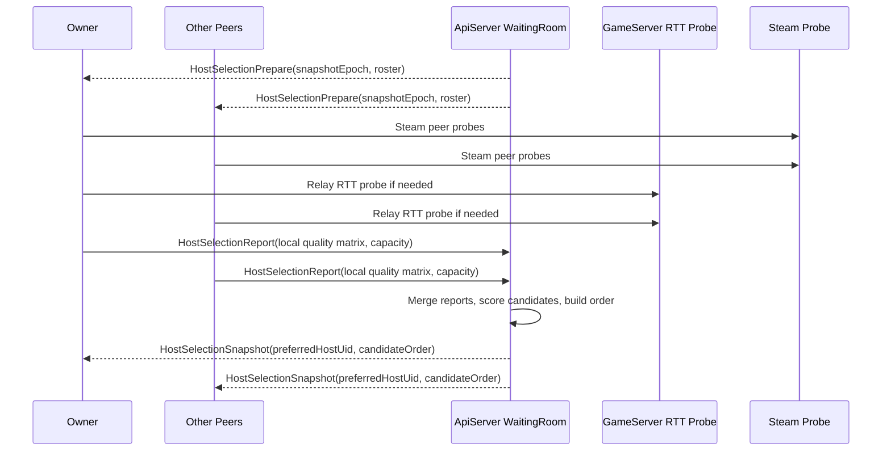

# Steam Host Selection V1 Spec

> 참고: 이 문서는 V1 기준의 상세 설계 기록이다.  
> 현재 런타임 metric version은 `host-selection-v2-hybrid`이며, 최신 프로젝트 기준 문서는 [steam_host_selection_v2_spec.md](./steam_host_selection_v2_spec.md)다.

작성일: 2026-05-03  
대상 프로젝트: RhythmRPG  
문서 목적: 현재 `ApiServer / WaitingRoom WS RTT` 기반의 `Preferred Host` 선정을, 실제 인게임 경로 품질을 기준으로 하는 `Steam Hybrid P2P Host Selection V1`로 교체하기 위한 상세 스펙을 정의한다.

빠르게 구조만 보고 싶다면 [steam_hybrid_p2p_flow.md](./steam_hybrid_p2p_flow.md)를 함께 참고한다. 이 문서는 그 구조 위에서 "누가 Host가 되어야 하는가"를 구체적인 점수와 데이터 계약 수준까지 내려서 정리한 문서다.

## 한 줄 결론

`Preferred Host`는 더 이상 `ApiServer RTT`가 아니라, **모든 참가자가 실제 게임 시작 후 사용할 경로 기준으로 평균적으로 가장 좋은 경험을 받게 만드는 peer**를 선택해야 한다.

즉, 목표는 아래 한 문장으로 정리한다.

- `모든 플레이어에게 평균적으로 가장 좋은 경험을 주는 Host를, 실제 게임 경로 기준으로, 시작 전에, 결정론적으로 뽑는다.`

## 왜 바꾸는가

현재 구현은 Waiting Room WebSocket의 `HostProbePing -> HostProbePong -> HostProbeReport` 값으로 `Preferred Host`를 고른다. 이 값은 `클라이언트 <-> ApiServer(Room WS)` 왕복시간일 뿐이며, 실제 전투에서 중요한 아래 경로를 반영하지 못한다.

- `Guest <-> Host` Steam P2P 경로
- `Guest -> GameServer relay -> Host` fallback 경로
- Steam direct / SDR 여부
- loss / jitter
- Host가 전투 authority를 돌릴 수 있는 로컬 여유

결과적으로 현재 방식은 다음 문제를 가진다.

- `ApiServer RTT`가 낮아도 실제 `Steam P2P` 품질이 나쁠 수 있다.
- 한 명에게만 좋은 Host가 뽑히고 전체 평균 경험은 나빠질 수 있다.
- Steam이 꺼진 참가자가 relay로 내려가도 그 영향이 host selection에 반영되지 않는다.
- Host migration용 백업 순서가 실제 인게임 품질 기준으로 정렬되지 않는다.

## 적용 범위

이 스펙은 아래 경우에만 적용한다.

- `WaitingRoom.UseP2PRelay == true`
- 또는 `networkMode`가 `steam` 계열인 match

아래 경우에는 적용하지 않는다.

- authoritative dedicated server 전투
- 싱글 플레이
- 인게임 도중 실시간 재선정

즉, 이 V1은 **게임 시작 직전 Host를 한 번 고르고, 백업 순서를 함께 확정하는 스펙**이다.

## 목표

1. `Preferred Host`를 `ApiServer RTT` 대신 `실제 게임 경로 품질`로 선택한다.
2. Host 선택 결과를 `HostUid`뿐 아니라 `HostCandidateOrder`까지 deterministic하게 만든다.
3. Steam direct, Steam SDR, ServerRelay fallback이 섞여 있어도 현재 방의 실제 경로 기준으로 점수를 계산한다.
4. 왜 이 Host가 선택되었는지, 왜 어떤 후보가 탈락했는지, 디버그 창에서 바로 읽을 수 있게 한다.
5. 현재 `P2PRelayRoom`의 런타임 failover가 같은 후보 순서를 재사용할 수 있게 한다.

## 비목표

이 V1에서 하지 않는 것은 아래와 같다.

- NAT 타입을 별도 점수 항목으로 직접 사용
- 지리 좌표나 국가 코드 기반 지역 점수
- 장시간 churn prediction이나 "곧 나갈 유저" 예측
- 대용량 업로드 throughput 벤치마크
- 인게임 도중 동적 host reselection

이 항목들은 V2 이상에서 보완할 수 있다. V1은 "실제 경로 기반 품질 + Host 권한 수행 가능성"에 집중한다.

## 용어

| 용어 | 의미 |
| --- | --- |
| `Owner` | 방 생성자, Start 권한자 |
| `Preferred Host` | 시작 직전 host selection 결과 기준 1순위 후보 |
| `Backup Host` | failover 시 사용할 2순위 이하 후보 |
| `P2PHost` | 전투 중 authoritative peer |
| `Candidate` | Host 후보로 점수 계산 대상이 되는 참가자 |
| `Pair Metric` | `Peer A -> Candidate H` 경로 기준 품질 측정값 |
| `Path Type` | `SteamDirect`, `SteamSDR`, `ServerRelayComposite`, `Unavailable` |
| `HostSelectionSnapshot` | 서버가 한 번의 선택 결과와 근거를 묶어 저장한 스냅샷 |

## V1의 핵심 원칙

1. host selection은 `나와 서버가 가까운 사람`을 뽑는 것이 아니다.
2. host selection은 `모든 참가자의 평균 경험`과 `가장 나쁜 참가자의 경험`을 함께 줄이는 쪽을 뽑아야 한다.
3. NAT 이론보다 `실제 경로 결과`가 우선이다.
4. Steam을 못 쓰는 참가자가 있으면 그 참가자는 `ServerRelay` 기준 품질로 계산해야 한다.
5. Host는 단순 네트워크 종점이 아니라 전투 authority이므로, 로컬 성능 여유가 부족한 후보는 감점 또는 탈락시켜야 한다.

## 선택 결과물

Host selection이 끝나면 서버는 아래 결과를 확정해야 한다.

- `PreferredHostUid`
- `HostCandidateOrder[]`
- `HostSelectionEpoch`
- `HostSelectionSnapshotId`
- `PerCandidateScoreBreakdown`

이 값들은 Waiting Room, `GameMatchManifest`, GameServer failover, 디버그 HUD에서 공통으로 참조한다.

## 측정 입력

V1에서 사용하는 입력은 아래 6종이다.

| 입력 | 설명 | 출처 | 사용 방식 |
| --- | --- | --- | --- |
| `Avg RTT` | 각 peer가 특정 후보 host에게 갈 때의 평균 RTT | 실제 probe | 핵심 |
| `Worst RTT` | 후보 기준 pair 중 가장 나쁜 RTT | 실제 probe | 핵심 |
| `Jitter` | RTT 변동량 | 실제 probe | 핵심 |
| `Packet Loss` | probe loss 비율 | 실제 probe | 핵심 |
| `Relay Usage` | direct 대신 SDR 또는 ServerRelay를 사용했는지 | Steam 상태 / composite | 보조 |
| `Host Capacity` | host 후보의 프레임 안정성, 전송 headroom | 클라이언트 self report | 보조 |

## NAT와 Upload를 V1에서 다루는 방식

사용자 관점에서 NAT와 업로드는 중요하지만, V1에서는 아래처럼 현실적으로 처리한다.

- `NAT 타입`은 직접 점수화하지 않는다.
- 대신 실제 probe 결과에서 `SteamDirect`, `SteamSDR`, `ServerRelayComposite`, `Unavailable`로 귀결된 결과를 사용한다.
- `업로드 속도`는 별도 대역폭 벤치마크 대신 `Host Capacity`의 일부로 낮은 비중으로 반영한다.

이렇게 하는 이유는 아래와 같다.

- NAT 타입은 라이브러리/플랫폼에 따라 추상화 수준이 다르다.
- 실제로는 `direct로 붙었는지`, `relay로 내려갔는지`, `그때 RTT/loss가 어떤지`가 더 중요하다.
- 대기방에서 무거운 throughput 테스트를 돌리면 오히려 UX가 나빠질 수 있다.

## 측정 경로 규칙

각 `Peer -> Candidate Host` 쌍은 아래 규칙으로 path type을 결정한다.

| 조건 | Path Type | 측정 방식 |
| --- | --- | --- |
| 양쪽 모두 Steam 준비 완료, Steam probe session 성공 | `SteamDirect` 또는 `SteamSDR` | Steam P2P probe |
| 한쪽이라도 Steam 준비 미완료, 또는 Steam probe 실패, 단 relay match는 가능 | `ServerRelayComposite` | `Peer <-> GameServer RTT` + `Candidate <-> GameServer RTT` 합성 |
| 후보가 ready 아님, 연결 불가, manifest 조건 불일치 | `Unavailable` | 측정 실패 |

`ServerRelayComposite`의 RTT 근사는 아래처럼 정의한다.

```text
CompositePairRttMs(peer, host) =
    PeerGameServerRttMs +
    HostGameServerRttMs +
    RelayProcessingAllowanceMs
```

`RelayProcessingAllowanceMs`는 고정 상수로 시작한다.

- 기본값: `8 ms`

이 값은 운영 데이터로 추후 보정할 수 있다.

## Steam Probe 규칙

Steam 경로 probe는 실제 인게임 transport와 최대한 같은 스택으로 측정한다.

- 사용 transport: `SteamP2PClientTransport`와 동일 계열
- 샘플 수: `10`
- 샘플 간격: `120 ms`
- 총 측정 시간: 약 `1.2 s`
- warm-up: 첫 샘플 전 `150 ms`
- timeout: 샘플당 `400 ms`

샘플 계산 규칙은 아래와 같다.

- `avgRttMs`: 유효 샘플 평균
- `worstRttMs`: 유효 샘플 최대값
- `p95RttMs`: 샘플 수 10 기준에서는 `worstRttMs`와 동일 취급
- `jitterMs`: 연속 샘플 RTT 차이 절대값의 평균
- `lossPct`: `(sent - acked) / sent * 100`
- `relayUsed`: SteamNetworking 상태가 direct가 아니면 `true`

## Host Capacity 규칙

Host 후보는 네트워크 품질이 좋아도, 로컬 authority를 안정적으로 돌릴 수 없으면 부적합하다. V1에서는 아래 self-report를 사용한다.

| 값 | 설명 | 기준 |
| --- | --- | --- |
| `p95FrameMs` | 최근 5초 프레임 시간 95 percentile | `> 25 ms`면 강한 감점 |
| `avgFrameMs` | 최근 5초 평균 프레임 시간 | 보조 |
| `sendRateKbps` | 최근 3초 평균 송신량 | 보조 |
| `sendQueueDepth` | 전송 큐 적체 정도 | 보조 |

V1에서는 아래처럼 단순 감점만 적용한다.

- `p95FrameMs <= 20 ms`: 감점 없음
- `20 < p95FrameMs <= 25 ms`: 약한 감점
- `p95FrameMs > 25 ms`: 강한 감점
- `sendQueueDepth`가 임계치 초과면 감점

## 하드 필터

아래 조건을 만족하지 못하면 후보는 점수 계산 전에 탈락한다.

1. `Ready == true`
2. `uid`가 유효하고 현재 room roster에 존재
3. Steam 모드인 경우 `local SteamId64` 존재
4. Steam 모드인 경우 `Steam initialized == true`
5. Steam 모드인 경우 `Steam lobby joined == true`
6. 최근 probe 혹은 relay RTT가 freshness window 안에 존재
7. `p95FrameMs <= 33 ms`
8. 자기 자신을 포함해 전체 room size의 최소 `70%` 이상에 대해 경로 품질 추정 가능

이때 `70%` 기준의 의미는 아래와 같다.

- 2인: 상대 1명 필수
- 3인: 상대 2명 중 최소 2명 권장, 1명만 있으면 degraded
- 4인 이상: 전체의 `70%` 미만이면 후보 탈락

탈락한 후보는 `DisqualifiedReason[]`에 사유를 남긴다.

예시:

- `SteamNotInitialized`
- `MissingSteamId`
- `ProbeStale`
- `InsufficientPeerCoverage`
- `FrameBudgetExceeded`
- `RosterMismatch`

## 점수 함수

V1의 최종 후보 점수는 `낮을수록 좋다`.

### 1. Pair Cost

각 `Peer P -> Candidate H`에 대해 아래 비용을 계산한다.

```text
PairCost(P, H) =
    0.50 * NormAvgRtt +
    0.20 * NormWorstRtt +
    0.15 * NormJitter +
    0.10 * NormLoss +
    0.05 * RelayPenalty
```

정규화 기준은 아래를 사용한다.

```text
NormAvgRtt   = clamp(avgRttMs   / 120, 0, 1)
NormWorstRtt = clamp(worstRttMs / 180, 0, 1)
NormJitter   = clamp(jitterMs   / 40,  0, 1)
NormLoss     = clamp(lossPct    / 3,   0, 1)
RelayPenalty = 0.00 for SteamDirect
             = 0.05 for SteamSDR
             = 0.12 for ServerRelayComposite
             = 1.00 for Unavailable
```

### 2. Host Capacity Penalty

후보 H 자체의 authority 수행 여유는 아래 감점으로 계산한다.

```text
HostCapacityPenalty(H) =
    0.70 * NormFramePenalty +
    0.30 * NormSendQueuePenalty
```

```text
NormFramePenalty =
    clamp((p95FrameMs - 16.7) / 16.3, 0, 1)

NormSendQueuePenalty =
    clamp(sendQueueDepth / QueueDepthThreshold, 0, 1)
```

### 3. Candidate Cost

후보 H의 최종 비용은 아래와 같다.

```text
CandidateCost(H) =
    0.70 * AveragePairCost(H) +
    0.20 * WorstPairCost(H) +
    0.10 * HostCapacityPenalty(H)
```

`AveragePairCost(H)`는 자기 자신을 제외한 모든 peer 기준 평균이다.  
`WorstPairCost(H)`는 그중 가장 큰 값이다.

이 설계의 의도는 아래와 같다.

- 평균 경험을 가장 크게 반영한다.
- 한 명만 극단적으로 나빠지는 Host를 막기 위해 worst cost를 별도로 반영한다.
- 네트워크가 같아도 host PC가 불안정하면 감점한다.

## 동점 처리 규칙

최종 점수가 아래 범위 이내면 동점으로 본다.

- `abs(CandidateCost(A) - CandidateCost(B)) < 0.03`

동점이면 아래 순서로 tie-break를 적용한다.

1. `RelayPairCount`가 적은 후보
2. `WorstPairCost`가 낮은 후보
3. `HostCapacityPenalty`가 낮은 후보
4. `OwnerUid`와 동일한 후보
5. `Uid` 사전순

즉, 점수가 거의 같다면 더 direct에 가깝고, 더 안정적이며, 그래도 같으면 사회적 Owner를 우선한다.

## 측정 시퀀스

Host selection은 아래 순서로 진행한다.



## 트리거 규칙

아래 이벤트가 발생하면 host selection snapshot을 다시 만들어야 한다.

1. room member join
2. room member leave
3. ready 상태 변경
4. Steam 준비 상태 변경
5. 기존 snapshot이 `10초` 이상 경과
6. Owner가 `Start`를 눌렀는데 snapshot이 stale 상태

`Start` 직전 snapshot이 stale이면 서버는 먼저 재측정을 요청한 뒤, 가장 최신 snapshot으로 시작한다.

## 클라이언트 보고 데이터 계약

현재 `HostProbeReport`는 `ApiServer RTT`만 담고 있으므로 V1에서는 교체하거나 확장해야 한다.

권장 request 이름:

- `HostSelectionReport`

권장 payload 예시는 아래와 같다.

```json
{
  "type": "HostSelectionReport",
  "snapshotEpoch": 12,
  "uid": "u_guest_b",
  "steamReady": true,
  "steamInitialized": true,
  "steamLobbyJoined": true,
  "localSteamId64": "76561198000000001",
  "gameServerRttMs": 42,
  "capacity": {
    "avgFrameMs": 13.8,
    "p95FrameMs": 18.4,
    "sendRateKbps": 220,
    "sendQueueDepth": 0
  },
  "links": [
    {
      "targetUid": "u_owner",
      "pathType": "SteamSDR",
      "avgRttMs": 33,
      "worstRttMs": 45,
      "jitterMs": 6,
      "lossPct": 0.0,
      "relayUsed": true,
      "measuredAtMs": 1777777777000
    },
    {
      "targetUid": "u_guest_a",
      "pathType": "SteamDirect",
      "avgRttMs": 21,
      "worstRttMs": 28,
      "jitterMs": 3,
      "lossPct": 0.0,
      "relayUsed": false,
      "measuredAtMs": 1777777777000
    }
  ]
}
```

## 서버 병합 규칙

서버는 각 링크를 단방향 raw report로 저장하지 않고, `Peer A <-> Peer B` 쌍 기준으로 병합한다.

병합 규칙은 아래를 사용한다.

1. 양쪽 보고가 모두 있으면 평균 또는 보수적 최댓값을 사용한다.
2. `loss`, `worstRtt`, `jitter`는 더 나쁜 쪽을 채택한다.
3. `avgRtt`는 양쪽 평균을 사용한다.
4. `pathType`은 더 보수적인 쪽을 채택한다.
5. freshness window 밖의 샘플은 폐기한다.

보수성 순서는 아래와 같다.

```text
Unavailable > ServerRelayComposite > SteamSDR > SteamDirect
```

즉, 한쪽이 direct라고 보고해도 다른 쪽이 relay라고 보면 relay로 본다.

## 후보 점수 계산 절차

서버는 아래 순서로 최종 후보 순서를 만든다.

1. room roster에서 `Candidate` 집합 생성
2. 하드 필터 적용
3. 각 후보별 `PairCost` 계산
4. 후보별 `CandidateCost` 계산
5. tie-break 적용
6. `HostCandidateOrder[]` 생성
7. `PreferredHostUid = HostCandidateOrder[0]`
8. 결과를 `HostSelectionSnapshot`으로 broadcast

## 실패와 degraded mode

모든 방이 이상적으로 Steam full-mesh probe에 성공하지는 않는다. V1은 아래 degraded mode를 허용한다.

### Full

- 모든 ready member가 probe를 완료
- 모든 후보가 coverage 기준 충족
- 정상 점수 계산

### HybridMixed

- 일부 peer는 Steam 경로, 일부 peer는 relay composite 경로
- 정상 점수 계산
- debug에는 `SelectionMode=HybridMixed` 표시

### PartialMetrics

- 일부 pair probe 미완료
- coverage `70%` 이상이면 계산 허용
- 없는 링크는 `Unavailable` 대신 `HighPenaltySyntheticLink`로 처리하지 않고, 후보 탈락 여부만 판단

### EmergencyFallback

모든 후보가 탈락하면 아래 순서로 fallback 한다.

1. Steam 가능한 `Owner`
2. Steam 가능한 member 중 uid 사전순
3. `Owner`
4. member uid 사전순

이 fallback이 발생하면 반드시 아래를 남겨야 한다.

- `SelectionMode=EmergencyFallback`
- `FallbackReason`
- `DisqualifiedReason[]`

## MatchManifest 변경 사항

`GameMatchManifest`에는 아래 항목이 추가되어야 한다.

| 필드 | 설명 |
| --- | --- |
| `HostCandidateOrder` | failover용 전체 후보 순서 |
| `HostSelectionEpoch` | 어떤 snapshot으로 뽑았는지 |
| `HostSelectionMode` | `Full`, `HybridMixed`, `PartialMetrics`, `EmergencyFallback` |
| `HostSelectionScore` | 최종 host score |
| `PreferredHostMetricVersion` | 점수 계산 버전 |

예시:

```json
{
  "hostUid": "u_owner",
  "hostSteamId64": "76561198000000000",
  "hostEpoch": 3,
  "hostCandidateOrder": ["u_owner", "u_guest_a", "u_guest_b"],
  "hostSelectionEpoch": 12,
  "hostSelectionMode": "HybridMixed",
  "hostSelectionScore": 0.184,
  "preferredHostMetricVersion": "host-selection-v1"
}
```

## GameServer와의 연결 규칙

GameServer는 V1에서 점수를 다시 계산하지 않는다. GameServer는 아래 역할만 가진다.

1. `HostCandidateOrder[]`를 런타임 failover 우선순위로 사용
2. 현재 host가 끊기면 다음 connected candidate를 선택
3. `SC_HostChange` 시 `hostEpoch`를 올림
4. 디버그 로그에 `manifest host order`와 현재 failover 위치를 남김

즉, **Host 선정은 ApiServer에서 끝내고, GameServer는 그 결과를 소비만 한다.**

## 디버그 창 요구사항

`Network Sync`와 `P2PHostLogWindow`에는 아래 항목이 보여야 한다.

- `Host Selection Mode`
- `Host Selection Epoch`
- `Preferred Host`
- `Host Candidate Order`
- `My Candidate Eligibility`
- `My Disqualified Reasons`
- `My Path To Preferred Host`
- `My Path Type`
- `My Steam Decision`
- `Per Candidate Score`
- `Per Candidate Avg/Worst RTT`
- `Per Candidate Loss/Jitter`
- `Per Candidate Relay Count`

`Owner`나 QA는 이 정보만 보고 아래를 판단할 수 있어야 한다.

- 왜 이 사람이 host가 되었는가
- 왜 나는 host가 아니었는가
- 왜 steam이 아니라 relay로 계산되었는가
- 지금 selection이 정상 모드인지 emergency fallback인지

## 권장 구현 순서

### 1단계

- 기존 `ApiServer RTT` 기반 `HostProbe*`를 유지하되, selection에는 더 이상 사용하지 않음
- 새 `HostSelectionReport` 저장 경로 추가
- `HostSelectionSnapshot` DTO 추가

### 2단계

- Steam peer probe 추가
- GameServer RTT probe 값 수집 표준화
- `ServerRelayComposite` 계산 추가

### 3단계

- ApiServer의 `SelectPreferredHostUid`를 V1 점수 함수로 교체
- `HostCandidateOrder[]` 생성
- `GameMatchManifest`에 반영

### 4단계

- `P2PRelayRoom`이 manifest의 후보 순서를 그대로 사용하도록 고정
- `Network Sync`, `P2PHostLogWindow`에 score breakdown 표시

### 5단계

- 운영 로그 기반으로 정규화 기준과 penalty 튜닝

## 예상 수정 파일

| 역할 | 파일 |
| --- | --- |
| Waiting Room host selection 계산 | `Server/ApiServer/2.Domain/WaitingRoom/WaitingRoomService.cs` |
| Match manifest host 확정 | `Server/ApiServer/2.Domain/GameMatch/GameMatchService.cs` |
| Host selection WS message 처리 | `Server/ApiServer/5.Presentation/WebSockets/RoomWebSocketHandler.cs` |
| Waiting Room probe 송신 | `Client/Assets/0.MainProject/01_Net/Room/RoomWsClient.cs` |
| Steam / relay probe 구현 | `Client/Assets/0.MainProject/04_Runtime/Game/Managers/P2PRelayClientBridge.cs` |
| Steam transport 상태 노출 | `Client/Assets/0.MainProject/04_Runtime/Game/Managers/SteamP2PClientTransport.cs` |
| Runtime failover 우선순위 소비 | `Server/GameServer/Rooms/P2PRelayRoom.cs` |
| Debug HUD 표시 | `Client/Assets/3.Script/NetWork/GameServer/Z.ForNetWork/PingManager.cs` |
| Host debug 로그 표시 | `Client/Assets/0.MainProject/04_Runtime/Game/Managers/P2PHostLogWindow.cs` |

## 수용 기준

V1 구현이 끝났다고 보려면 최소 아래를 만족해야 한다.

1. `Preferred Host` 선정에 `ApiServer RTT`가 직접 사용되지 않는다.
2. 2인 방에서 더 낮은 실제 `Peer <-> Host` RTT를 가진 후보가 뽑힌다.
3. 3인 이상 방에서 전체 평균이 더 좋은 후보가 뽑힌다.
4. 한 명의 worst path가 극단적으로 나쁜 후보는 평균이 조금 좋아도 탈락하거나 감점된다.
5. Steam 미초기화 참가자가 있으면 `ServerRelayComposite`가 score에 반영된다.
6. 모든 후보 순서가 `HostCandidateOrder[]`로 manifest에 저장된다.
7. GameServer failover는 같은 후보 순서를 사용한다.
8. 디버그 창에서 `왜 relay로 계산되었는지`, `왜 탈락했는지`, `왜 이 Host가 선택되었는지`를 읽을 수 있다.

## 테스트 시나리오

### 시나리오 A: 2인, 둘 다 Steam 정상

- A-B Steam direct
- A 기준 18ms, B 기준 42ms
- 결과: 더 좋은 실제 Steam path를 제공하는 쪽이 host

### 시나리오 B: 3인, 평균은 좋지만 한 명이 극단적으로 나쁨

- A는 B와 15ms, C와 140ms
- B는 A와 20ms, C와 40ms
- 결과: 평균 + worst cost 기준 B 우선

### 시나리오 C: 한 명 Steam off

- A, B는 Steam 가능
- C는 Steam 미초기화
- C는 relay composite path로 계산
- 결과: `SelectionMode=HybridMixed`, debug에 그 이유 표시

### 시나리오 D: 모든 Steam probe 실패

- Steam session 전부 실패
- relay composite만 존재
- 결과: relay 기반으로 계산하거나, 불가능하면 `EmergencyFallback`

### 시나리오 E: host 후보 프레임 드랍

- 네트워크는 제일 좋지만 `p95FrameMs=31ms`
- 결과: 감점 또는 탈락

## 최종 정리

V1의 핵심은 아래 세 줄이다.

1. `ApiServer RTT`는 더 이상 Host 선정 기준이 아니다.
2. `실제 인게임 경로 품질`과 `Host authority 수행 가능성`으로 `Preferred Host`를 뽑는다.
3. 결과는 `PreferredHostUid` 하나가 아니라 `HostCandidateOrder[]`와 `Score Breakdown`까지 함께 남겨야 한다.

이 스펙대로 가면 현재 Hybrid 구조를 크게 뒤엎지 않으면서도, host selection의 기준을 "대기방 서버와 가까운 사람"에서 "실제로 모두에게 제일 좋은 host"로 올릴 수 있다.
