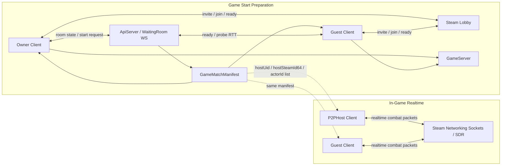
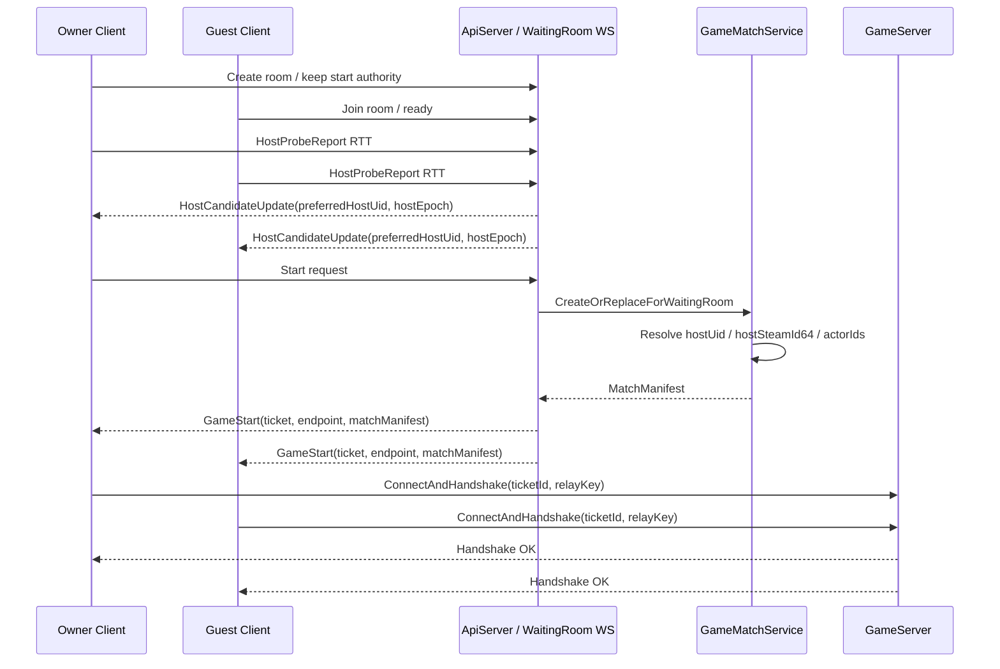
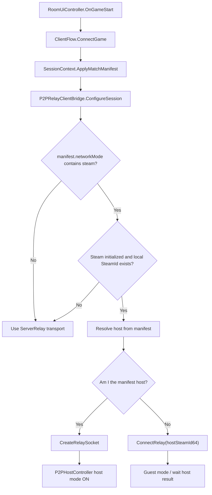
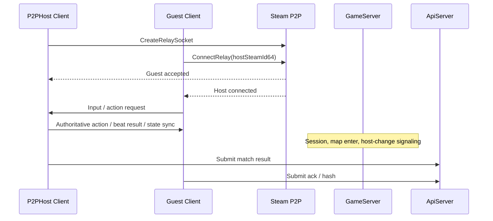
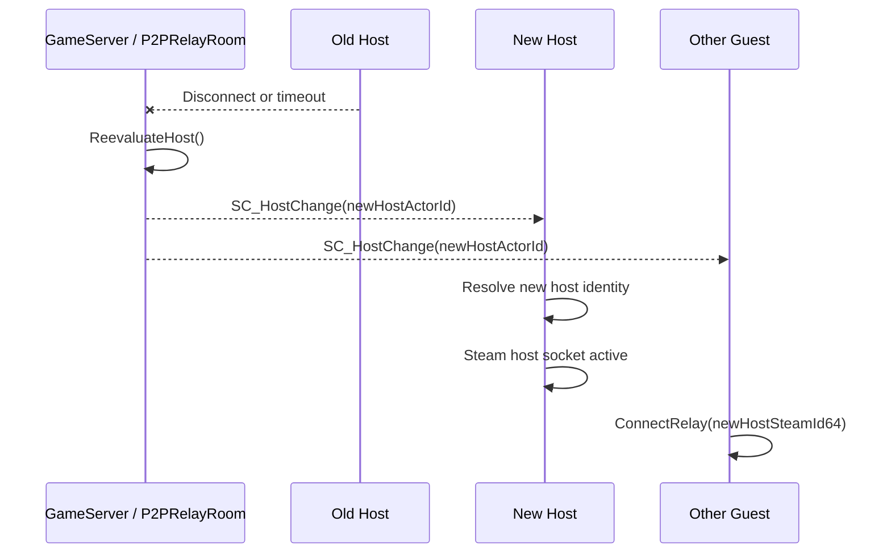

# Steam Hybrid P2P Diagrams

## Overview

```mermaid
flowchart LR
    subgraph PreGame["Game Start Preparation"]
        Owner["Owner Client"]
        Guest["Guest Client"]
        Lobby["Steam Lobby"]
        Api["ApiServer / WaitingRoom WS"]
        Match["GameMatchManifest"]
        GS["GameServer"]
    end

    subgraph Battle["In-Game Realtime"]
        Host["P2PHost Client"]
        Peer["Guest Client"]
        Steam["Steam Networking Sockets / SDR"]
    end

    Owner <-->|"invite / join / ready"| Lobby
    Guest <-->|"invite / join / ready"| Lobby
    Owner <-->|"room state / start request"| Api
    Guest <-->|"ready / probe RTT"| Api
    Api --> Match
    Match --> Owner
    Match --> Guest
    Owner --> GS
    Guest --> GS

    Match -. "hostUid / hostSteamId64 / actorId list" .-> Host
    Match -. "same manifest" .-> Peer
    Host <-->|"realtime combat packets"| Steam
    Peer <-->|"realtime combat packets"| Steam
```

## Start Flow

```mermaid
sequenceDiagram
    participant O as Owner Client
    participant G as Guest Client
    participant WR as ApiServer / WaitingRoom WS
    participant GM as GameMatchService
    participant GS as GameServer

    O->>WR: Create room / keep start authority
    G->>WR: Join room / ready
    O->>WR: HostProbeReport RTT
    G->>WR: HostProbeReport RTT
    WR-->>O: HostCandidateUpdate(preferredHostUid, hostEpoch)
    WR-->>G: HostCandidateUpdate(preferredHostUid, hostEpoch)

    O->>WR: Start request
    WR->>GM: CreateOrReplaceForWaitingRoom
    GM->>GM: Resolve hostUid / hostSteamId64 / actorIds
    GM-->>WR: MatchManifest

    WR-->>O: GameStart(ticket, endpoint, matchManifest)
    WR-->>G: GameStart(ticket, endpoint, matchManifest)

    O->>GS: ConnectAndHandshake(ticketId, relayKey)
    G->>GS: ConnectAndHandshake(ticketId, relayKey)
    GS-->>O: Handshake OK
    GS-->>G: Handshake OK
```

## Client Decision

```mermaid
flowchart TD
    A["RoomUiController.OnGameStart"] --> B["ClientFlow.ConnectGame"]
    B --> C["SessionContext.ApplyMatchManifest"]
    C --> D["P2PRelayClientBridge.ConfigureSession"]
    D --> E{"manifest.networkMode contains steam?"}
    E -- "No" --> F["Use ServerRelay transport"]
    E -- "Yes" --> G{"Steam initialized and local SteamId exists?"}
    G -- "No" --> F
    G -- "Yes" --> H["Resolve host from manifest"]
    H --> I{"Am I the manifest host?"}
    I -- "Yes" --> J["CreateRelaySocket"]
    I -- "No" --> K["ConnectRelay(hostSteamId64)"]
    J --> L["P2PHostController host mode ON"]
    K --> M["Guest mode / wait host result"]
```

## Battle Packet Flow

```mermaid
sequenceDiagram
    participant H as P2PHost Client
    participant G as Guest Client
    participant S as Steam P2P
    participant GS as GameServer
    participant API as ApiServer

    H->>S: CreateRelaySocket
    G->>S: ConnectRelay(hostSteamId64)
    S-->>H: Guest accepted
    S-->>G: Host connected

    G->>H: Input / action request
    H->>G: Authoritative action / beat result / state sync

    Note over GS: Session, map enter, host-change signaling
    H->>API: Submit match result
    G->>API: Submit ack / hash
```

## Host Change

```mermaid
sequenceDiagram
    participant GS as GameServer / P2PRelayRoom
    participant Old as Old Host
    participant New as New Host
    participant Guest as Other Guest

    Old --x GS: Disconnect or timeout
    GS->>GS: ReevaluateHost()
    GS-->>New: SC_HostChange(newHostActorId)
    GS-->>Guest: SC_HostChange(newHostActorId)
    New->>New: Resolve new host identity
    New->>New: Steam host socket active
    Guest->>Guest: ConnectRelay(newHostSteamId64)
```
