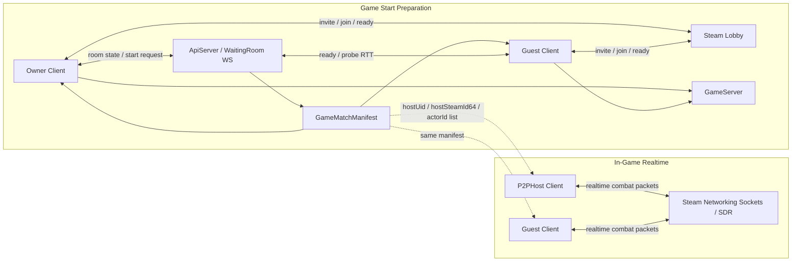
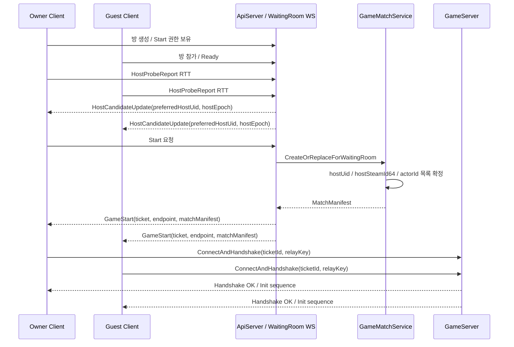
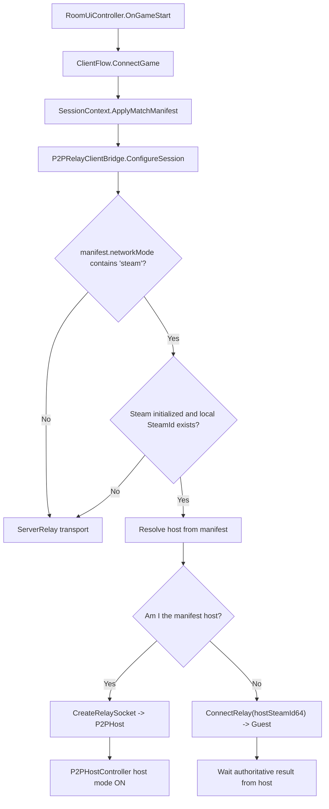
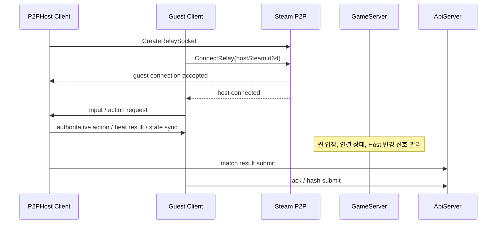
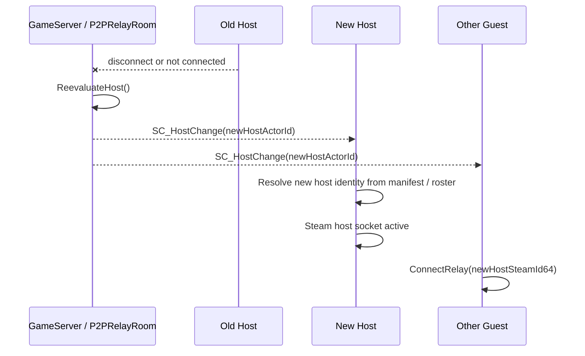

# Steam Hybrid P2P Flow

작성일: 2026-05-03  
대상 프로젝트: RhythmRPG  
문서 목적: Steam P2P를 포함한 Hybrid 구조에서 `서버`, `클라이언트`, `게임 시작 시점`, `P2PHost / Guest Client`의 역할과 흐름을 한눈에 보이도록 정리한다.

Mermaid만 빠르게 보고 싶다면 [steam_hybrid_p2p_diagrams.md](./steam_hybrid_p2p_diagrams.md)를 먼저 열면 된다.

## 한 줄 요약

현재 Hybrid 구조는 다음처럼 이해하면 가장 명확하다.

- `ApiServer / WaitingRoom`: 방 생성, ready 상태, host 후보 probe, GameStart 조율
- `GameMatchManifest`: 누가 Host인지, 각자 ActorId가 무엇인지, 어떤 match인지 확정하는 계약서
- `GameServer`: 티켓 검증, 씬 진입, 초기 세션 연결, 런타임 Host 변경 브로드캐스트
- `Steam P2P`: 전투 중 Host <-> Guest 실시간 패킷 경로
- `P2PHost`: 전투 중 authoritative peer
- `Guest Client`: 입력을 보내고 Host의 확정 결과를 받는 peer

즉, **방장은 사회적 Owner이고, P2PHost는 전투 authority이며, 둘은 같을 수도 있고 다를 수도 있다.**

## 역할 용어 먼저 정리

| 용어 | 의미 | 현재 결정 시점 |
| --- | --- | --- |
| `Owner` | 방을 만든 사람, Start 권한을 가진 사람 | Waiting Room 생성 시 |
| `Preferred Host` | 시작 직전 probe 결과 기준으로 우선 Host 후보가 된 사람 | Waiting Room 중 |
| `P2PHost` | 전투 중 authoritative peer | `MatchManifest` 생성 시 확정, 필요 시 런타임 변경 |
| `Guest Client` | Host가 아닌 나머지 참가자 | `MatchManifest` 생성 시 확정 |
| `ApiServer` | 방/시작 조율, manifest 생성 | 게임 시작 전 |
| `GameServer` | 티켓 핸드셰이크, 맵 입장, Host 변경 신호 | 게임 시작 직후 ~ 전투 중 |
| `Steam Lobby` | 친구 초대, 참가, 로비 바인딩 | 대기방 중 |
| `Steam P2P` | 실시간 전투 패킷 경로 | 전투 중 |

## 구조를 한 장으로 보면

## 게임 시작 전 기준 흐름

핵심은 `게임 시작 전에 서버가 누가 Host인지 먼저 확정하고`, 그 다음에 각 클라이언트가 같은 `MatchManifest`를 들고 움직인다는 점이다.

## 시작 시점에서 누가 Host가 되는가

현재 코드 기준으로는 아래 순서로 이해하면 된다.

1. Waiting Room 동안 각 클라이언트가 `HostProbeReport`를 보낸다.
2. 서버는 최근 probe RTT가 더 좋은 쪽을 `Preferred Host` 후보로 본다.
3. Start 시 `GameMatchManifest`에 `hostUid`, `hostSteamId64`, `hostEpoch`, `participants(actorId 포함)`를 고정한다.
4. 각 클라이언트는 이 manifest를 받은 뒤 자신이 Host인지 Guest인지 판단한다.
5. Steam 사용 가능 조건이 맞으면 `SteamP2P` transport를, 아니면 `ServerRelay` fallback을 사용한다.

즉, **전투 authority 판단의 기준은 더 이상 "누가 먼저 씬에 들어왔나"가 아니라 manifest 안의 Host 정보**다.

## 클라이언트 내부 결정 흐름

## 전투 중 실제 패킷 흐름

현재 Hybrid 구조에서 실시간 전투는 `Steam P2P`가 맡고, 서버는 완전히 사라지지 않는다.  
서버는 여전히 `입장`, `세션`, `Host 변경 신호`, `결과 저장` 경계에 남는다.

## 런타임 Host 변경은 어떻게 보아야 하나

현재 구조에서는 `MatchManifest`로 시작 Host를 고정하지만, 런타임 중에는 `GameServer`가 연결 상태를 보고 `SC_HostChange`를 브로드캐스트할 수 있다.

중요 포인트:

- `Owner`와 `P2PHost`는 같은 개념이 아니다.
- `Preferred Host`는 시작 직전 후보이고, `P2PHost`는 실제 전투 authority다.
- Steam P2P를 쓴다고 해도 `GameServer`는 완전히 없어지지 않는다.
- 현재 구조는 `서버 조율 + 클라이언트 Host authority + Steam P2P transport`의 Hybrid다.

## 현재 코드 기준 매핑

| 역할 | 현재 파일 |
| --- | --- |
| Waiting Room의 Host probe 수집 / HostCandidateUpdate 브로드캐스트 | `Server/ApiServer/5.Presentation/WebSockets/RoomWebSocketHandler.cs` |
| Start 시 `MatchManifest` 생성 | `Server/ApiServer/2.Domain/GameMatch/GameMatchService.cs` |
| GameStart를 받아 게임 서버 접속 시작 | `Client/Assets/0.MainProject/01_Net/Room/UI/RoomUiController.cs` |
| Manifest를 세션에 반영하고 연결 시작 | `Client/Assets/0.MainProject/00_App/Flow/ClientFlow.cs` |
| Steam P2P와 ServerRelay 중 transport 선택 | `Client/Assets/0.MainProject/04_Runtime/Game/Managers/P2PRelayClientBridge.cs` |
| 실제 Steam relay socket 생성 / guest connect | `Client/Assets/0.MainProject/04_Runtime/Game/Managers/SteamP2PClientTransport.cs` |
| 런타임 Host 재평가와 `SC_HostChange` 브로드캐스트 | `Server/GameServer/Rooms/P2PRelayRoom.cs` |
| 전투 authority 로컬 실행 지점 | `Client/Assets/0.MainProject/04_Runtime/Game/Managers/P2PHostController.cs` |

## 이 구조를 설명할 때 추천 문장

회의나 기획 문서에서는 아래처럼 설명하면 혼동이 적다.

- `Owner`는 방의 시작 권한자다.
- `Preferred Host`는 시작 직전 probe 기준으로 계산된 후보자다.
- `P2PHost`는 전투 중 판정 authority를 가진 실제 peer다.
- `ApiServer`는 시작 전 조율과 manifest 확정을 담당한다.
- `GameServer`는 세션 진입과 Host 변경 신호를 담당한다.
- `Steam P2P`는 전투 중 실시간 패킷 통신 경로다.

## 결론

이 Hybrid 구조의 핵심은 `서버가 시작 조건과 Host identity를 고정하고`, `클라이언트가 Steam P2P로 전투를 수행하며`, `문제가 생기면 GameServer가 Host 변경을 다시 조율하는 것`이다.

따라서 시각적으로는 아래 세 층으로 기억하면 된다.

1. `Waiting Room / Match Start 조율 층`
2. `GameServer 입장 / 세션 유지 층`
3. `Steam P2P 전투 authority 층`
