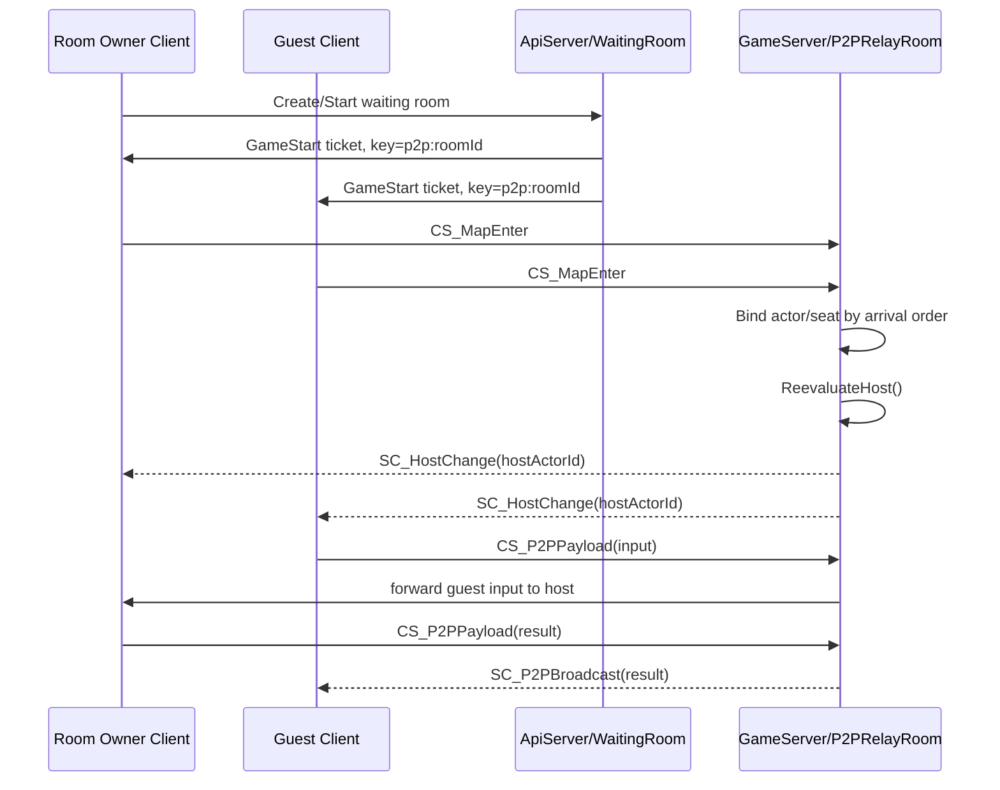
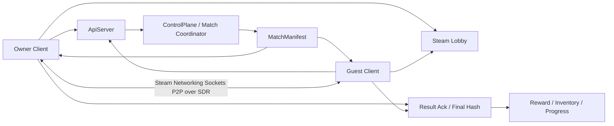
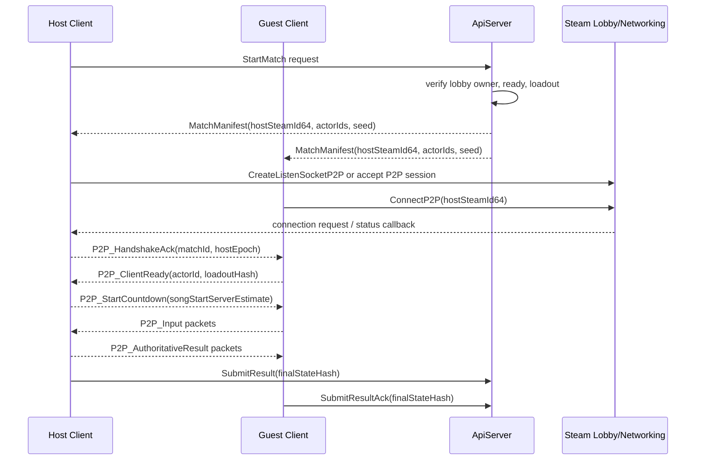
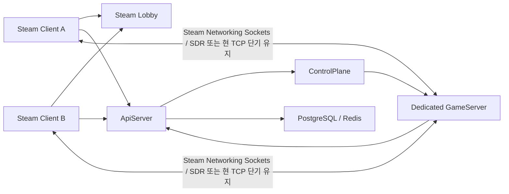
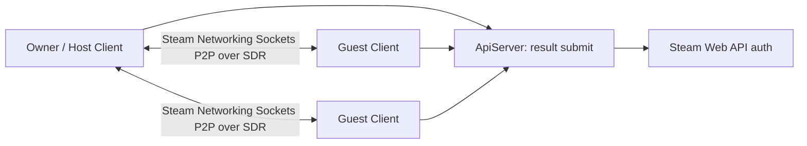

# Steam 출시 목표 멀티플레이어 구현 가이드

작성일: 2026-04-29  
대상 프로젝트: RhythmRPG  
문서 목적: 현재 `P2PRelayRoom` 기반 구조를 Steam 출시 기준에서 어떤 구조로 가져가야 하는지, 개발 환경과 구현 절차까지 한 번에 정리한다.

빠르게 흐름만 보고 싶다면 [steam_hybrid_p2p_flow.md](./steam_hybrid_p2p_flow.md)를 함께 참고한다.  
이 문서는 `Owner`, `Preferred Host`, `P2PHost`, `Guest Client`, `ApiServer`, `GameServer`, `Steam P2P`의 역할을 시각적으로 분리해 둔 보조 문서다.

## 결론

Steam 출시를 목표로 한다면 최종 권장 구조는 **Steam Lobby + Steam 인증 + 권위 서버(authoritative dedicated GameServer)** 이다. 현재 구현처럼 클라이언트 중 한 명이 전투 판정 Host가 되는 방식은 개발 속도는 빠르지만, Steam 출시 후 보상/진행도/아이템이 얽히면 치팅, Host 이탈, Host 선출 레이스, NAT/중계 비용 문제가 계속 남는다.

권장 우선순위는 다음과 같다.

1. 정식/상점 빌드: Dedicated GameServer가 전투 권위를 가진다.
2. 캐주얼/친구방/오프라인 테스트: Steam Networking Sockets P2P Host 모드를 허용할 수 있다.
3. 현재 자체 `P2PRelayRoom`은 Steam 전환 전 개발용 fallback 또는 사내 테스트용으로만 유지한다.

즉, "방을 만든 사람이 Host가 아닌 문제"는 현재 구조에서는 고칠 수 있지만, 출시용 이상 구조에서는 **게임 플레이 Host 선출 자체를 없애는 것**이 가장 안정적이다.

## 현재 구조 진단

현재 relay mode는 Steam Relay나 Unity Relay가 아니다. GameServer 안의 `P2PRelayRoom`이 클라이언트 패킷을 받아 다른 클라이언트에게 전달하는 자체 relay 구조다.

현재 흐름은 다음과 같다.



문제는 Host 기준이 대기방의 `ownerUid`가 아니라 GameServer 입장 순서라는 점이다. `RoomBase`는 `CS_MapEnter`를 먼저 처리한 연결에 낮은 `SeatIndex`와 낮은 `ActorId`를 준다. `P2PRelayRoom.ReevaluateHost()`는 기존 Host가 살아 있으면 유지하고, 없으면 연결된 플레이어 중 `SeatIndex`, `ActorId`가 가장 낮은 사람을 Host로 잡는다. 그래서 방장이 게임 씬 로드나 네트워크 핸드셰이크에서 늦으면 참가자가 Host가 될 수 있다.

현재 구조의 장점은 구현이 빠르고 현재 서버 자산을 재사용한다는 점이다. 단점은 다음과 같다.

- 실시간 트래픽이 모두 자체 GameServer를 지난다.
- 클라이언트 Host가 전투 판정과 결과 제출을 맡는다.
- 방장과 전투 Host의 개념이 분리되어 있다.
- Host 이탈 시 게임 상태 이전이 약하다.
- Steam 친구 초대, 오버레이 join, Steam Lobby 검색 경험을 직접 다시 만들어야 한다.

## Steam 기준 목표 아키텍처

## Steam P2P 전제의 권장 구조

전투 중 실시간 통신을 Steam에서 제공하는 P2P 기능으로 처리한다면, 목표 구조는 **서버 조율형 Steam P2P Host-authoritative match**가 된다. 이 구조에서 서버는 전투 프레임을 직접 돌리지 않지만, 전투 시작 조건과 참가자 검증, 장비 스냅샷, match manifest, 최종 보상 저장 권한은 계속 가진다.



이때 사용하면 좋은 Steam 기능은 다음과 같다.

| 기능 | 사용처 |
| --- | --- |
| Steam Lobby | 방 생성, 친구 초대, 로비 검색, ready 상태, owner 표시 |
| Steam Auth Ticket | ApiServer 로그인/계정 검증 |
| Steam Networking Sockets P2P | 전투 중 Host와 Guest 사이 실시간 패킷 |
| Steam Datagram Relay | NAT/방화벽 우회와 IP 비노출 relay 경로 |

Steam Lobby chat/binary message는 ready, character select, start vote 같은 작은 제어 메시지에는 사용할 수 있지만, 리듬 전투 입력/판정/상태 동기화 같은 실시간 게임 데이터에는 쓰지 않는다. 실시간 데이터는 Steam Networking Sockets 또는 Steam Networking Messages 계열로 분리한다.

### 권장 책임 분리

| 시점 | 서버 책임 | Steam P2P 책임 | 클라이언트 책임 |
| --- | --- | --- | --- |
| 로그인 | Steam ticket 검증, uid 매핑 | 없음 | SteamID/ticket 획득 |
| 방 대기 | match 조건 검증, 필요 시 lobby metadata 검증 | Lobby join/invite | ready UI, map 선택 |
| 시작 직전 | `MatchManifest` 생성, 장비/스킬 freeze, Host 확정 | 연결 대상 SteamID 전달 | P2P 연결 준비 |
| 전투 중 | heartbeat/탈주 기록 정도만 선택 | 입력/결과/beat sync 실시간 전송 | Host 판정, Guest 예측/표시 |
| 전투 후 | 결과 검증, 보상/장비/진행도 저장 | 없음 | Host result, Guest ack/hash 제출 |

### MatchManifest

Steam P2P 모드에서는 게임 시작 전에 서버가 모든 참가자에게 동일한 `MatchManifest`를 내려줘야 한다. 이것이 전투 중 서버 부재를 보완하는 계약서 역할을 한다.

```json
{
  "matchId": "m_20260429_001",
  "networkMode": "steam_p2p_host",
  "protocolVersion": 20260429,
  "mapId": "Game_Forest_01",
  "stageSeed": 18273645,
  "songStartDelayMs": 3000,
  "hostUid": "u_owner",
  "hostSteamId64": "76561198000000000",
  "hostEpoch": 1,
  "participants": [
    {
      "uid": "u_owner",
      "steamId64": "76561198000000000",
      "actorId": 1,
      "loadoutHash": "sha256:..."
    },
    {
      "uid": "u_guest",
      "steamId64": "76561198000000001",
      "actorId": 2,
      "loadoutHash": "sha256:..."
    }
  ]
}
```

필수 원칙:

- `actorId`는 GameServer 입장 순서가 아니라 서버가 manifest에서 확정한다.
- `hostSteamId64`는 방 생성자 또는 명시적으로 양도된 Steam Lobby owner로 확정한다.
- `stageSeed`와 loadout snapshot은 모든 클라이언트가 동일해야 한다.
- 전투 중 장비/스킬 변경은 이번 match에 반영하지 않는다.
- `protocolVersion`이 다르면 P2P 연결을 시도하지 않는다.

### Steam P2P 연결 흐름

권장 연결 흐름은 다음과 같다.



Host는 Steam P2P listen socket 또는 symmetric connection 정책을 열고, Guest는 manifest의 `hostSteamId64`를 대상으로 접속한다. 연결이 완료되면 자체 `P2P_Handshake`를 반드시 한 번 더 수행한다. Steam 연결이 성공했다는 사실만으로 현재 match의 올바른 상대라는 뜻은 아니기 때문이다.

`P2P_Handshake`에서 확인할 값:

| 값 | 확인 이유 |
| --- | --- |
| `matchId` | 다른 방/이전 방 패킷 차단 |
| `protocolVersion` | packet schema 불일치 차단 |
| `hostEpoch` | 낡은 Host 변경 이벤트 차단 |
| `steamId64` | manifest 참가자 검증 |
| `actorId` | 입력 위조 방지 |
| `loadoutHash` | 전투 시작 전 장비 스냅샷 일치 확인 |

### 전투 중 패킷 방향

Steam P2P 전투는 완전 mesh보다 star topology를 권장한다.

```text
Guest -> Host: input
Host -> Guests: authoritative result
Host <-> Guests: ping, state hash, heartbeat
```

패킷 예시:

| 패킷 | 방향 | 전송 |
| --- | --- | --- |
| `P2P_Input` | Guest -> Host | unreliable sequenced |
| `P2P_InputAck` | Host -> Guest | unreliable |
| `P2P_BeatSync` | Host -> Guest | unreliable |
| `P2P_ActionInstant` | Host -> Guests | reliable or unreliable with seq |
| `P2P_BeatActions` | Host -> Guests | reliable ordered |
| `P2P_EntitySpawn` | Host -> Guests | reliable ordered |
| `P2P_EntityDespawn` | Host -> Guests | reliable ordered |
| `P2P_StateHash` | 양방향 | unreliable periodic |
| `P2P_MatchEnd` | Host -> Guests | reliable ordered |

리듬 게임 특성상 입력은 최신성이 중요하고, 확정 결과는 순서와 누락 방지가 중요하다. 그래서 입력은 `unreliable sequenced`, 결과는 `reliable ordered`를 기본값으로 둔다.

### 결과 제출과 검증

전투 결과와 장비/보상 처리는 현재처럼 서버 API에서 진행하되, Host 단독 결과만 믿지 않는다.

권장 제출 흐름:

1. Host가 `SubmitP2PResult(matchId, result, finalStateHash, timelineHash)`를 보낸다.
2. 각 Guest가 `SubmitP2PResultAck(matchId, finalStateHash, localStats)`를 보낸다.
3. ApiServer는 manifest와 비교한다.
4. Host result와 다수 Guest hash가 일치하면 보상을 지급한다.
5. 불일치하면 보상 보류, 낮은 보상, 재검토 로그 중 하나로 처리한다.

검증 항목:

| 항목 | 검증 방식 |
| --- | --- |
| 참가자 | manifest의 `uid`/`steamId64`와 제출자 일치 |
| 플레이 시간 | 서버가 기록한 start/end 시각과 오차 제한 |
| stage/loadout | `stageSeed`, `loadoutHash` 일치 |
| 클리어 시간 | 최소/최대 가능 시간 범위 |
| damage | 스킬/장비 기준 상한 검증 |
| finalStateHash | Host와 Guest 다수결 또는 전원 일치 |
| 중복 제출 | `matchId` idempotency key |

이 방식은 dedicated server만큼 강한 보안은 아니지만, 현재 장비/보상 API를 유지하면서 Steam P2P 실시간 전투를 붙이는 현실적인 중간 지점이다.

### 현재 코드에서의 직접 전환 방향

현재 자체 relay를 Steam P2P로 바꾸려면 `P2PRelayClientBridge`의 역할을 그대로 transport adapter로 바꾸는 접근이 좋다.

현재:

```text
P2PRelayClientBridge.SendWrappedPacket(packet)
    -> NetworkManager.Send(CS_P2PPayload)
    -> GameServer/P2PRelayRoom
    -> Host 또는 Guests
```

목표:

```text
P2PSteamClientBridge.SendWrappedPacket(packet)
    -> SteamP2PTransport.Send(targetSteamId64, payload)
    -> Host 또는 Guests
```

추가할 인터페이스 예시:

```csharp
public interface IP2PRealtimeTransport
{
    bool IsReady { get; }
    bool IsHost { get; }
    ulong LocalSteamId64 { get; }
    ulong HostSteamId64 { get; }

    event Action<ulong, ArraySegment<byte>> PacketReceived;
    event Action<ulong, P2PConnectionState> ConnectionChanged;

    void Configure(MatchManifest manifest);
    void StartHost();
    void ConnectToHost();
    void SendToHost(ArraySegment<byte> payload, P2PDelivery delivery);
    void Broadcast(ArraySegment<byte> payload, P2PDelivery delivery);
    void Disconnect(string reason);
}
```

`P2PHostController`는 당장 전부 갈아엎기보다 다음 순서로 이관한다.

1. `P2PRelayClientBridge`와 직접 결합된 부분을 `IP2PRealtimeTransport`로 감싼다.
2. `CS_P2PPayload` wrapper 의존을 제거하고 raw packet payload를 주고받게 한다.
3. `SessionContext.MyActorId`는 manifest의 actor id로 설정한다.
4. Host 판정은 `SC_HostChange`가 아니라 manifest의 `hostSteamId64`로 한다.
5. 서버 GameServer relay room 없이도 `P2PHostController.EnqueueGuestActionRequest`가 동작하게 한다.
6. 결과 제출만 ApiServer endpoint로 분리한다.

### MVP 권장 범위

Steam P2P를 전제로 한 MVP는 다음 범위가 현실적이다.

- 2~4인 PvE만 지원
- Host migration 없음
- Host disconnect 시 match failed 또는 town return
- 보상은 Host result + Guest ack/hash 일치 시 지급
- 불일치 시 보상 보류 또는 낮은 보상
- ranked/경쟁 콘텐츠에는 사용하지 않음
- 모든 참가자는 Steam 로그인 필수
- Steam Lobby owner가 기본 Host

MVP 이후에 Host migration, dedicated authority, replay 검증을 확장한다.

### 권장안 A: Dedicated Authoritative GameServer

정식 출시 목표 구조는 다음과 같다.



역할 분리는 다음과 같다.

| 영역 | 권장 담당 |
| --- | --- |
| 친구 초대, 로비 검색, 로비 멤버 상태 | Steam Lobby |
| 계정 인증, SteamID 매핑, 보상/인벤토리 | ApiServer |
| 서버 배정, ticket 발급, match reservation | ControlPlane |
| 전투 판정, 몬스터 AI, 리듬 beat 기준, 보상 결과 | Dedicated GameServer |
| 실시간 트래픽 | Steam Networking Sockets/SDR 또는 단기적으로 현재 TCP |

Dedicated 구조에서는 `P2PHostController`가 전투 권위자가 되면 안 된다. 클라이언트는 입력과 예측 표시만 하고, 확정 결과는 GameServer가 보낸다. `P2PContentDirector`와 전투 판정 로직은 서버에서 돌 수 있도록 shared deterministic core로 옮기는 것이 좋다.

이 구조의 가장 큰 장점은 출시 이후 운영 리스크가 작다는 점이다.

- Host 선출 문제가 사라진다.
- Host가 게임을 조작해서 보상을 제출하는 문제가 줄어든다.
- 재접속, 이탈, 타임아웃 정책을 서버에서 일관되게 처리한다.
- 랭킹, 업적, 드랍, 성장 재화와 궁합이 좋다.

### 권장안 B: Steam P2P Host Mode

예산이나 일정상 완전 dedicated 전환이 어렵다면, Steam 출시 초기에는 친구방/비경쟁 PvE 전용으로 client-host mode를 둘 수 있다. 단 이때도 현재 자체 relay가 아니라 Steam Networking Sockets의 P2P 연결을 사용하는 쪽이 좋다.



이 모드에서 Host는 임의 선출하면 안 된다. 시작 시점에 backend가 `hostSteamId`와 `hostEpoch`를 명시하고 모든 클라이언트가 같은 값을 받아야 한다.

Host 선정 기본 정책:

1. 방 생성자 또는 현재 Steam Lobby owner를 우선 Host로 지정한다.
2. 방장이 Host 준비 probe에 실패하면 Start를 막거나 명시적으로 Host를 양도한다.
3. Start 이후에는 `hostSteamId`를 고정한다.
4. Host 변경은 `hostEpoch`를 증가시킨 서버 명령으로만 허용한다.
5. Host가 끊기면 match를 pause하고 재선출 또는 방 종료를 명확히 선택한다.

이 모드의 보상 정책:

- 랭킹, 거래 가능 재화, 희귀 드랍은 지급하지 않거나 서버 검증을 강하게 건다.
- Host가 제출한 결과는 deterministic replay, 플레이 시간, 입력 로그, stage seed, damage cap으로 검증한다.
- 검증 불가한 전투 결과는 캐주얼 보상으로 제한한다.

## Steam 기능별 적용 방식

### Steam Lobby

Steam Lobby는 방 목록, 초대, 친구 join, 오버레이 진입, 로비 메타데이터에 사용한다. Valve 문서 기준으로 Lobby chat/binary message는 작은 제어 메시지에는 쓸 수 있지만 게임 데이터처럼 양이 많은 트래픽에는 Steam Networking API를 쓰는 것이 맞다.

Lobby metadata 예시:

| Key | 예시 | 설명 |
| --- | --- | --- |
| `build` | `0.4.12` | 클라이언트 호환성 필터 |
| `protocol` | `20260429` | 네트워크 프로토콜 버전 |
| `map` | `Game_Forest_01` | 선택 맵 |
| `mode` | `dedicated` 또는 `client_host` | 네트워크 모드 |
| `region` | `kr` | 선호 지역 |
| `state` | `open`, `ready`, `starting`, `in_game` | 로비 상태 |
| `hostSteamId` | `7656...` | client-host 모드에서만 사용 |
| `matchId` | `...` | backend match reservation id |

Steam Lobby owner는 사회적 방장이다. Dedicated 구조에서는 simulation authority가 아니다. Client-host 모드에서는 lobby owner를 Host 후보로 쓸 수 있지만, 게임 시작 후에는 backend가 확정한 `hostSteamId`가 진짜 기준이어야 한다.

### Steam 인증

Steam 출시 빌드에서는 자체 uid만 믿지 말고 SteamID64를 계정의 1차 외부 식별자로 삼는다.

권장 로그인 흐름:

1. 클라이언트가 Steamworks API 초기화 후 현재 유저의 SteamID64를 얻는다.
2. 클라이언트가 Steam auth ticket을 요청한다.
3. 클라이언트가 ticket을 ApiServer `/auth/steam`으로 보낸다.
4. ApiServer가 Steam Web API로 ticket을 검증한다.
5. ApiServer가 내부 `uid`와 `steamId64`를 매핑하고 기존 JWT/세션을 발급한다.

서버 저장 모델:

| 필드 | 설명 |
| --- | --- |
| `uid` | 내부 계정 id. 기존 시스템 유지 가능 |
| `steamId64` | Steam 계정 고유 id |
| `displayName` | Steam persona name 캐시 |
| `lastSteamAuthAt` | 마지막 Steam ticket 검증 시각 |
| `banState` | 자체 제재/VAC 관련 상태 캐시 |

주의할 점:

- Steam publisher key는 서버 환경 변수 또는 secret store에만 둔다.
- Steam auth ticket, publisher key, encrypted app ticket private key는 클라이언트에 넣지 않는다.
- 개발용 `steam_appid.txt`는 커밋하지 않는다.

### Steam Networking Sockets / SDR

Steam 출시에서 네트워크 선택지는 세 단계로 나눈다.

1. **단기 안정화**: 현재 TCP GameServer를 유지하고, Steam Lobby/Auth만 먼저 붙인다.
2. **중기 권장**: dedicated GameServer의 transport를 Steam Networking Sockets로 추상화한다.
3. **장기 이상**: GameServer를 SDR Hosted Dedicated Server 흐름 또는 Valve가 권장하는 ticket 기반 접속 흐름으로 연결한다.

.NET GameServer에서 Steam Networking Sockets를 바로 쓰는 것은 C++ SDK 중심이라 작업량이 있다. 그래서 transport 계층을 먼저 분리하는 것이 중요하다.

```csharp
public interface IGameTransport
{
    event Action<ClientConnection, ArraySegment<byte>> Received;
    void Start(GameTransportOptions options);
    void Send(ClientConnection target, ArraySegment<byte> payload, DeliveryMode mode);
    void Disconnect(ClientConnection target, string reason);
    void Stop();
}
```

구현체는 다음처럼 나눈다.

| 구현체 | 용도 |
| --- | --- |
| `TcpGameTransport` | 현재 GameServer 유지, 개발/단기 출시 후보 |
| `SteamSocketsClientTransport` | Unity 클라이언트 Steam P2P 또는 dedicated 접속 |
| `SteamSocketsServerTransport` | dedicated 서버 SDR 전환 |
| `LoopbackTransport` | 서버 단위 테스트 |

Steam 전용 transport를 붙일 때의 핵심은 게임 로직과 packet serialization을 transport에서 분리하는 것이다. 현재 `NetworkManager`, `Session`, `PacketManager`, `ServerSession` 주변에 TCP 가정이 섞여 있다면 이 부분을 먼저 adapter화한다.

## Host 선출 정책

Dedicated 구조에서는 전투 Host가 없다. 모든 클라이언트는 동일하게 client이고, GameServer가 Host다.

Client-host fallback을 유지한다면 정책은 다음처럼 바꾼다.

### 현재 방식

```text
Host = 현재 연결된 플레이어 중 SeatIndex/ActorId가 가장 낮은 사람
```

이 방식은 방 생성자를 보장하지 않는다.

### 권장 방식

```text
Host = backend가 명시한 hostSteamId
```

Host 결정 절차:

1. 방 생성 시 `ownerSteamId`를 저장한다.
2. Start 요청은 owner만 가능하게 한다.
3. Start 직전 owner client에게 `HostReadyProbe`를 보낸다.
4. owner가 일정 시간 안에 응답하면 `hostSteamId = ownerSteamId`.
5. owner가 실패하면 Start를 실패시키거나 owner가 선택한 다른 멤버에게 Host를 양도한다.
6. 모든 ticket payload에 `hostSteamId`, `hostEpoch`, `matchId`, `mapId`, `protocolVersion`을 넣는다.
7. GameServer 또는 lobby metadata가 `SC_HostChange`를 보내더라도 `hostEpoch`가 낮으면 무시한다.

Host migration은 가능하면 출시 MVP에서 빼는 것이 좋다. 리듬 게임은 beat 기준, 입력 판정, 몬스터 AI, 스킬 이벤트가 많아 migration 중 오차가 체감된다. 필요하면 match pause 후 최신 authoritative snapshot을 기준으로 재개해야 한다.

## 전투 권위와 리듬 동기화

RhythmRPG는 일반 액션 게임보다 시간 기준이 더 중요하다. 권장 원칙은 다음과 같다.

- 모든 판정 기준은 `serverSongStartMs + beatIndex * beatDurationMs`로 계산한다.
- 클라이언트는 입력을 즉시 예측 표시하지만 확정 결과는 authority가 보낸다.
- 입력 패킷에는 `localInputTimeMs`, `estimatedServerTimeMs`, `beatIndex`, `inputSeq`, `actorId`를 포함한다.
- authority는 beat window 안의 입력만 채택한다.
- 같은 beat의 충돌은 deterministic ordering으로 정렬한다.

정렬 기준 예시:

```text
beatIndex ASC
actionPriority ASC
serverReceiveTime ASC
actorId ASC
inputSeq ASC
```

Dedicated 전환을 쉽게 하려면 `P2PHostController` 안의 전투 처리 코드를 다음처럼 나누는 것이 좋다.

| 현재 책임 | 분리 후 위치 |
| --- | --- |
| 입력 검증 | `CombatAuthority` |
| beat별 command queue | `BeatCommandScheduler` |
| 스킬 이벤트 실행 | `SkillTimelineExecutor` |
| 데미지/이동 판정 | `CombatRules` |
| 결과 패킷 생성 | `CombatResultEmitter` |
| 클라이언트 로컬 표시 | `ClientPredictionPresenter` |

이렇게 나누면 같은 core를 dedicated GameServer와 client-host fallback에서 모두 재사용할 수 있다.

## 개발 환경 구성

### 필수 로컬 환경

| 영역 | 권장 값 |
| --- | --- |
| OS | Windows 11 개발 기준, Linux 서버 배포 기준 |
| Unity | 현재 프로젝트 기준 Unity `6000.3.12f1` |
| .NET | Server 프로젝트 기준 .NET 8 SDK |
| IDE | Rider 또는 Visual Studio 2022 |
| Container | Docker Desktop |
| DB | PostgreSQL 15 |
| Cache/Room state | Redis 7 |
| Steam | Steam client 설치 및 개발 계정 로그인 |
| Steamworks | 실제 AppID 접근 권한, Steamworks SDK |

현재 repo의 서버 구성은 `Server/docker-compose.yml` 기준으로 PostgreSQL, Redis, ControlPlane, ApiServer, TownServer, GameServer가 있다. Steam 전환 후에도 이 구성은 유지하되, 인증과 로비/매치메이킹 경계만 Steam에 맞게 바꾸는 것이 좋다.

### Steamworks SDK 배치

권장 원칙:

- Steamworks SDK 원본 전체를 repo에 넣지 않는다.
- 필요한 redistributable만 Unity plugin 또는 build pipeline으로 복사한다.
- SDK 버전은 문서화하고 CI 변수로 관리한다.
- Windows client에는 `steam_api64.dll`이 실행 파일 옆 또는 Unity plugin output에 있어야 한다.
- Linux dedicated server에서 Steam GameServer API를 쓰면 Linux용 redistributable을 포함한다.

예시 환경 변수:

```text
STEAM_APP_ID=1234560
STEAM_WEB_API_PUBLISHER_KEY=***secret***
STEAMWORKS_SDK_DIR=C:\SteamworksSDK\sdk
RHYTHM_ENV=Development
```

### Unity Editor 개발

Unity Editor에서 Steam API를 테스트할 때:

1. Steam client를 실행하고 개발 계정으로 로그인한다.
2. Editor 실행 경로 또는 standalone build 출력 경로에 `steam_appid.txt`를 생성한다.
3. 파일 내용은 AppID 숫자만 둔다.
4. 이 파일은 `.gitignore`에 포함한다.
5. Steam 초기화 실패 시 게임은 `SteamUnavailable` 상태로 떨어지고, 내부 dev auth로 fallback할 수 있게 한다.

주의:

- `steam_appid.txt`는 Steam depot 업로드 빌드에 포함하지 않는다.
- 같은 Steam 계정으로 두 클라이언트를 동시에 멀티플레이 테스트하기 어렵다. 최소 2개 이상의 Steam 개발 계정과 2대 이상의 PC 또는 VM을 준비한다.
- Steam Overlay, invite, join callback은 Editor보다 standalone build에서 먼저 안정화한다.

### 서버 개발

로컬 서버 실행 기준:

```powershell
cd Server
docker compose up -d db redis controlplane apiserver gameserver
dotnet test .\Server.sln
```

Steam auth 검증은 로컬에서도 실제 Steam Web API를 호출하므로 secret이 필요하다. secret은 다음 우선순위로 주입한다.

1. 로컬 user secrets 또는 `.env.local` 같은 커밋 제외 파일
2. CI secret
3. 운영 secret store

서버 로깅에는 다음 값을 반드시 넣는다.

| 로그 필드 | 이유 |
| --- | --- |
| `steamId64` | Steam 계정 기준 추적 |
| `uid` | 내부 계정 기준 추적 |
| `lobbyId` | Steam Lobby 문제 추적 |
| `matchId` | 게임 세션 추적 |
| `hostSteamId` | client-host fallback 디버깅 |
| `ticketId` | 접속 실패 추적 |
| `protocolVersion` | 빌드 호환성 추적 |

### SteamPipe / 배포 환경

Steam 배포 파이프라인은 최소 3개 branch를 둔다.

| Branch | 용도 |
| --- | --- |
| `internal` | 개발팀 매일 테스트 |
| `qa` | QA/지인 테스트, password branch |
| `default` | 출시 또는 출시 후보 |

권장 CI 단계:

1. Unity batchmode client build
2. .NET server build/test
3. packet generator 실행 및 generated file diff 검사
4. client/server protocol version stamp 생성
5. Steam redistributable 포함 여부 검사
6. `steam_appid.txt` 포함 여부 실패 처리
7. SteamPipe ContentBuilder preview
8. `internal` 또는 `qa` branch 업로드

릴리즈 전 수동 확인:

- Steam overlay 열림
- 친구 초대 수신
- `+connect_lobby <lobbyId>` 진입
- beta branch 선택 후 업데이트
- clean OS에서 redistributable 설치
- Windows 방화벽/백신 환경에서 접속

## 구현 로드맵

### Phase 1: Steam identity layer

목표: 기존 계정 시스템을 유지하면서 SteamID64를 붙인다.

작업:

- `ISteamPlatformService` 인터페이스 추가
- Unity client Steam 초기화 모듈 추가
- `GetSteamId64`, `RequestAuthTicket`, `OnAuthTicketReady` 추상화
- ApiServer `/auth/steam` 추가
- 기존 `ClientIdentity` 또는 `AuthSession`에 `SteamId64` 추가
- DB migration으로 user table에 `SteamId64` unique index 추가

완료 기준:

- Steam 계정으로 로그인하면 기존 uid 또는 신규 uid에 매핑된다.
- Steam auth 실패 시 명확한 오류 UI가 뜬다.
- publisher key가 클라이언트 빌드에 포함되지 않는다.

### Phase 2: Steam Lobby adapter

목표: 현재 WaitingRoom UI를 Steam Lobby 기반으로 교체하거나 dual mode로 둔다.

작업:

- `IRoomService` 인터페이스 도입
- `ApiWaitingRoomService`와 `SteamLobbyRoomService` 구현 분리
- Steam Lobby 생성/검색/입장/퇴장/메타데이터 갱신
- Lobby owner 표시와 Start 권한 동기화
- 친구 invite와 join callback 처리
- build/protocol mismatch 필터링

완료 기준:

- Steam 친구 초대로 방에 들어올 수 있다.
- 방 목록은 build/protocol/map/maxPlayers 기준으로 필터링된다.
- Start는 owner만 가능하고, 모든 참가자의 ready 상태가 동기화된다.

### Phase 3: Dedicated GameServer authority

목표: 정식 게임 모드에서 client-host 권위를 제거한다.

작업:

- `P2PHostController` 전투 로직을 shared core로 분리
- GameServer에 `CombatAuthority` 도입
- `P2PContentDirector` stage/monster AI를 서버 실행 가능 구조로 이동
- client는 `CS_ActionRequest`만 전송하고 `SC_BeatActions`/`SC_ActionInstantBroadcast`를 수신
- 게임 결과 제출은 client가 아니라 GameServer가 ApiServer로 보고

완료 기준:

- 클라이언트 Host 없이도 몬스터 AI와 스킬 판정이 진행된다.
- 모든 보상은 GameServer 결과만 기준으로 지급된다.
- 클라이언트 연결 순서가 게임 권위에 영향을 주지 않는다.

### Phase 4: Steam Networking transport

목표: transport를 TCP에서 Steam Networking Sockets/SDR로 전환 가능하게 만든다.

작업:

- client/server 공통 transport abstraction 추가
- 현재 TCP 구현을 `TcpGameTransport`로 감싸기
- Unity client에 Steam Networking Sockets wrapper 연결
- dedicated server용 native bridge 또는 sidecar 검토
- connection state, reconnect, reliable/unreliable channel 정책 정의

전송 채널 예시:

| Channel | Delivery | 용도 |
| --- | --- | --- |
| `control` | reliable ordered | handshake, init, host/match state |
| `input` | unreliable sequenced | 반복 입력, 위치 의도 |
| `combat` | reliable ordered | 확정 전투 결과 |
| `sync` | unreliable | ping, beat sync, telemetry |

완료 기준:

- TCP와 Steam transport를 config로 바꿀 수 있다.
- packet serialization은 transport와 무관하게 동일하다.
- 연결 실패와 reconnect 로그가 matchId 기준으로 추적된다.

### Phase 5: Client-host fallback 정리

목표: fallback을 유지하더라도 Host 선출 레이스를 없앤다.

작업:

- `P2PRelayRoom` 생성 시 `ownerSteamId` 또는 `ownerUid` 전달
- `ReevaluateHost()`에서 owner 우선 또는 explicit `hostActorId` 사용
- Start ticket에 `hostSteamId`, `hostEpoch` 포함
- Host가 아닌 클라이언트가 결과 제출 시 거부
- Host timeout 시 pause/abort 정책 명시

완료 기준:

- 방장이 정상 연결되면 항상 Host가 된다.
- 방장이 늦게 `CS_MapEnter`를 보내도 다른 멤버가 Host가 되지 않는다.
- Host가 끊겼을 때 UI와 서버 상태가 일치한다.

## QA 체크리스트

### 네트워크

- 2인, 4인, maxPlayers 인원으로 start
- 방장이 가장 늦게 로딩되는 경우
- 게스트가 가장 먼저 GameServer에 들어오는 경우
- Host 후보가 alt+F4로 종료되는 경우
- Steam client offline 전환
- 200ms/400ms RTT, 2%/5% packet loss
- 클라이언트 빌드 버전 불일치

### 리듬/전투

- 같은 beat에 여러 명이 같은 타겟 공격
- 같은 beat에 이동과 공격 충돌
- judge window 경계 입력
- 서버 beat sync drift
- scene load 전 `SC_InitMap` 수신
- 몬스터 AI와 player action 동시 처리

### Steam

- Steam API init 실패
- Steam Overlay 열림
- friend invite 수락
- `+connect_lobby` launch
- private lobby / friends-only lobby / public lobby
- beta branch별 매칭 분리
- `steam_appid.txt` 없는 depot build

### 보안/운영

- Steam auth ticket 재사용
- 만료 ticket 사용
- 다른 SteamID로 ticket 변조
- client-host result 조작
- 보상 중복 제출
- reconnect 후 중복 actor 생성
- Redis 재시작
- ApiServer 재시작
- GameServer graceful shutdown

## 운영 지표

출시 전후로 다음 지표를 수집해야 한다.

| 지표 | 기준 |
| --- | --- |
| lobby create success rate | 방 생성 성공률 |
| lobby join success rate | 초대/검색 입장 성공률 |
| match start failure reason | ready, ticket, allocation, transport 실패 구분 |
| connect time p50/p95 | ticket 수신부터 InitMap까지 |
| beat drift p50/p95 | client estimate와 server beat 차이 |
| input late drop rate | 판정 window 밖 입력 비율 |
| reconnect success rate | 재접속 성공률 |
| host migration count | fallback 모드에서만 추적 |
| result validation failure | 보상 검증 실패율 |

## 현재 코드 기준 권장 수정 순서

1. 단기 버그 수정: `P2PRelayRoom`에 owner 정보를 넘기고 owner 우선 Host 선출로 바꾼다.
2. 문서화: `owner`, `lobby owner`, `host`, `authority` 용어를 코드와 UI에서 분리한다.
3. 추상화: `RoomUiController`가 직접 Api waiting room에 묶이지 않도록 `IRoomService`를 둔다.
4. 인증: `AuthApi`에 Steam auth endpoint를 추가하고 `ClientIdentity`에 SteamID64를 넣는다.
5. 전투 분리: `P2PHostController`의 판정 core를 서버에서도 실행 가능한 shared 모듈로 이동한다.
6. Dedicated 모드: `P2PRelayRoom`을 거치지 않는 authoritative GameRoom을 정식 모드로 만든다.
7. Steam Lobby: 친구 초대/로비 검색/metadata를 Steam Lobby adapter로 전환한다.
8. Steam transport: TCP transport abstraction 후 Steam Networking Sockets/SDR 전환을 진행한다.

## 출시 판단 기준

정식 출시 후보는 다음 조건을 만족해야 한다.

- 보상 지급이 client-host 결과만으로 결정되지 않는다.
- 방 생성자와 Host 개념이 UI와 서버 로그에서 혼동되지 않는다.
- Steam 계정 인증 실패 시 게임 진입이 차단된다.
- Steam 초대와 beta branch 테스트가 안정적으로 동작한다.
- 클라이언트 연결 순서가 전투 권위에 영향을 주지 않는다.
- 서버 재시작/클라이언트 재접속 후 중복 보상이 발생하지 않는다.

## 참고 공식 문서

- [Steam Datagram Relay](https://partner.steamgames.com/doc/features/multiplayer/steamdatagramrelay?language=english): SDR 개념, P2P와 dedicated server 연결 방식, game coordinator/ticket 기반 흐름.
- [ISteamNetworkingSockets](https://partner.steamgames.com/doc/api/ISteamnetworkingSockets): P2P listen/connect, hosted dedicated server, relay auth ticket 관련 API.
- [ISteamNetworkingMessages](https://partner.steamgames.com/doc/api/ISteamNetworkingMessages?language=english): UDP-like 메시징 모델과 Steam Networking Sockets와의 관계.
- [ISteamMatchmaking](https://partner.steamgames.com/doc/api/ISteamMatchmaking): Steam Lobby, lobby owner, lobby metadata, invite/join 흐름.
- [User Authentication and Ownership](https://partner.steamgames.com/doc/features/auth?language=english): Steam session ticket, Web API 기반 backend 인증.
- [Steamworks API Overview](https://partner.steamgames.com/doc/sdk/api?language=english): SDK 초기화, redistributable, `steam_appid.txt`, `SteamAPI_RestartAppIfNecessary`.
- [Uploading to Steam](https://partner.steamgames.com/doc/sdk/uploading): SteamPipe ContentBuilder와 depot upload.
- [Builds](https://partner.steamgames.com/doc/store/application/builds?language=english): build, manifest, beta branch 운영.
