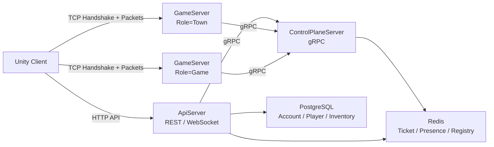

# Pulse World (RhythmRPG)

**Pulse World (RhythmRPG)**는 Unity 클라이언트와 .NET 8 서버로 구성한 리듬 액션 RPG 프로토타입입니다.

이 저장소의 공개 브랜치는 포트폴리오 검토를 위한 코드 스냅샷이며, 핵심 초점은 **Ticket / Presence 기반 게임 서버 아키텍처**입니다. 서버는 `ApiServer`, `ControlPlaneServer`, `GameServer(Town/Game Role)`로 분리되어 있고, Redis와 PostgreSQL을 사용해 인증, 세션 이동, 서버 할당, 접속 상태를 관리합니다.

> 대용량 아트, 오디오, 일부 빌드 산출물과 민감한 운영 설정은 저장소 크기와 라이선스 관리를 위해 제외했습니다.

---

## 프로젝트 요약

| 항목 | 내용 |
| --- | --- |
| 장르 | 리듬 액션 RPG / 멀티플레이어 월드 프로토타입 |
| 클라이언트 | Unity, C# |
| 서버 | .NET 8, ASP.NET Core, gRPC, TCP Socket |
| 인프라 | PostgreSQL, Redis, Docker Compose |
| 핵심 구현 | Ticket 발급/검증, Presence lease, Town/Game 서버 역할 분리, TCP handshake, Room/Session lifecycle |
| 보조 구현 | Steam P2P 측정/대체 경로, JSON 기반 게임 콘텐츠 로딩, 패킷 생성기 |

---

## 서버 아키텍처



### 주요 서버

- `ApiServer`
  - 로그인/인증, 플레이어 상태, 인벤토리, Room 생성/조회 API를 제공합니다.
  - PostgreSQL과 Redis를 사용하며, Game/Town 진입 시 ControlPlane을 통해 ticket을 발급받습니다.

- `ControlPlaneServer`
  - gRPC 기반 중앙 제어 서버입니다.
  - 서버 등록/heartbeat, ticket 발급/소비, presence lease, GameServer 할당, room 생성 요청을 담당합니다.
  - ApiServer의 gRPC 호출에는 요청별 deadline을 적용하고, timeout과 그 밖의 RPC 실패를 각각 HTTP 504·502로 변환합니다.

- `GameServer`
  - 동일 실행 파일을 `--role Town` 또는 `--role Game`으로 실행합니다.
  - TCP listener, handshake, session, room, packet dispatch, 콘텐츠 로딩을 담당합니다.

- `ServerCore / PacketGenerator`
  - TCP session, send/recv buffer, packet framing, PDL 기반 packet code 생성을 담당합니다.
  - 송수신 completion callback을 분리하고 `Interlocked`로 중복 disconnect를 막습니다.

---

## 핵심 요청 경로

### 1. Ticket 기반 서버 입장

1. 클라이언트가 `ApiServer`에 Town 또는 Game 입장을 요청합니다.
2. `ApiServer`는 `ControlPlaneServer`에 ticket 발급을 요청합니다.
3. 클라이언트는 발급받은 ticket과 endpoint로 대상 `GameServer`에 TCP 접속합니다.
4. `GameServer`는 handshake 단계에서 `ReserveOrConsumeTicket`을 호출해 ticket을 검증/소비합니다.
5. ticket target, TTL, 중복 사용, pinned server mismatch 등을 ControlPlane에서 검증합니다.

관련 코드:

- [`TicketService.cs`](Server/ControlPlaneServer/Domain/Tickets/TicketService.cs)
- [`HandshakeFlow.cs`](Server/GameServer/2.Domain/Auth/HandshakeFlow.cs)
- [`control_plane.proto`](Server/Shared/Protos/control_plane.proto)

### 2. Presence 기반 단일 실시간 연결 관리

1. ticket 검증 후 `GameServer`가 `AttachConnection`을 호출합니다.
2. ControlPlane은 `uid -> state/serverId/connId/epoch` 형태의 presence를 Redis에 기록합니다.
3. 접속 중에는 `RenewLease`로 lease를 갱신합니다.
4. 같은 유저가 다른 서버로 이동하거나 중복 접속하면 이전 서버에 kick event를 발행합니다.

관련 코드:

- [`PresenceService.cs`](Server/ControlPlaneServer/Domain/Presence/PresenceService.cs)
- [`PresenceLeaseRenewer.cs`](Server/GameServer/2.Domain/Auth/PresenceLeaseRenewer.cs)
- [`ControlEventHub.cs`](Server/ControlPlaneServer/Domain/Presence/ControlEventHub.cs)

### 3. Town / Game Role 분리

`GameServer`는 role에 따라 Town 서버와 Game 서버로 분기됩니다.

- `Town`: 로비/마을, town room, 대기/입장 처리
- `Game`: 인스턴스 게임 room, 전투/리듬 콘텐츠 처리

Docker Compose에서는 같은 `GameServer` 이미지를 `townserver`, `gameserver` 두 서비스로 실행합니다.

관련 코드:

- [`GameStartup.cs`](Server/GameServer/0.Bootstrap/RoleStartup/GameStartup.cs)
- [`TownStartup.cs`](Server/GameServer/0.Bootstrap/RoleStartup/TownStartup.cs)
- [`docker-compose.yml`](Server/docker-compose.yml)

---

## 클라이언트 / 네트워크 보조 기능

클라이언트는 HTTP API로 인증과 Room 정보를 조회하고, 실시간 구간은 TCP 패킷으로 서버와 통신합니다. Steam 사용 가능 환경에서는 peer 간 품질을 측정하고, 서버 경유 또는 P2P 경로를 고르는 데 필요한 RTT·loss·jitter 정보를 수집합니다.

관련 코드:

- [`RoomSteamPairProbeService.cs`](Client/Assets/0.MainProject/01_Net/Room/RoomSteamPairProbeService.cs)
- [`RoomWsClient.cs`](Client/Assets/0.MainProject/01_Net/Room/RoomWsClient.cs)
- [`NetworkManager.cs`](Client/Assets/0.MainProject/00_Session/Net/NetworkManager.cs)

---

## 디렉터리 구조

```text
Pulse_World/
├── Client/                         # Unity 클라이언트
│   └── Assets/0.MainProject/        # 앱, 네트워크, UI, 게임 런타임 코드
├── Server/
│   ├── ApiServer/                   # REST API, 인증, DB, Room API
│   ├── ControlPlaneServer/          # gRPC ControlPlane, Ticket, Presence, Registry
│   ├── GameServer/                  # TCP GameServer, Town/Game Role, Room/Session
│   ├── ServerCore/                  # TCP listener/session/buffer 기반 코드
│   ├── PacketGenerator/             # PDL 기반 packet code generator
│   ├── Shared/                      # gRPC proto, 공용 모델/유틸리티
│   ├── GameServer.Tests/            # 서버 단위 테스트
│   └── docker-compose.yml           # 로컬 서버 인프라 구성
├── Tools/                           # 보조 도구
└── README.md
```

---

## 실행 방법

### 사전 요구사항

- .NET 8 SDK
- Docker Desktop
- Unity Editor
- OpenSSL 또는 RSA key 생성 도구

### 서버 실행

```powershell
cd Server
Copy-Item .env.example .env
```

`Server/.env`에서 로컬 비밀번호와 공개 endpoint를 환경에 맞게 수정합니다.

```env
POSTGRES_USER=app_user
POSTGRES_PASSWORD=change-me-postgres-password
POSTGRES_DB=lobbydb
REDIS_PASSWORD=change-me-redis-password
SERVER_PUBLIC_HOST=127.0.0.1
TOWN_PUBLIC_PORT=13221
GAME_PUBLIC_PORT=13222
CONTROLPLANE_PORT=5001
API_PORT=5000
```

로컬 인증키를 생성합니다.

```powershell
New-Item -ItemType Directory -Force ApiServer/4.Infrastructure/Security/keys, GameServer/keys
openssl genrsa -out ApiServer/4.Infrastructure/Security/keys/lobby_private.pem 2048
openssl rsa -in ApiServer/4.Infrastructure/Security/keys/lobby_private.pem -pubout -out ApiServer/4.Infrastructure/Security/keys/lobby_public.pem
Copy-Item ApiServer/4.Infrastructure/Security/keys/lobby_public.pem GameServer/keys/lobby_public.pem
```

Docker Compose로 서버 묶음을 실행합니다.

```powershell
docker compose up -d --build
```

실행되는 서비스:

- `postgres_db`
- `redis_cache`
- `controlplane_server`
- `api_server`
- `town_server`
- `game_server`

### 클라이언트 실행

1. Unity Hub에서 `Client` 폴더를 엽니다.
2. 로컬 서버 endpoint를 클라이언트 설정에 맞춥니다.
3. Title/Login 씬에서 실행합니다.

---

## 구현 범위와 주의사항

- 이 저장소는 포트폴리오 공개용 스냅샷입니다.
- Ticket, Presence, TCP handshake, Town/Game role, Docker 기반 로컬 실행 구조는 코드로 확인할 수 있습니다.
- 대규모 동시 접속 benchmark, 운영 환경 자동 배포, 장애 복구 정책 전체는 현재 공개 범위에 포함하지 않았습니다.
- Steam P2P 관련 코드는 품질 측정과 fallback 판단을 위한 보조 기능이며, 모든 게임 상태를 P2P로 동기화하는 구조로 설명하지 않습니다.
- 저장소의 일부 콘텐츠/바이너리/운영 설정은 공개 브랜치에서 제외되어 있습니다.
