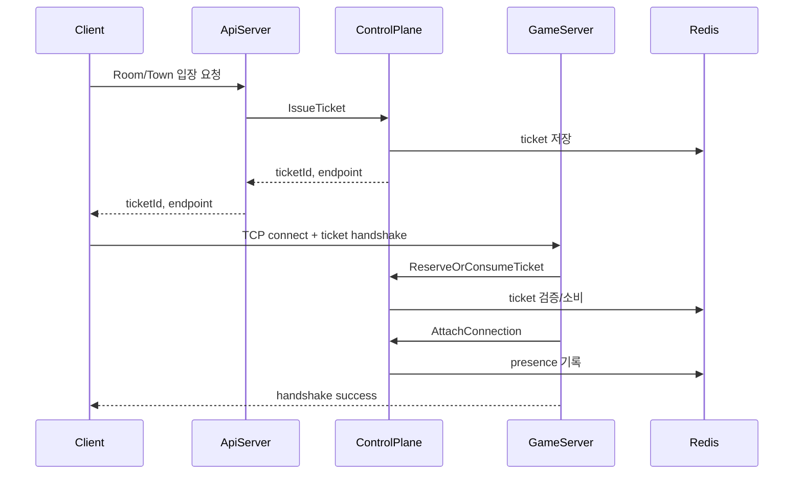

# Pulse World Server

Pulse World 서버는 .NET 8 기반의 게임 서버 구조입니다. `ApiServer`, `ControlPlaneServer`, `GameServer`를 분리하고, Redis 기반 Ticket/Presence 흐름으로 클라이언트의 Town/Game 서버 입장을 검증합니다. PostgreSQL은 영구 플레이어 데이터, MongoDB는 게임 결과와 텔레메트리 아카이브를 담당합니다.

이 문서는 `Server/` 폴더 기준의 요약입니다. 전체 프로젝트 설명은 상위 [`README.md`](../README.md)를 참고하세요.

---

## 구성 요소

| 구성 | 역할 |
| --- | --- |
| `ApiServer` | 인증, 플레이어 상태, 인벤토리, Room/Town API, PostgreSQL 및 MongoDB 연동 |
| `ControlPlaneServer` | gRPC 제어 서버, Ticket, Presence, 서버 registry, allocation |
| `GameServer` | TCP listener/session, handshake, packet 처리, Town/Game role 실행 |
| `ServerCore` | socket listener, session, send/recv buffer |
| `PacketGenerator` | `PDL.xml` 기반 packet class/manager 생성 |
| `Shared` | gRPC proto, 공용 모델과 유틸리티 |
| `GameServer.Tests` | 서버 로직 단위 테스트 |
| `ApiServer.Tests` | 게임 결과 fingerprint 등 API 도메인 단위 테스트 |

---

## 네트워크 흐름



---

## 핵심 구현

- **Ticket**
  - TTL, target, issued server, pinned server, used 상태를 Redis hash로 관리합니다.
  - TCP handshake 시 `ReserveOrConsumeTicket`으로 ticket을 원자적으로 검증/소비합니다.
  - 관련 코드: `ControlPlaneServer/Domain/Tickets/TicketService.cs`

- **Presence**
  - `uid`, `state`, `serverId`, `connId`, `epoch`를 Redis에 기록합니다.
  - 연결 유지 중 `RenewLease`를 수행하고, epoch mismatch나 중복 접속을 감지합니다.
  - 이전 서버 연결이 남아 있으면 ControlPlane event로 kick을 보냅니다.
  - 관련 코드: `ControlPlaneServer/Domain/Presence/PresenceService.cs`, `GameServer/2.Domain/Auth/PresenceLeaseRenewer.cs`

- **Town/Game Role**
  - `GameServer`는 `--role Town`, `--role Game` 인자로 실행 모드를 나눕니다.
  - Docker Compose에서는 같은 GameServer 이미지를 `townserver`, `gameserver`로 각각 실행합니다.

- **TCP / Packet**
  - `ServerCore`가 listener/session/buffer 기반 네트워크 처리를 담당합니다.
  - `PacketGenerator`가 PDL 정의를 기반으로 packet manager와 packet class를 생성합니다.

- **MongoDB 게임 결과 아카이브**
  - `MatchId`를 `_id`로 사용하여 매치 결과를 중복 없이 장기 보존합니다.
  - MongoDB 장애 시 Redis pending set에 저장하고 백그라운드 reconciler가 재시도합니다.
  - 설정, API, 문서 구조와 장애 복구 방법은 [`docs/MongoDB_GameResult_Archive.md`](docs/MongoDB_GameResult_Archive.md)를 참고하세요.

---

## 로컬 실행

```powershell
cd Server
Copy-Item .env.example .env
```

`Server/.env`에서 PostgreSQL, Redis, MongoDB 비밀번호, public endpoint와 32자 이상의 임의 `SYSTEM_API_KEY`를 반드시 수정합니다. placeholder 키이면 서버가 시작되지 않습니다.

```powershell
New-Item -ItemType Directory -Force ApiServer/4.Infrastructure/Security/keys, GameServer/keys
openssl genrsa -out ApiServer/4.Infrastructure/Security/keys/lobby_private.pem 2048
openssl rsa -in ApiServer/4.Infrastructure/Security/keys/lobby_private.pem -pubout -out ApiServer/4.Infrastructure/Security/keys/lobby_public.pem
Copy-Item ApiServer/4.Infrastructure/Security/keys/lobby_public.pem GameServer/keys/lobby_public.pem
```

```powershell
docker compose up -d --build
```

기본 포트:

| 서비스 | 포트 |
| --- | --- |
| ApiServer | `5000` |
| ControlPlaneServer | `5001` |
| Town GameServer | `13221` |
| Game GameServer | `13222` |
| PostgreSQL | `5432` |
| Redis | host `6380` -> container `6379` |
| MongoDB | host `127.0.0.1:27017` -> container `27017` |

---

## 현재 공개 범위

- Ticket/Presence 기반 입장 검증과 단일 실시간 연결 정책은 공개 코드에서 확인할 수 있습니다.
- 대규모 부하 테스트, 운영 배포 자동화, 장애 복구 정책 전체는 공개 범위에 포함하지 않았습니다.
- 공개 브랜치에는 민감한 키, 로컬 `.env`, 대용량 빌드 산출물이 포함되어 있지 않습니다.

